原文链接：[Introduction to Apache Mesos and Mesosphere DCOS](https://filipv.net/2015/08/27/introduction-to-apache-mesos-and-mesosphere-dcos/) （翻译：吴佳兴）

## A little history

Mesos 是一个早在2009年由 Benjamin Hindman、Andy Konwinski、Matei Zaharia、Ali Ghodsi、Anthony D. Joseph、Randy Katz、Scott Shenker和Ion Stoica几人联合发起的伯克利大学研究项目。Benjamin 随后将其引入 Twitter，而如今它已经完美的运行在他们的数据中心上， Benjamin 本人也在不久之后成为了 Mesosphere 的首席架构师，正是它构建了 Mesosphere 数据中心操作系统（DCOS）。

Mesos 的设计宗旨在于尝试和提高集群的利用效率和性能，他们认为对于数据中心资源的单纯静态划分和使用的这样一个方式是值得重新考量的，举个例子来说：

我们假设你的数据中心里拥有9个主机：

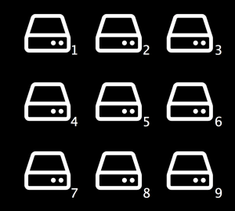

如果把它静态的划分开来，并且指定每三个主机承载一个应用，这样一来总共是3个应用（这里是Hadoop、Spark 和 Ruby on Rails）。

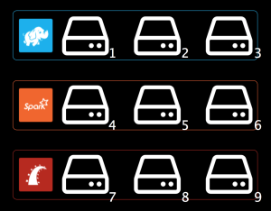

显而易见的一个问题是这些主机的资源利用率并不会很高；

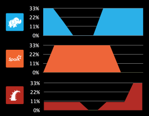

因此如果你想使用全部的资源，即这里例子中的全部9台主机，那么就需要将其抽象成一个共享资源池，而你可以按需计划配置，这样的话，利用率自然可以得到相应的提升；

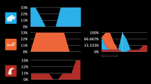

Mesos团队的第二个观点在于他们觉得需要为分布式系统量身定制一套新的系统，换句话说，他们觉得MapReduce并不是适用于所有的场景（这也导致了Spark的诞生，而它又是另外一个故事了），而我们需要一个新的更简单和更具有通用性的专为分布式系统提供服务的这样一个框架。

## Mesos 框架（分布式系统）到底是什么?

一般来说，一个分布式系统你需要有一个Coordinator（调度器）和 多个Worker（执行任务）。调度器以同步（分布式）的方式运行进程/任务，处理程序错误（容错），并且负责优化性能（即弹性伸缩）。换句话说，它负责协调在数据中心去实际执行你想要运行的代码（不需要是一个完整的程序，它也可以是某些种类的运算）。正如之前所提到的那样，Mesos将其称之为联合调度。

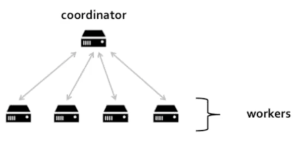

或者也可以这么说，Mesos是一个带有调度器的分布式系统。

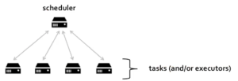

那么Mesos的真正定位是什么呢? 当你尝试去执行它的任务时你可以理解为它实际上就是机器和调度器之间的一层抽象。

因此在Mesos里，调度器是和Mesos层（通过API等）通信，而不是直接跟物理机器打交道。Mesos这里通过这样的方式尝试解决的即是资源的静态划分问题，这意味着你不再需要针对每个特定的运行时分配一个对应的调度器去决定实际去执行它的workers，而取而代之的是，你有一个调度器去和Mesos通信，而它会反过来依据整个资源池的剩余资源做调度。

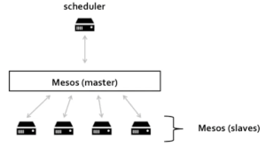

这样做带来的最显而易见的好处就是你可以在一批机器上运行多个不同的分布式系统并且更有效的（不再是静态划分）动态划分和共享这些资源。

其次，之所以这样抽象设计的另外一个重要原因在于它能够提供一个通用功能集（故障检测、分布式任务、任务启动、任务监控、结束任务、清理任务等），这样一来就无需每个分布式系统都各自重复的去实现这样一套逻辑。

## Mesos 适合作为数据中心的哪一层的抽象?

Mesos 这一层抽象实现的目的即是想要尝试通过使用并更好的调度资源使得运行在其之上的这些框架变得更加易于构建和运行。

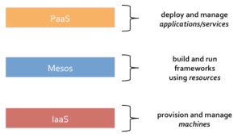

IaaS的抽象的是机器，例如你给它指定一个数字，它便会生成一堆的机器而这也可以看作是Mesos概念模型更底层化的一个抽象。PaaS则考虑的更多是部署和管理应用/服务，它并不关心底层的那些基础架构，而你可以把它看作是Mesos概念模型的一个更高层面的抽象。在交互方面，PaaS可能是和开发者直接交互，而Mesos则是以API的形式和软件程序交互。

换句话说，你可以基于Mesos之上构建一个Paas系统（例如像Marathon - 它好像任何地方都比一个真正的Paas系统更像PaaS），同时你可以在一个IaaS上运行Mesos（例如OpenStack）。

如果你将你的Mesos运行在一个组合系统（例如就像Openstack + 物理硬件 + 虚拟机）之上，那么你可以很直观的再次体会到动态划分资源的好处，那便是你能够跨越这些底层组件而直接的去管理和计划你的工作负载，某种意义上来说，你可以认为Mesos类似于是一个数据中心的内核，即它负责将物理机器抽象成资源，从而使得你能够忽略底层组件的存在，通过消费Mesos的抽象资源来构建分布式系统。

因此我们可以说，Apache Mesos是为构建和运行其它分布式系统（例如像Spark）提供服务的分布式系统。

## Mesos架构内幕

在 Mesos 里，一个框架程序（或者说分布式系统）发起的一次请求会在被接收到的那个时刻由调度器承接和分配。这跟传统分布式系统一般人为发起请求的方式不太一样（再强调一下，Mesos将会让框架程序发起请求，而不是人工操作），传统的方式即需要在人为发起请求时设定好需要分配的特定资源，然后再去真正请求和获取这些资源，这类情况中最典型的莫过于需求场景的变换（设想在Map/Reduce的场景下，比如在Map和Reduce阶段切换之际产生的一个需求资源的变化）

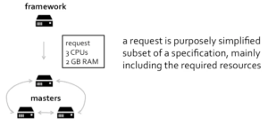

与传统分布式系统不一样的是，Mesos 将会立马为其分配所能分配的最大资源，而不是傻傻的在那等到满足该请求的资源完成/完全到位（在这里它想要实现的便是在绝大多数情况下十分奏效的无阻塞式资源分配策略，即你无须立马消费预期请求的全量资源的这样的情景）。

当然，现在框架类应用（分布式系统）也可以使用Mesos提供的资源完成他们自己的调度，这便是所谓的 “二次资源调度”。

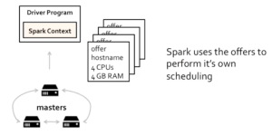

最终达到的效果即是你下发的一个任务可以在整个数据中心的任意一个地方提交并且运行。

构建这样的“二次资源调度”系统的原因在于它可以在同一时间内支持多个分布式系统。同样以上面的例子来解释，Mesos为Spark提供和分配所需的资源。而这里，Spark则负责决策和分配这些可用资源去运行实际任务（即因为可用的资源得以满足需求，所以我才能够实际去运行这些map任务）。

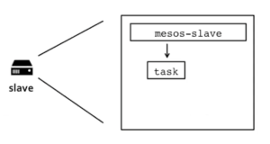

所以一旦一个任务被框架应用提交到Mesos，那么这些任务就必须被实际执行。Mesos master 负责指派任务给每个slave，而每个slave通过上面跑着的agent来管理和运行这些任务。（这即是说如果这个任务是对应的一个命令，那么它会去执行它，如果它需要一些特定的资源来完成这个任务，比如像jar包，那么它会先获取所需的资源，然后在一个沙盒里执行它，最后才发起这个任务）

或者说你也可以这样，框架应用可以通过一个执行器（框架应用需要一个中间层，这个中间层可以用来多线程执行任务）来灵活的决定它想要执行的任务。

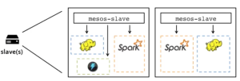

为了保证资源的相对隔离性，Mesos 对 Kernel的cgroups和namespaces 提供了内置的原生支持，当然你也可以将一个Docker容器当做一个任务去运行。这样一来，它便给你提供了一个多租户的（框架）资源池的访问机制（跨主机和主机内部的进程间通信）。

你可以预请求你所需的资源，当然这样你也就回到了资源固定划分的时代。如果你有一些有状态的应用，那么你需要预定一些资源（这类任务通常需要在同一台主机上运行）并且需要一些持久化的存储卷（数据需要能够支持故障迁移和恢复），而这类需求Mesos同样能够支持。

## Mesosphere DCOS

DCOS（数据中心操作系统）即是Mesos的“核心”与其周边的服务及功能组件所组成的一个生态系统。例如像mesos-dns这样的插件模块，类似一个CLI，一个GUI又或者是提供你想运行的所有的包的仓库等工具，以及像Marathon（又名分布式的init）、Chronos（又名分布式的cron）这样的框架等等。

顾名思义，它即是意味着一个跨越在数据中心或者云环境所有主机之上的操作系统。DCOS 可以运行在任意的现代Linux环境，公有或私有云，虚拟机甚至是裸机环境。（当前所支持的平台有：亚马逊AWS、谷歌GCE、微软Azure、OpenStack、Vmware、RedHat、CentOS、CoreOS以及Ubuntu）。迄今为止，DCOS 在其公有仓库上已经提供了多达40余种服务组件（Hadoop、Spark、Cassandra、Jenkins、Kafka、MemSQL等等）。

[Mesosphere 集群操作系统（DCOS）入门视频](https://youtu.be/0I6qG9RQUnY)