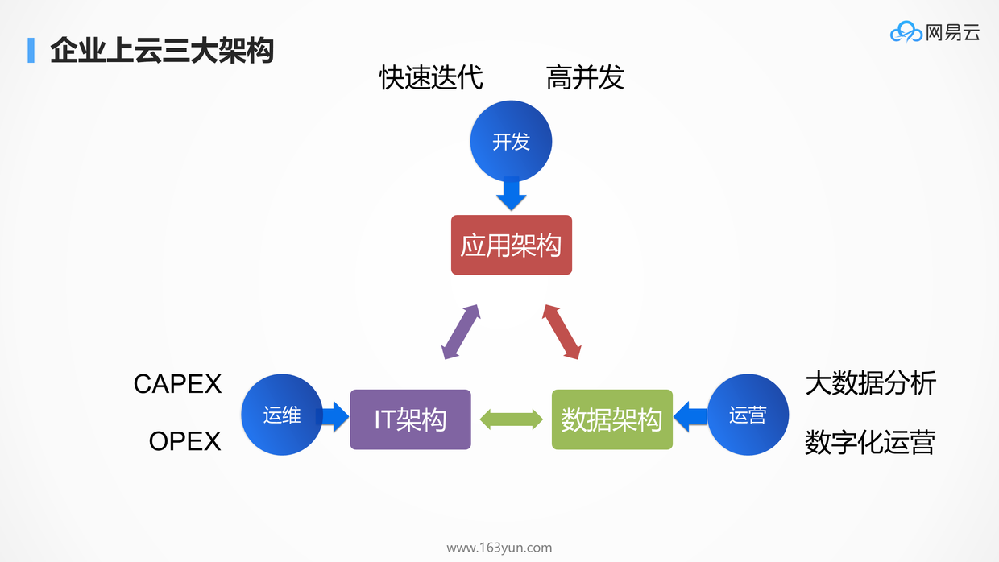
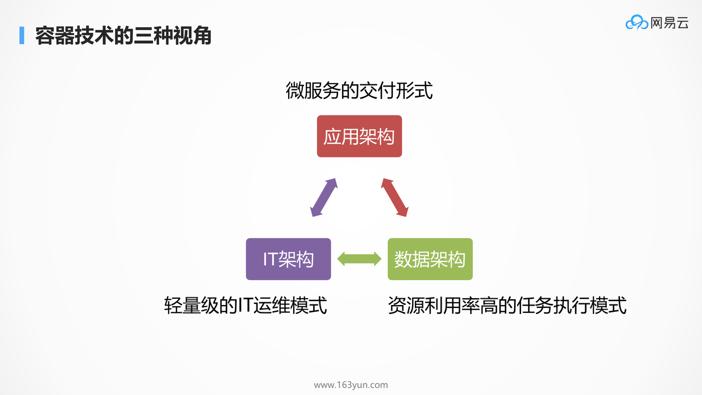
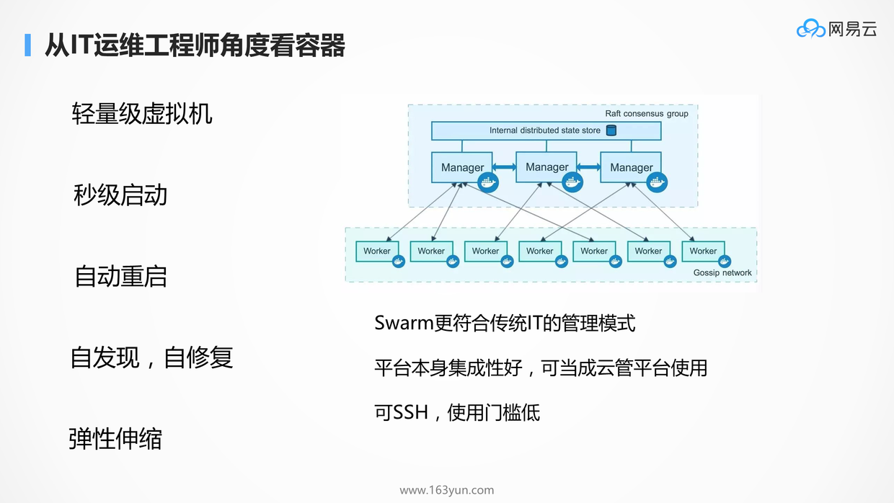
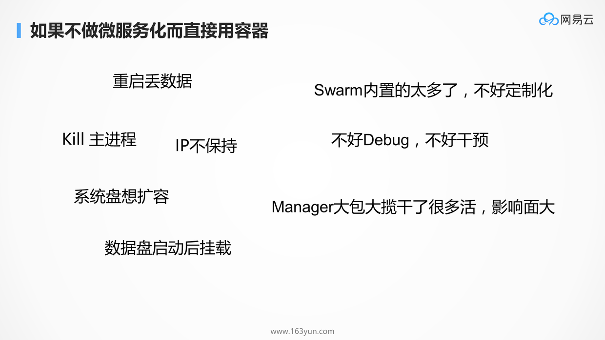
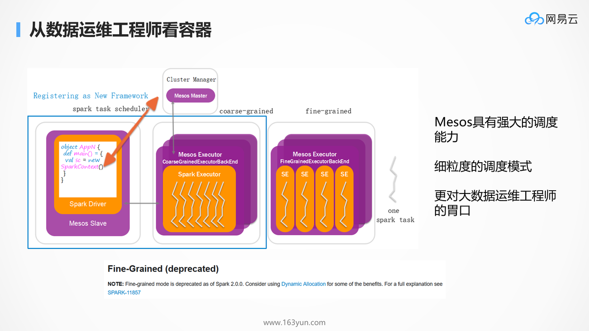
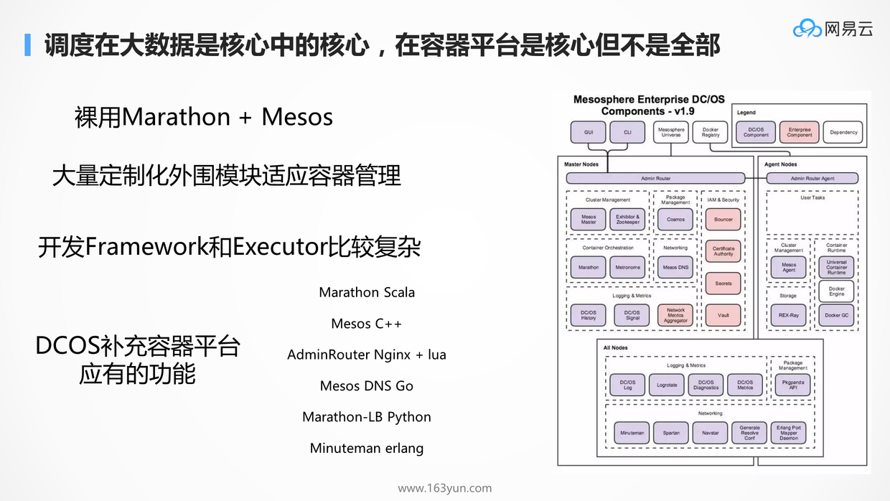
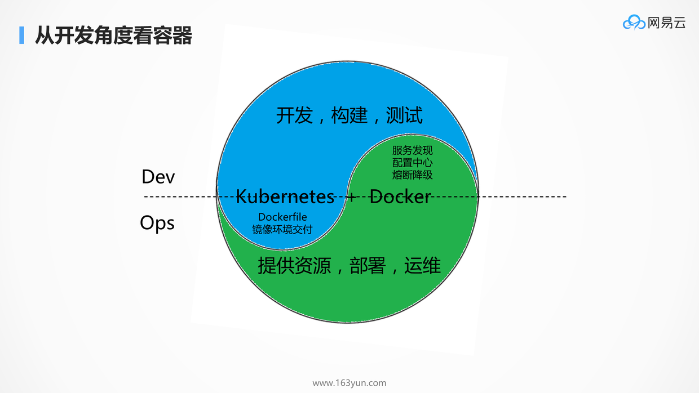

## IT、数据、应用：从不同的角度看待容器技术

如图所示，企业上的三大架构为IT架构，应用架构和数据架构，在不同的公司，不同的人，不同的角色，关注的重点不同。

对于大部分的企业来讲，上云的诉求是从IT部门发起的，发起人往往是运维部门，他们关注计算，网络，存储，试图通过云计算服务来减轻CAPEX和OPEX。

有的公司有ToC的业务，因而累积了大量的用户数据，公司的运营需要通过这部分数据进行大数据分析和数字化运营，因而在这些企业里面往往还需要关注数据架构。

从事互联网应用的企业，往往首先关注的是应用架构，是否能够满足终端客户的需求，带给客户良好的用户体验，业务量往往会在短期内出现爆炸式的增长，因而关注高并发应用架构，并希望这个架构可以快速迭代，从而抢占风口。

在容器出现之前，这三种架构往往通过虚拟机云平台的方式解决。 当容器出现之后，容器的各种良好的特性让人眼前一亮，他的轻量级、封装、标准、易迁移、易交付的特性，使得容器技术迅速被广泛使用。

-|IT运维工程师|数据工程师|应用开发人员
-|-|-|-|
曾经的工作|在机房里面管计算、网络、存储|管理大数据任务的执行|开发应用，满足终端客户的需求
如何看待容器|轻量级的运维模式|一种新的任务执行模式|容器是微服务的交付形式
容器技术的优势|轻量级、易复制、易传输、启动快，自动重启、自动关联、弹性伸缩|在调度完成后不需要等待环境配置完成，直接起一个容器执行任务，可以执行更细粒度的任务规划|开发多花5%的时间，去换取运维200%的劳动，并且提高稳定性
使用容器的方法|把容器当虚拟机用|把容器当成大数据任务执行环境，调度任务时不再考虑环境问题|Dockerfile配置环境是应用开发的一部分
最可能使用的编排工具|Docker Swarm|Mesos|Kubernetes
缺点|容器像虚拟机但不是真虚拟机，变化太快（IP、存储等）|调度在大数据领域是核心，但在容器平台不是|把一些原本在开发中做的事丢给了运维（服务发现、配置中心、熔断降级）

## 从IT运维工程师的角度看待容器技术：Docker Swarm

### IT运维工程师如何使用容器？

* 能够清晰地看到容器在不同机器的分布和状态
* 可以根据需要很方便地SSH到一个容器里面去查看情况
* 容器最好能够原地重启，而非随机调度一个新的容器，这样原来在容器里面安装的一切都是有的
* 可以很方便的将某个运行的容器打一个镜像，而非从Dockerfile开始，这样以后启动就可以复用在这个容器里面手动做的100项工作
* 最好薄薄得一层，像一个云管理平台一样，只不过更加方便做跨云管理，毕竟容器镜像很容易跨云迁移

总而言之，OpenStack能做的，容器做得更好

### 这样使用容器技术存在的问题

**容器终究是容器，不是虚拟机**：

* 容器不能像虚拟机一样保存程序在CPU和内存中的运行状态，不能像虚拟机一样暂停传输到别处重启还能从原来暂停的地方开始运行，只能在文件系统中保存状态
  * “如果重启之后不能回到原来的地方运行，还得把原来的应用启动一遍，那自适应编排有个锤子意义”
  * “关机和启动还得搞开发的单独写程序，增加不必要的工作量”
* 容器自动调度的时候，IP是不保持的，所以往往重启原来的IP就没了
* 容器不像虚拟机能选择硬盘大小
  * “这个都不能调整，叫什么云计算的弹性啊”
* 容器启动之后不能像虚拟机那样挂载数据盘
* Swarm内置的功能太多，不方便定制，不方便Debug，不方便干预

## 从数据运维工程师的角度看待容器技术：Mesos

从大数据平台运维的角度来讲，如何更快的调度大数据处理任务，在有限的时间和空间里面，更快的跑更多的任务，是一个非常重要的要素。所以当我们评估大数据平台牛不牛的时候，往往以单位时间内跑的任务数目以及能够处理的数据量来衡量。

### 数据运维工程师如何使用容器？

从数据运维的角度来讲，Mesos是一个很好的调度器，既然能够跑任务，也就能够跑容器，Spark和Mesos天然的集成，有了容器之后，可以用更加细粒度的任务执行方式。

在没有细粒度的任务调度之前，任务的执行过程是这样的。任务的执行需要Master的节点来管理整个任务的执行过程，需要Worker节点来执行一个个子任务。在整个总任务的一开始，就分配好Master和所有的Work所占用的资源，将环境配置好，等在那里执行子任务，**没有子任务执行的时候，这个环境的资源都是预留在那里的**，显然不是每个Work总是全部跑满的，存在很多的资源浪费。

在细粒度的模式下，在整个总任务开始的时候，只会为Master分配好资源，不给Worker分配任何的资源，当**需要执行一个子任务的时候，Master才临时向Mesos申请资源**，环境没有准备好怎么办？好在有Docker，启动一个Docker，环境就都有了，在里面跑子任务。在没有任务的时候，所有的节点上的资源都是可被其他任务使用的，大大提升了资源利用效率。

原来大数据运维工程师出身的，会比较容易选择Mesos作为容器管理平台。只不过原来是跑短任务，加上marathon就能跑长任务。但是后来**Spark将细粒度的模式deprecated掉了，因为效率还是比较差**。

### 这样使用容器技术存在的问题

调度在大数据领域是核心中的核心，但在容器平台，容器还需要被编排，还需要互相访问，调度只是万里长征的第一步。

早期用Marathon + Mesos的厂商，多是裸用Marathon和Mesos的，由于周边不全，因而要做各种的封装，各家不同。大家有兴趣可以到社区上去看裸用Marathon和Mesos的厂商，各有各的负载均衡方案，各有各的服务发现方案。

因此时至今日，尽管有了开源的DCOS解决方案，但是很可惜，很多厂商都自己定制过了，都有了各自的DCOS解决方案。而且Mesos虽然调度牛，但是只解决一部分调度，另一部分靠用户自己写framework以及里面的调度，有时候还需要开发Executor，这个开发起来还是很复杂的，学习成本也比较高。

另外，DCOS各种组件用的语言也很多种，出了Bug也不好修复。

## 从开发角度看容器：Kubernetes

初看Kubernetes的人觉得他是个奇葩所在，容器还没创建出来，概念先来一大堆，文档先读一大把，编排文件也复杂，组件也多，让很多人望而却步。我就想创建一个容器玩玩，怎么这么多的前置条件。如果你将Kubernetes的概念放在界面上，让客户去创建容器，一定会被客户骂。

在开发人员角度，使用Kubernetes绝对不是像使用虚拟机一样，开发除了写代码，做构建，做测试，还需要知道自己的应用是跑在容器上的，而不是当甩手掌柜。开发人员需要知道，容器是和原来的部署方式不一样的存在，你需要区分有状态和无状态，容器挂了起来，就会按照镜像还原了。开发人员需要写Dockerfile，需要关心环境的交付，需要了解太多原来不了解的东西。实话实说，一点都不方便。

在运维人员角度，使用Kubernetes也绝对不是像运维虚拟机一样，我交付出来了环境，应用之间互相怎么调用，我才不管，我就管网络通不通。在运维眼中做了过多他不该关心的事情，例如服务的发现，配置中心，熔断降级，这都应该是代码层面关心的事情，应该是SpringCloud和Dubbo关心的事情，为什么要到容器平台层来关心这个。

### Kubernetes + Docker，是Dev和Ops融合的桥梁

#### 环境交付本就应该是开发人员的工作

Docker是微服务的交付工具，微服务之后，服务太多了，单靠运维根本管不过来，而且很容易出错，这就需要研发开始关心环境交付这件事情。例如配置改了什么，创建了哪些目录，如何配置权限，只有开发最清楚，这些信息一方面很难通过文档的方式，又及时又准确的同步到运维部门来，就算是同步过来了，运维部门的维护量也非常的大。

所以，有了容器，最大的改变是环境交付的提前，是每个开发多花5%的时间，去换取运维200%的劳动，并且提高稳定性。

#### 服务发现，配置中心，熔断降级等本就应该是运维的工作

显然，作为开发人员，最该关心的应该是程序的业务逻辑，像服务发现，配置中心，熔断降级等操作通常在各种程序中都一样，大家都要用同一套方案，何必在每个业务逻辑里面都搞上这样的功能？这些功能完全可以从应用中独立出来，交给运维统一完成，因为运维才是最熟悉基础设施的。而有了容器，开发人员完全不用在应用逻辑里加一些乱七八糟的功能，运维也能很方便的对容器进行统一的调度和管理。
