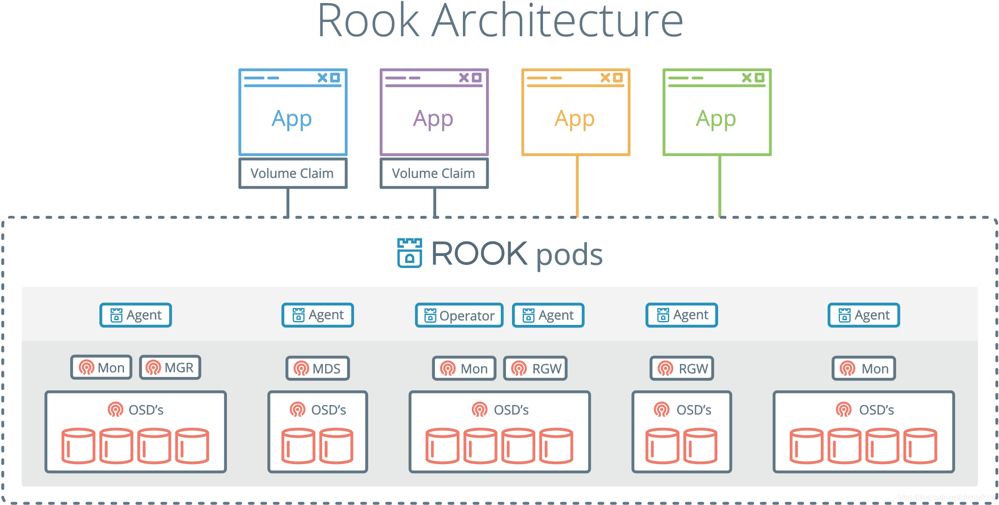
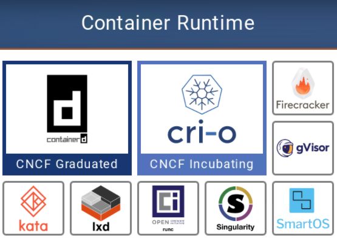

前置知识：[《CNCF简介（零）》](CNCF.md)

## 云原生存储（Cloud native storage）

存储，即存放应用程序持久数据的位置，通常称为持久卷。轻松访问持久卷，对于应用程序可靠运行至关重要。通常，当我们说持久数据时，是指想要确保我们在应用重新启动时不会消失的任何数据。

### 解决的问题

**云原生架构具有不固定性，灵活性和弹性**，这使得应用重启后的持久数据面临挑战。容器化的应用程序在扩缩容或自我修复时，将会连续创建和删除实例，并随时间更改物理位置。因此，**必须以与节点无关的方式提供云原生存储**。

但是，要存储数据，就要需要硬件（具体来说是磁盘）。磁盘与其他任何硬件一样，都受基础结构约束。这是第一个挑战。

第二个挑战是，存储接口。以前，每个基础架构都有自己的存储解决方案和自己的接口，这使可移植性变得非常困难。

第三个挑战是，由于云的弹性，必须以自动化方式配置存储。

云原生存储，是针对此云原生量身定制。

### 解决问题的方法

* 为容器提供云原生存储选项
* 标准化容器与存储提供者之间的接口
* 通过备份和还原操作提供数据保护

因此，使用云原生存储能够兼容多数三方存储，并且可以自动配置，从而消除了人为瓶颈，实现了自动扩展和自我修复。

### 具体软件

容器存储接口（CSI）在很大程度上使云原生存储成为可能，该接口允许使用标准API向容器提供文件和块存储。在这个领域中，有许多工具，包括开源的和供应商提供的，都可以利用CSI为容器提供按需存储。

除了这一极其重要的功能之外，我们还有许多其他工具和技术，旨在解决云原生中的存储问题。Minio是一个受欢迎的项目，除其他外，它提供了兼容S3的API用于对象存储。Velero之类的工具可帮助简化Kubernetes集群本身以及应用程序使用的持久数据的备份和还原过程。

#### CNCF孵化项目：ROOK

Rook是一个自管理的分布式存储编排系统，可以为Kubernetes提供便利的存储解决方案。Rook本身并不提供存储，而是在kubernetes和存储系统之间提供适配层，简化存储系统的部署与维护工作。目前，rook支持的存储系统包括：Ceph、CockroachDB、Cassandra、EdgeFS、Minio、NFS，其中Ceph为Stable状态，其余均为Alpha。

Rook由Operator和Cluster两部分组成：

* Operator：由一些CRD和一个All in one镜像构成，包含包含启动和监控存储系统的所有功能
* Cluster：负责创建CRD对象，指定相关参数，包括ceph镜像、元数据持久化位置、磁盘位置、dashboard等

下图是Rook的体系结构图，Operator启动之后，首先创建Agent和Discover容器，负责监视和管理各个节点上存储资源。然后创建Cluster，Cluster是创建Operator时定义的CRD。Operator根据Cluster的配置信息启动Ceph的相关容器。存储集群启动之后，使用kubernetes元语创建PVC为应用容器所用。

## 容器运行时（Container runtime）

容器是一组用于执行应用程序的约束（compute constraints）。容器化的应用程序相信它们正在自己的专用计算机上运行，而忽略了它们与其他进程（类似于虚拟机）共享资源。

容器运行时，是执行集装箱化（或“约束”）的应用程序。如果没有运行时，则只有容器镜像，该文件指定了容器化应用的外观。运行时将在容器中启动应用程序，并为其提供所需的资源。

### 解决的问题

* 容器镜像（带有应用程序规范的文件）必须以标准化，安全和隔离的方式启动。
* 标准化，因为无论它们在何处运行，都需要标准的操作规则。
* 安全，因为你不希望任何不应该访问它的人，对它操作。
* 隔离，因为你不希望应用程序影响其他应用，或受其他应用程序的影响（例如，在同一节点的其他应用程序崩溃）。隔离基本上起保护作用。此外，必须为应用程序提供从CPU到存储再到内存的资源隔离。

### 解决问题的方法

容器运行时以标准化方式在所有环境中启动应用程序，并设置安全边界。像CRI-O或gVisor这样的运行时，强化了它们的安全性边界。运行时还设置了容器的资源限制。没有它，该应用程序可能会根据需要消耗资源，从而有可能占用其他应用程序的资源，因此你始终需要设置限制。

### 具体软件

并非此类别中的所有工具都是一样的。 Containerd （Docker产品的一部分）和CRI-O是标准的容器运行时实现。

然后，有一些工具可以将容器的使用扩展到其他技术，例如Kata，它允许你将容器作为VM运行。其他目标旨在解决与容器相关的特定问题，例如gVisor，它在容器和OS之间提供了额外的安全层。

几个相关概念：
* OCI(Open Container Initiative)：开放容器联盟，由Docker Inc在2015年牵头建立，其明确目的是围绕容器格式和运行时创建开放行业标准。
* OCI镜像规范：由OCI定义的容器运行时和镜像规范，目前仍在制定之中。OCI镜像规范工作的基础是Docker V2镜像规范。

#### CNCF毕业项目：containerd

2014年，containerd诞生于Docker，最初它是Docker引擎的底层运行时管理器。2017 年 3 月，Docker在五个最大的云提供商（阿里云，AWS，Google Cloud Platform，IBM Softlayer和Microsoft Azure）的支持下，将containerd捐赠给了CNCF，其协议是作为多个容器平台和容器编排系统的核心容器运行时。

containerd已经成为一个行业标准的容器运行时，它简单、稳定、有良好的可移植性，最广泛的使用方式是作为Docker引擎和OCI runc执行器之间的层。

containerd 旨在嵌入到更大的系统中，而不是由开发人员或最终用户直接使用。

#### CNCF孵化项目：CRI-O

CRI-O是Kubernetes自建的容器运行时，可以取代Docker。

>CRI-O项目最重要的主张是，用户不应该对创建工作负载并用以stage的容器产生依赖。按照最初的设想，该项目将对Kubernetes提供工具，使其不需要Docker、rkt、OpenShift、Photon等任何的品牌容器，就可以管理容器的全生命周期。

## 云网络（Cloud native networking）

容器通过云原生网络相互通信，并与基础结构层通信。分布式应用程序具有多个组件，这些组件将网络用于不同目的。

### 解决的问题

通常，将在容器中运行的代码称为应用程序，但事实是，大多数容器仅包含较大应用程序的一小部分特定功能。诸如Netflix或Gmail之类的现代应用程序实际上由许多这些较小的组件组成，每个组件都在其自己的容器中运行。为了使所有这些独立的部分充当一个有凝聚力的应用程序，容器需要彼此私下通信。此类工具提供该专用通信网络。

此外，在这些容器之间交换的消息可能是私有的，敏感的或非常重要的。这导致了其他要求，例如为各种组件提供**隔离**以及**检查流量**以识别网络问题的能力。在某些用例中，你可能需要**扩展这些网络和网络策略**（例如防火墙和访问规则），以便你的应用程序可以连接到在我们的容器网络外部运行的虚拟机或服务。

### 解决问题的方法

容器网络接口（CNI）为容器化应用程序提供联网功能。某些工具（例如Flannel）相当简单，可提供与容器的基本连接。其他诸如NSX-T等提供了完整的SDN层，可为每个Kubernetes命名空间创建一个隔离的虚拟网络。

容器网络至少需要为Pod（在Kubernetes中运行容器化的应用程序）分配IP地址，以允许其他进程访问它。

### 具体软件

#### CNCF孵化项目：CNI

CNI(Container Network Interface)容器网络接口是一个专用于配置容器网络的标准。

不管是 docker 还是 kubernetes，在网络方面目前都没有一个完美的、终极的、普适性的解决方案，不同的用户和企业因为各种原因会使用不同的网络方案。目前存在网络方案 flannel、calico、openvswitch、weave、ipvlan等，而且以后一定会有其他的网络方案，这些方案接口和使用方法都不相同，而不同的容器平台都需要网络功能，它们之间的适配如果没有统一的标准，会有很大的工作量和重复劳动。

CNI 就是这样一个标准，它旨在为容器平台提供网络的标准化。不同的容器平台（比如目前的 kubernetes、mesos 和 rkt）能够通过相同的接口调用不同的网络组件。
