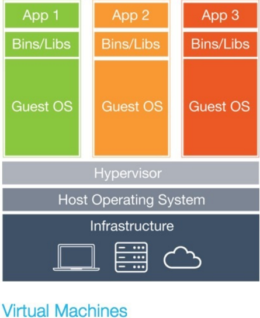

>**Any problem in computer science can be solved by another layer of indirection.**
>
>**计算机科学领域的任何问题都可以通过增加一个间接的中间层来解决。**

[基础教程](https://zhuanlan.zhihu.com/p/22403015)

[VMWare](https://wenku.baidu.com/view/ef529b470408763231126edb6f1aff00bfd5703e.html)

## 容器和虚拟机

### 虚拟机

在软件层面上通过**模拟硬件的输入和输出**，让虚拟机的操作系统得以运行在没有物理硬件的环境中（也就是宿主机的操作系统上）。

模拟出硬件输入输出的程序称为“**hypervisor**”。

* Guest OS：虚拟机上运行的操作系统
* Virtual Hardware：hypervisor虚拟出来的硬件
* 宿主机：运行虚拟机的物理机

### 高性能的虚拟机：虚拟化直通技术

* 单纯模拟硬件的输入输出，指令执行效率很低
* 解决方法：虚拟化直通技术。不模拟硬件输入输出，只是**做真实硬件输入输出的搬运**工，从而能极大提升虚拟机的运行效率（前提是宿主机的硬件架构必须和要虚拟的**硬件架构一致**）

代表性技术：Intel的VT-d、Linux的Direct I/O

代表性软件：VMware vSphere

虚拟化直通技术允许宿主机将某些硬件资源的管辖权直接移交给虚拟机，此时宿主机将不能再使用此硬件，虚拟机会以直通独占的方式使用它们，利用效率几乎等同于将硬件插到了虚拟机的主板扩展槽里一样。

虚拟化直通技术对于像 VirtualBox、VMware Workstation 这类安装在 OS 层以上的虚拟机软件来说实际意义并不是很大，它主要面向的是企业级服务器这种全天候、对性能要求很高的场景。

### 容器

#### 比虚拟化直通技术更进一步

创建虚拟机也不一定需要模拟硬件的输入和输出，假如**宿主机和虚拟机的操作系统内核(Kernel)是一致的**，就不用做硬件输入输出的搬运工了，只需要**做Kernel输入输出的搬运**工即可。

#### 容器技术由此产生👇

**容器**，又名操作**系统层虚拟化** (Operating-system-level virtualization)，是通过“模拟”Kernel的输入输出实现的虚拟化，它要求宿主机和虚拟机有同样的操作系统内核。

Docker是在Linux Kernel上开发的容器服务，因此Docker容器的宿主机只能是Linux系统。并且：

* 各个Linux 发行版的内核都是一样的所以在很大程度上都能通用
* 在Windows上运行 Docker 的时候其实是在一个 Hyper-V虚拟机上运行的简易Linux系统上运行Docker

### 对比

* 传统虚拟机如VMware、VisualBox之类的需要**模拟整台机器**包括硬件，每台虚拟机都需要有自己的操作系统，虚拟机一旦被开启，预分配给它的资源将全部被占用。每一台虚拟机包括应用，必要的二进制和库，以及一个完整的用户操作系统
* 容器技术是**和宿主机共享硬件资源及操作系统**，可以实现资源的动态分配。容器**包含应用和其所有的依赖包**，但是**与其他容器共享内核**。容器**在宿主机操作系统中**，在用户空间**以分离的进程运行**

* **容器技术是实现操作系统虚拟化的一种途径**
* Linux 容器是 Linux 发展出的一种虚拟化技术
* **Docker 是 Linux 容器的一种封装**

## 深入原理

[提高教程](https://zhuanlan.zhihu.com/p/22382728)

### 核心技术

[AUFS](AUFS.md)

[cgroup](cgroup.md)

[namespace](namespace.md)
