[原文在此](https://zhuanlan.zhihu.com/p/1928005367754884226)

## 1 传统 prefill 和 decode 阶段中存在的问题

每个大语言模型（LLM）的推理请求都会经历两个阶段：首先是 **prefill** 阶段，模型会处理整个输入 prompt 并生成第一个输出 token；随后进入 **decode** 阶段，模型会一次生成一个 token，直到输出完整的结果。

prefill 阶段由于可以并行处理整个输入，**往往延迟较高但能充分利用 GPU 计算资源**；而 decode 阶段每次只处理一个 token，**延迟较低但 GPU 利用率也随之降低**。**因此，批处理（batching）在 decode 阶段尤为有效，有助于提升整体吞吐量。**但在实际服务中，多个请求的批量调度会导致 prefill 和 decode 阶段交错进行，这为同时实现高吞吐和低延迟带来了不小的挑战。

## 2 Batching 的演进过程

### 2.1 Static Batching

**Static Batching** 是一种传统的大模型推理调度策略，其核心特点是：一旦构建了一个 batch，**其中的所有请求将统一执行，直到全部完成后才释放资源并加入新的请求**。

**Static Batching 虽然可以降低 TBT 延迟，但也会牺牲整体系统吞吐量，并导致 GPU 资源浪费。**

下图展示了使用 Static Batching 完成 4 个推理请求的过程。在第一轮（图左），每个请求根据提示词（黄色）生成一个 token（蓝色）。经过多轮迭代后（图右），每个请求的生成长度不同，因为它们在不同轮次生成了结束标记（红色）。尽管请求 3 在第二轮就已完成，Static Batching 仍要求整个 batch 等待最慢的请求完成（此例中为第六轮的请求 2），这导致 GPU 在后续迭代中无法被充分利用。

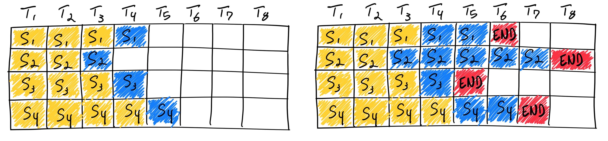

下面这张动图可以更清晰地展示 Static Batching 的基本原理：

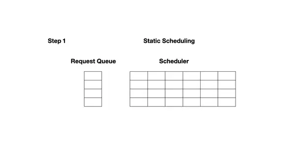

Static Batching 采用的是固定的调度流程：调度器（Scheduler）每次从请求队列中取出一组请求（例如图中的 x1 和 x2），组成一个新的 batch，并交由执行引擎（Execution Engine）统一进行推理。只有当执行引擎完成该 batch 中所有请求的推理后，调度器才会开始处理下一轮 batch。由于 batch 中的所有请求必须一起行动，我们管这种调度策略叫 **request-level schedule。**

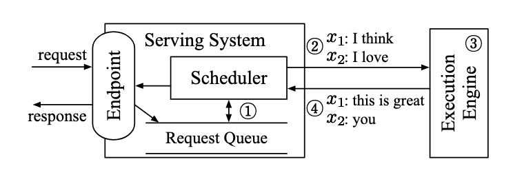

[图片来源：Orca: A Distributed Serving System for Transformer-Based Generative Models](https://www.usenix.org/system/files/osdi22-yu.pdf)

以下是 Static Batching 的伪代码实现：

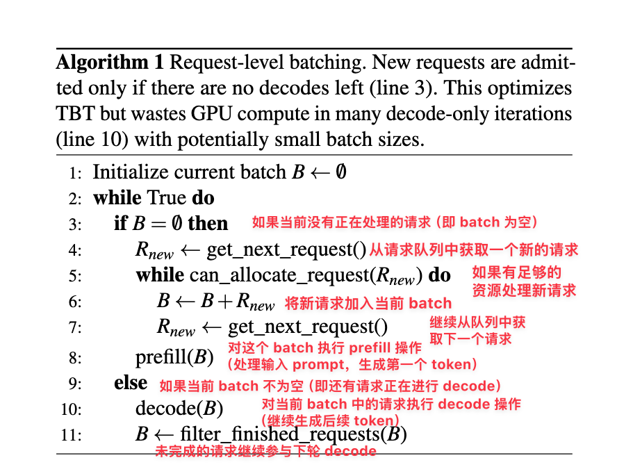

[图片来源：Taming Throughput-Latency Tradeoff in LLM Inference with Sarathi-Serve](https://arxiv.org/abs/2403.02310)

### 2.2 Continuous Batching

> 论文：
>
> Orca: A Distributed Serving System for Transformer-Based Generative Models：https://www.usenix.org/conference/osdi22/presentation/yu

业界意识到传统方法存在效率低下的问题，并提出了更优的方案。[Orca: A Distributed Serving System for Transformer-Based Generative Models](https://www.usenix.org/conference/osdi22/presentation/yu) 是 OSDI ’22 上发表的一篇论文，这是首个系统性解决该问题的工作。Orca 引入了 **iteration-level scheduling**，不再等待 batch 中所有序列生成完成，而是**每轮迭代动态决定 batch 大小**。这样一来，batch 中的某个序列一旦完成生成，就可以立即被替换为新的请求，从而相比 Static Batching 显著提升了 GPU 的利用率。

下图展示了使用 Continuous Batching 完成 7 个推理请求的过程。左图展示的是第一轮迭代后的 batch，右图展示的是多轮迭代后的情况。一旦某个请求生成了结束标记（EOS token），就将其替换为一个新的请求（例如 S5、S6 和 S7）。这种方式避免了等待所有请求完成后再处理新请求的情况，因此能显著提升 GPU 的利用率。

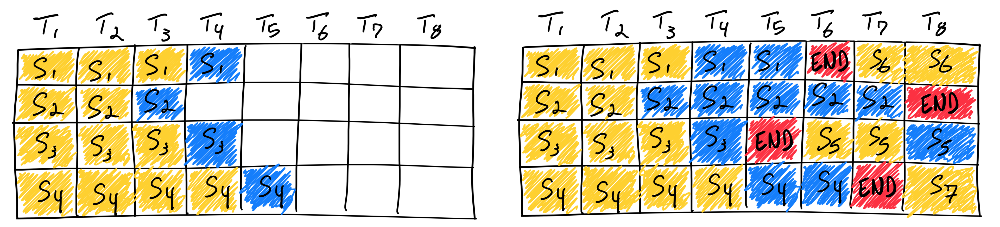

下面这张动图可以更清晰地展示 Continuous Batching 的基本原理：

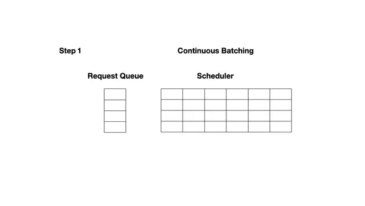

#### 2.2.1 Iteration-Level Scheduling

下展示了 ORCA 采用迭代级调度（iteration-level scheduling）时的系统架构与整体工作流程：

- ① 调度器首先决定下一步要运行哪些请求。
- ② 然后调用引擎对四个选中的请求（x₁, x₂, x₃, x₄）进行推理。对于首次被调度的请求，调度器会提供其输入 token 给引擎处理。本例中，x₃ 和 x₄ 尚未进行过任何迭代，因此调度器为 x₃ 提供了 (x₃₁, x₃₂)，为 x₄ 提供了 (x₄₁, x₄₂, x₄₃)。
- ③ 接着，引擎对这四个请求执行了一轮模型推理。
- ④ 并返回每个请求生成的一个输出 token（x₁₅, x₂₃, x₃₃, x₄₄）。

一旦某个请求完成推理，请求池会移除该请求，并通知终端返回响应。

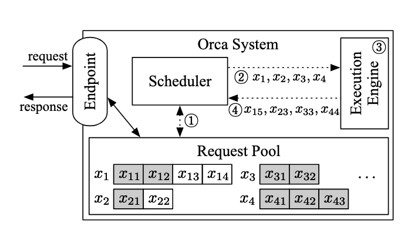

[图片来源：Orca: A Distributed Serving System for Transformer-Based Generative Models](https://www.usenix.org/system/files/osdi22-yu.pdf)

#### 2.2.2 在 Iteration-Level Scheduling 中实现 Batching 的挑战

在实践中应用 iteration-level scheduling 时，我们面临的一个主要挑战就是如何实现批处理。为了达到高效执行的目的，执行引擎应当能够对任意被选中的一组请求进行批处理执行。否则，就只能一个一个地处理请求，无法发挥 GPU 的大规模并行计算能力。

然而，即使只是两条请求，也无法保证它们在下一轮迭代中能够合并执行。**这是因为要实现批处理，不仅需要多个请求处于相同的阶段，还必须具有形状完全一致的输入张量。**

一对请求在以下 3 种情况下，下一次迭代不能一起批处理：

- **两个请求都处于 prefill 阶段，但输入 token 数量不同（例如 x₃ 和 x₄）**。prefill 阶段的 Attention 是一次性并行处理整个 prompt 序列。如果两个请求的输入 token 长度不同，它们的输入张量在长度维度（L）上不一致，无法拼接成统一形状的 batch 张量 `[B, L, H]`，导致无法合批执行。请求 x₃ 的 prompt 长度是 2，输入张量形状为 `[1, 2, H]`；请求 x₄ 的 prompt 长度是 3，输入张量形状为 `[1, 3, H]`，无法拼接成一个 `[2, L, H]` 的张量，因此不能合批执行。
- **两个请求都处于 decode 阶段，但正在生成不同位置的 token（例如 x₁ 和 x₂）。** 虽然 decode 阶段每次只处理一个 token，输入张量形状都是 `[1, H]`，但此阶段的 Attention 会依赖之前生成的所有 token（即使用 KV cache）。如果请求的生成位置不同，其 KV cache 长度也不同，导致 Attention 的 Key/Value 张量形状不同。
- **两个请求处于不同阶段：一个在 prefill，另一个在 decode（例如 x₁ 和 x₃）。** prefill 的一次迭代会并行处理所有输入 token，以提高效率，而 decode 阶段的一次迭代则只处理一个 token。

**为了解决上述挑战，一个可行的思路是：尽可能寻找这些请求在计算过程中的共性，以便将相同的部分合并执行，从而最大化批处理效率；对于差异部分，则单独处理。**

#### 2.2.3 Selective Batching

**Selective Batching 的核心原理在于：仅对适合批处理的操作执行批处理，不适合批处理的操作则单独处理。**

具体来说：

- 对于 `preproj`、`postproj`、`FFN1` 和 `FFN2` 这类线性变换或归一化操作，它们的计算与序列长度无关，只是在 hidden_size 维度上做线性转换，并且都需要从显存读取权重。**因此，可以将 batch 内所有 token 拉平成一个二维张量**，例如 x₃ 和 x₄ 的输入张量可以合并为一个形状为 $[∑L, H] = [5, H]$ 的二维张量，一次性完成所有相关计算。这样不仅简化了操作，还能显著提升权重加载的利用率，降低 IO 次数，提高整体执行效率。
- 对于 Attention 操作，由于每个请求的 mask、KV cache 和 token 位置可能不同，导致其张量形状不一致，无法直接合并处理。Selective Batching 会在进入 Attention 之前将 batch 拆分，逐个请求单独计算 Attention 分数，完成后再将结果合并回统一的张量，以便继续执行后续操作。**Attention 分数的计算并不依赖显存中的模型权重，只需使用之前生成的 Q、K、V 向量即可，因此拆分处理不会带来额外的 IO 开销。**

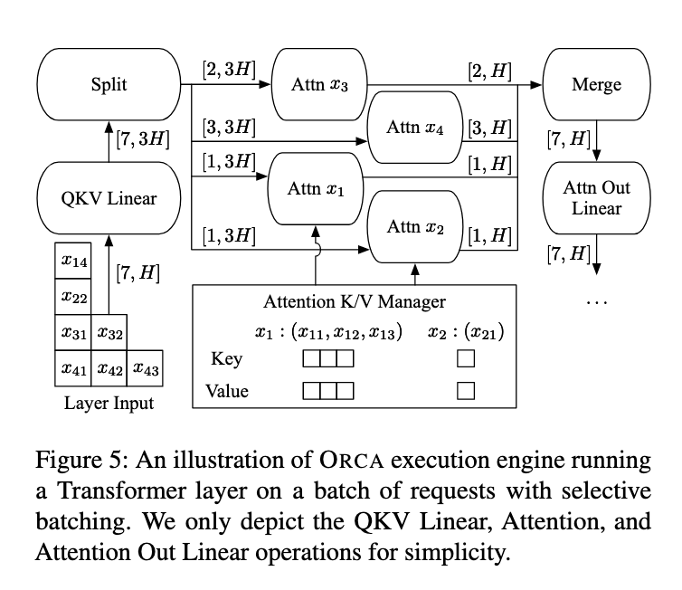

[图片来源：Orca: A Distributed Serving System for Transformer-Based Generative Models](https://www.usenix.org/system/files/osdi22-yu.pdf)

##### 2.2.3.1 为什么在 Batch 中混合 Prefill 和 Decode 请求可以提升性能？

**在 Batch 中混合 Prefill 和 Decode 请求可以提升性能，原因在于这两种阶段对 GPU 资源的利用方式互补，混合后能更充分地发挥硬件潜力**：

- **prefill 阶段是计算密集型（compute-bound）**，主要时间花在大规模的线性变换和矩阵运算上，算力利用率高，但内存带宽利用率不高。即使 batch size 很小，prefill 吞吐量也很快趋于饱和，增大 batch size 对提升吞吐帮助有限（比如 batch size 从 4 增加到 8），甚至可能因算力饱和而下降。
- **decode 阶段是内存密集型（memory-bound）**，大部分时间消耗在读取 KV cache 和模型权重上，算力利用率很低。此时增大 batch size 可以显著提升吞吐，因为可以合并多次权重和 KV cache 的读取，减少 IO 次数，让空闲的算力得到利用。

混合批处理的优势在于：  
  - **prefill 阶段可以搭载（piggyback）在 decode 阶段未被充分利用的算力上，提升整体算力利用率。**
  - decode 阶段可以和 prefill 阶段共享一次权重读取，减少内存带宽压力，提高带宽利用率。
  - 这样，GPU 的计算单元和内存带宽都能被更充分利用，整体吞吐和 QPS 明显提升。

下展示了吞吐量随 batch size 变化的趋势。可以观察到：**对于 decode 阶段，吞吐量几乎呈线性随 batch size 增长**；而 prefill 阶段即便只处理一个请求，其吞吐量也已接近饱和，进一步增大 batch size 效果有限。

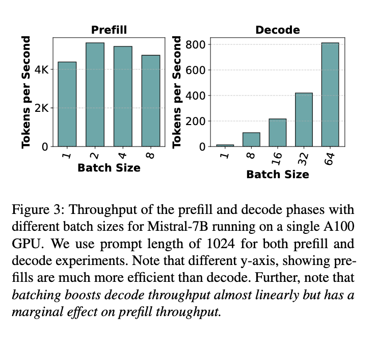

[图片来源：Taming Throughput-Latency Tradeoff in LLM Inference with Sarathi-Serve](https://arxiv.org/abs/2403.02310)

prefill 和 decode 阶段在吞吐量扩展性上的差异，源于它们所执行的矩阵乘法形式不同：**prefill 阶段执行的是（批量的）矩阵-矩阵乘法（matrix-matrix multiplications），而 decode 阶段执行的是向量-矩阵乘法（vector-matrix multiplications）。**众所周知，当算术强度高于 GPU 的 **FLOPS:内存带宽**（FLOPS，floating-point operations per second，表示模型在推理过程中执行的浮点运算次数）比值时，内核属于 compute-bound 类型，能够高效地在 GPU 上运行。相反，算术强度较低的内核则由于受限于内存带宽，难以充分发挥 GPU 的计算能力，属于 memory-bound 类型。

下图展示了 prefill 和 decode 阶段中各个操作的算术强度（arithmetic intensity）。如下图所示，在 prefill 阶段，**即使 batch size 为 1，所有操作的算术强度依然很高**。而在 decode 阶段，这些操作的算术强度下降了两个数量级以上，**只有在 batch size 达到 256 这种极大值时，decode 阶段才开始变得计算密集**。

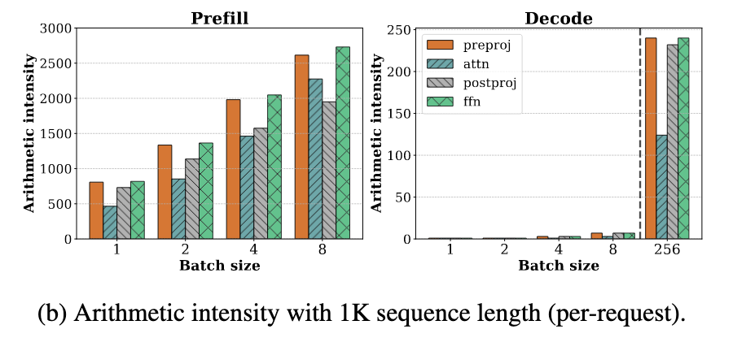

**然而，将 batch size 扩展到如此之高在实际中几乎无法实现，因为每条请求的 KV cache 占用非常大。** 例如，在 LLaMA-13B 模型上，使用 A6000 GPU，在序列长度为 1K 的情况下，最多只能容纳 18 条请求的 batch。**因此，在当前可行的 batch size 范围内，decode 阶段仍然是内存瓶颈（memory-bound）**。

[图片来源：Taming Throughput-Latency Tradeoff in LLM Inference with Sarathi-Serve](https://arxiv.org/abs/2403.02310)

##### 2.2.3.2 Selective Batching 还存在什么问题？

回顾 ORCA 的 Selective Batching 的策略就会发现，其行为具有一定的**随机性**：一个 batch 中包含多少条 prefill 请求、多少条 decode 请求，并没有明确控制，仅仅是按照“先到先服务”的策略动态拼装而成。这就带来一些问题：

- 若某个 batch 中包含大量 prefill 请求，或某些 prefill 请求本身 token 很长，就会导致 prefill tokens 占据大量计算资源，使整个 batch 变得 **compute-bound**；
- 相反，若 batch 中以 decode 请求为主，例如所有请求都处于推理阶段，或没有新的输入序列可调度，则该 batch 很可能是 **memory-bound** 的，导致算力无法充分利用。
- 在流水线并行中同样可能产生气泡。

虽然流水线并行（Pipeline Parallelism）可以扩展大模型的并行能力，但也引入了一个典型问题：**流水线气泡（pipeline bubbles）**。所谓“气泡”，是指由于不同阶段间计算不均衡或等待导致的 GPU 空闲时间，从而造成资源浪费和吞吐下降。

Orca 系统尝试通过 **迭代级调度（iteration-level scheduling）** 来缓解这一问题，但在实际推理中仍然可能出现气泡，主要原因包括：

- **PB1：连续 micro-batch 的 prefill token 数量差异大**。例如，若 AB 和 CD 分别是两个 micro-batch，且 AB 的 token 总数显著多于 CD。当 GPU1 完成 Cp 和 Dp 的 prefill 后，必须等待 GPU2 完成 AB 的 prefill，才能继续执行 Ad1 和 Bd1 的 decode。GPU1 在此期间处于空转状态，形成 PB1 类型气泡。
- **PB2：prefill 阶段和 decode 阶段计算负载差异大**。PB2 类型气泡出现在 prefill 和 decode 阶段相继执行时。以 Ad1 和 Bd1 为例，它们的 decode 阶段每次仅处理一个 token，计算时间极短；而此时 GPU2 正在处理 Cp 和 Dp 的 prefill，涉及多个 token，耗时较长，导致 GPU1 无法及时执行后续任务，资源被浪费，形成 PB2 气泡。
- **PB3：decode 阶段上下文长度差异导致计算时间不均**。decode 阶段的计算开销受上下文长度（即 KV cache 长度）影响较大。不同 micro-batch 中请求的上下文长度不一，导致 decode 阶段耗时不同，从而在流水线上产生等待，形成 PB3 类型气泡。

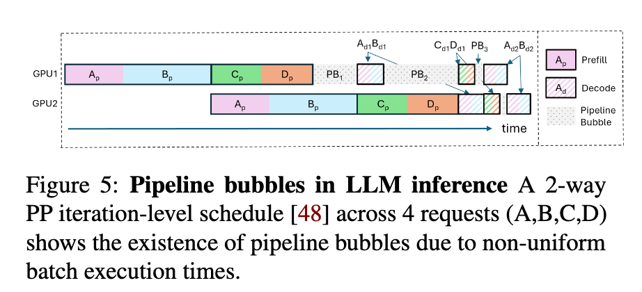

[图片来源：SARATHI: Efficient LLM Inference by Piggybacking Decodes with Chunked-Prefills](https://arxiv.org/abs/2308.16369)

### 2.3 Chunked-Prefills

> 论文：
>
> SARATHI: Efficient LLM Inference by Piggybacking Decodes with Chunked-Prefills： https://arxiv.org/abs/2308.16369
>
> Taming Throughput-Latency Tradeoff in LLM Inference with Sarathi-Serve：https://arxiv.org/abs/2403.02310
>
> Github：https://github.com/microsoft/sarathi-serve

为了进一步解决上述问题，Sarathi-Serve 提出了一种兼顾吞吐量与延迟的调度机制，其中包括两个核心设计思想：**chunked-prefills（分块预填充）** 和 **stall-free scheduling（无阻塞调度）**。chunked-prefills 将一个 prefill 请求拆分为计算量基本相等的多个块（chunk），并在多轮调度迭代中逐步完成整个 prompt 的 prefill 过程（每次处理一部分 token）。而 stall-free scheduling 则允许新请求在不阻塞 decode 的前提下，动态加入正在运行的 batch，通过将所有 decode 请求与新请求的一个或多个 prefill chunk 合并，**构造出满足预设大小（chunk size）的混合批次**。

Sarathi-Serve 建立在 iteration-level batching 的基础上，但有一个重要区别：它在接纳新请求的同时，限制每轮迭代中 prefill token 的数量。**这样不仅限制了每轮迭代的延迟，还使其几乎不受输入 prompt 总长度的影响。**通过这种方式，Sarathi-Serve 将新 prefill 的计算对正在进行的 decode 阶段的 TBT 影响降到最低，从而**同时实现了高吞吐量和较低的 TBT 延迟**。

**此外，Sarathi-Serve 构建的混合批次（包含 prefill 和 decode token）具有近似均衡的计算需求**。结合流水线并行（pipeline-parallelism），这使我们能够创建基于微批处理（micro-batching）的均衡调度，从而显著减少流水线气泡（pipeline bubbles），提升 GPU 利用率，实现高效且可扩展的部署。

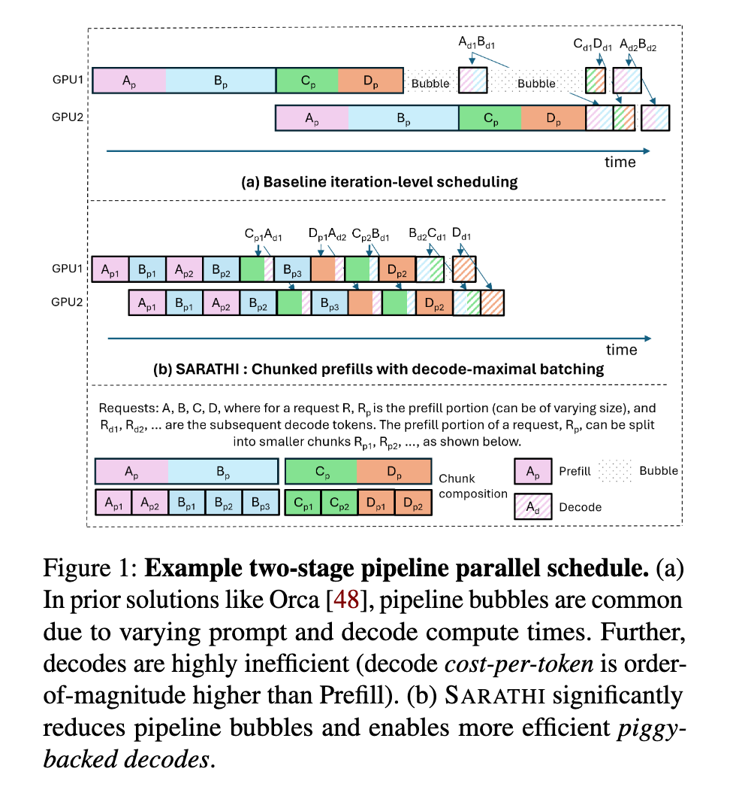

[图片来源：SARATHI: Efficient LLM Inference by Piggybacking Decodes with Chunked-Prefills](https://arxiv.org/abs/2308.16369)

在实际调度过程中，**Sarathi-Serve 会优先调度正在进行的 decode 请求**，因为每个 decode 仅消耗一个 token，且对延迟最为敏感，调度器会根据 KV cache 的容量判断是否仍可继续添加 decode 请求。随后，**系统会在剩余的 token 预算范围内处理尚未完成的 prefill 请求**，优先填满一个 prefill 请求中的 token，再继续处理下一个，在预算允许的情况下可连续处理多个 prefill 请求。**若仍有剩余 token 预算，则进一步接纳新的 prefill 请求加入当前批次**。

**系统会确保当前调度轮次中 decode 和 prefill 的 token 总数不超过预设的 chunk size。**

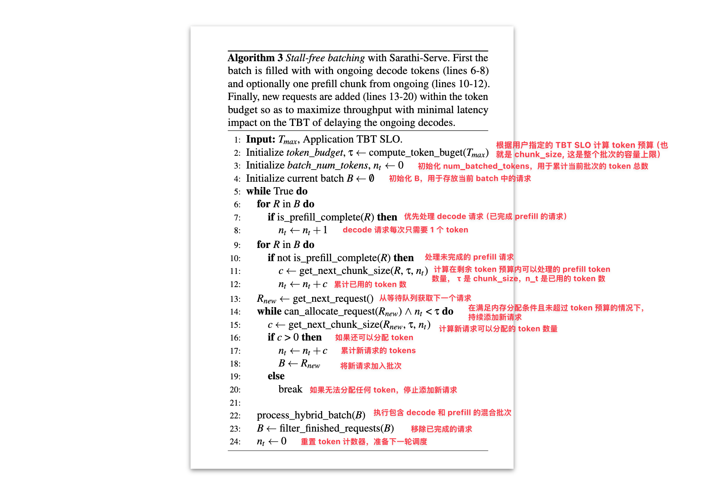

> 注：论文中提到了两个相关概念：
>
> - 一是 token budget，这个概念较为明确，用于决定每轮迭代中允许处理的最大 token 数（即 chunk size 的上限）；
> - 二是 chunk size，其使用较为模糊，有时指代 token budget，有时又表示实际 chunk 中包含的 token 数量。
>
> 在 Sarathi-Serve 的实现代码中，chunk_size 明确用于表示每轮迭代中 token 数的上限（即 token budget）。为了避免混淆，本文中所提到的 chunk size 均指 每轮迭代的 token 上限。

除了**固定的 chunk size**（默认值是 512 个 token，该值是 Sarathi 论文中基于硬件特性和性能分析实验计算出的，在单个 batch 中能够最大化 GPU 计算饱和度的 token 数量。）之外，Sarathi-Serve 还提供了**动态 chunk size **机制，这是一种渐进式的分块策略，旨在平衡首 token 延迟和整体吞吐量。该机制将长提示词的处理过程划分为多个阶段，在早期阶段使用较大的 chunk size（如 2048 个 token）来快速推进处理，减少首 token 延迟；随着处理进度的推进，逐步减小 chunk size（最终降至 256 个 token），避免长提示词的后续处理阻塞其他请求。

固定 chunk size 是包含 prefill + decode token 的总数。例如，512 token 的 batch 可能包含：2 个 decode 请求（各 1 token）+ prefill 请求 1（400 个 token）+ prefill 请求 2（110 个 token）= 512 个 token。

而动态 chunk size 对于不同阶段的 prefill 请求是不一样的，比如 chunk_sizes 列表是 [1024, 512, 256]，一个 batch 可能包含 2 个 decode 请求（各 1 个 token）+ prefill 请求 1（250 个 token，阶段 3）+ prefill 请求 2（772 个 token，阶段 1，1024-2-250=772）= 1024 个 token。

#### 2.3.1 Stall-Free Scheduling 和其他调度策略的对比

**在 Sarathi-Serve 的设计理念下，无论是 prefill 阶段还是 decode 阶段，都不会产生停滞（stall）。**从作者的观点来看，其余推理系统（如 vLLM、Orca、FasterTransformer）在调度策略上或多或少都牺牲了一方的性能以保全另一方：

**prefill 优先的调度策略（prefill-prioritized schedules）**：

-  vLLM 会优先调度尽可能多的 prefill 请求，只有在完成这些 prefill 后才恢复 decode，从而造成 decode 阶段的阻塞，导致 TBT 延迟上升。
- Orca 和 vLLM 都采用 FCFS（先来先服务）的 iteration-level batching 策略，并同样优先处理 prefill 请求。但在 batch 组成策略上有所不同：vLLM 仅支持纯 prefill 或纯 decode 的 batch，而 Orca 支持 prefill 和 decode 的混合 batch。**尽管如此，Orca 的混合 batch 在包含长 prompt 时执行时间依然较长，decode 阶段依旧受到影响，无法避免 decode 阻塞**。

**decode 优先的调度策略（decode-prioritized schedules）**：

- FasterTransformer 采用 request-level batching 策略，在当前请求的 decode 阶段全部完成之前，不会调度任何新的请求。例如在下图中，请求 C 和 D 的 prefill 将被阻塞，直到请求 A 和 B 完全退出系统。**该策略虽然可以显著降低 TBT 延迟**，但也牺牲了系统整体吞吐量。

**无阻塞（stall-free）的调度策略**：

- Sarathi-Serve 同样支持 prefill 和 decode 的并行执行，但相比 Orca，**它通过精细控制每个 batch 中 prefill token 的数量，确保 decode 几乎不受影响**。与 FasterTransformer 相比，Sarathi 的 decode 时间只略有延长（把 Sarathi-Serve 的绿色块和 FasterTransformer 的红色块相比，可以发现绿色块只长了一点），却显著提升了吞吐量，**实现了低延迟与高吞吐的兼得**。

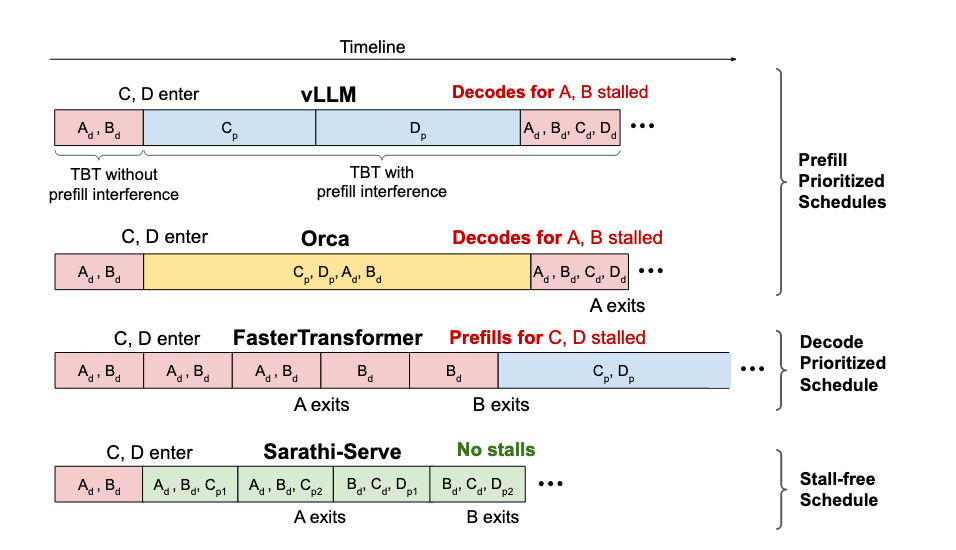

[图片来源：Taming Throughput-Latency Tradeoff in LLM Inference with Sarathi-Serve](https://arxiv.org/abs/2403.02310)

> 注：目前 vLLM 已支持 chunked-prefills 和混合 batch，以上关于 vLLM 的描述是基于论文撰写时的实现情况。

#### 2.3.2 混合 Batch 的性能提升效果

下图展示了在 A6000 GPU 上运行 LLaMA-13B 模型，不同 batch 组合方式下每个 token 的处理时间（单位：毫秒）：

- 仅包含 prompt 的请求（prompt 长度为 1024，batch 大小为 4）；
- 仅包含 decode 的请求（batch 大小为 4，序列长度为 1024）；
- 一个混合 batch，包括 1 个长度为 1021 的 prefill 请求和 3 个 decode 请求。

**结果表明，混合 batch 能将每个 token 的解码时间显著降低一个数量级，大幅提升整体推理效率；同时，prefill 阶段的耗时几乎没有变化。**

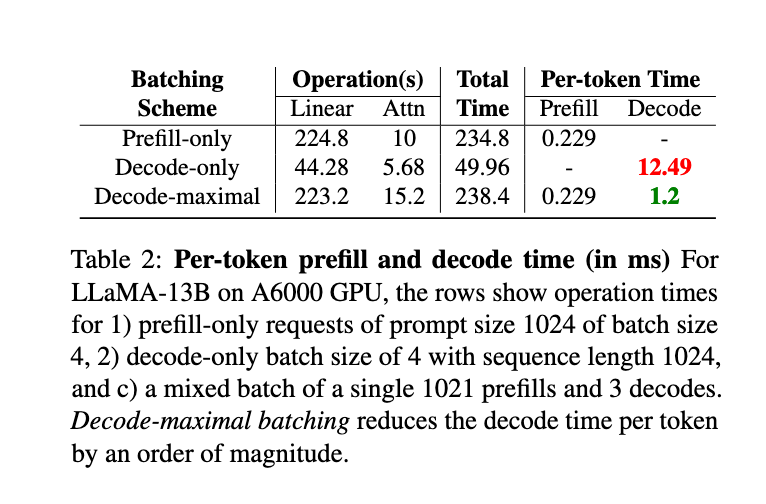

[图片来源：SARATHI: Efficient LLM Inference by Piggybacking Decodes with Chunked-Prefills](https://arxiv.org/abs/2308.16369)

#### 2.3.3 Chunked-Prefills 的开销

chunked-prefills 的开销主要来自两个方面：

- 第一，**当 chunk size 变小时，chunked-prefills 的算术强度会下降，进而降低 GPU 利用率，从而影响 prefill 阶段的效率**。下图展示了在 Yi-34B 模型中，chunking 操作对整体 prefill 时延带来的影响。如预期所示，chunk 的划分越细（例如 size 为 512），带来的开销越大；**但整体来看，开销的增长始终控制在 1.25 倍以内，属于可接受的范围**。

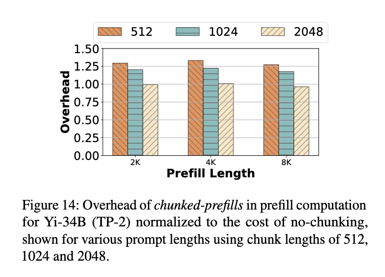

[图片来源：Taming Throughput-Latency Tradeoff in LLM Inference with Sarathi-Serve](https://arxiv.org/abs/2403.02310)

- 第二，**chunked-prefills 会对 Attention 计算造成轻微开销，因为每个 chunk 在执行 Attention 时需要重复从 GPU 内存中读取该请求之前所有 chunk 的 KV cache**。如下图所示，在 prompt 的前向传递结束前，所有 chunked-prefills 操作的 FFN 计算量是相同的，但从第二个 chunk 开始，每一个 Attention kernel 都必须重新读取之前所有 token 的 KV 对。例如，如果将一个 prefill 序列切分为 N 个 chunk，则第一个 chunk 的 KV cache 会被读取 N 次，第二个读取 N−1 次，依此类推。

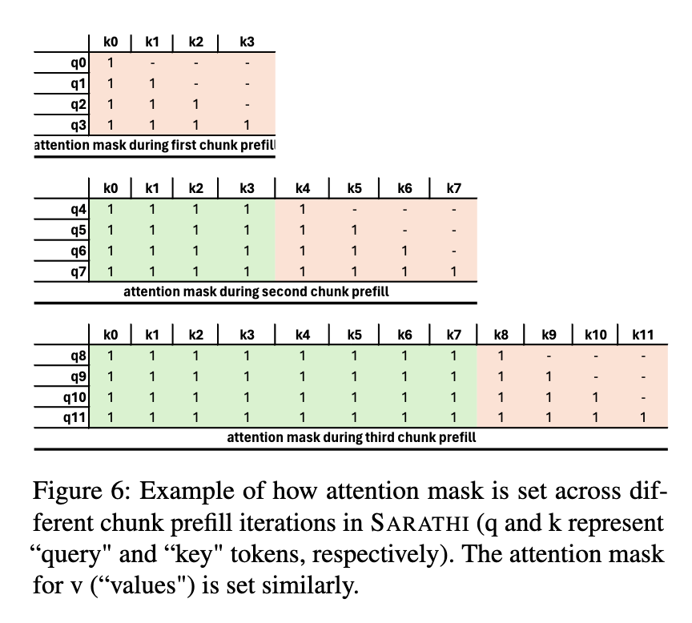

[图片来源：SARATHI: Efficient LLM Inference by Piggybacking Decodes with Chunked-Prefills](https://arxiv.org/abs/2308.16369)

尽管这种额外的 Attention 计算时间带来了一定开销，但由于 Attention 在整个前向传递中所占比例较小（如下图所示），因此它对端到端 prefill 效率的影响并不显著。

下图将 prefill 和 decode 阶段的计算时间细分为线性操作（linear）、注意力机制（Attention）以及其他部分，并展示了它们各自的耗时占比。可以看出，线性操作占据了绝大部分的执行时间。尽管 Attention 的开销会随序列长度呈平方增长，但即使在较长的序列下，**线性操作仍占据超过 80% 的总耗时**。因此，优化线性操作对于提升大模型推理效率至关重要。**而我们前面提到，像 preproj、postproj、FFN1 和 FFN2 这类线性操作，恰恰是可以通过批处理来提升效率的。**

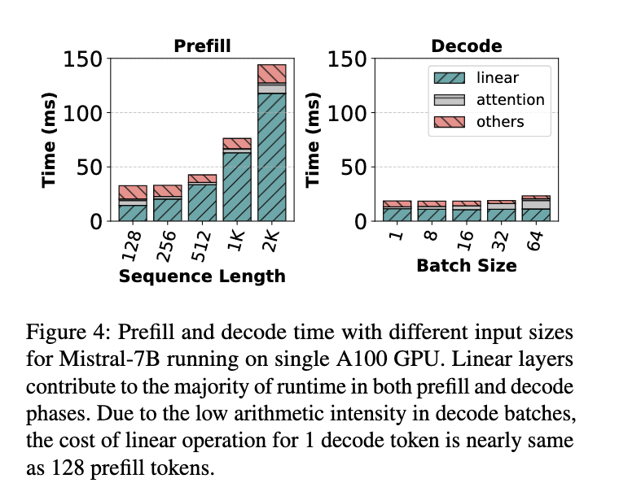

[图片来源：Taming Throughput-Latency Tradeoff in LLM Inference with Sarathi-Serve](https://arxiv.org/abs/2403.02310)

#### 2.3.4 如何确定最佳的 Chunk Size

**在延迟（TBT）目标与 prefill 开销之间寻求平衡**

较小的 chunk size 有助于减少 TBT 延迟，因为每轮 iteration 涉及的 prefill token 更少，执行速度更快。

但如果 chunk size 过小，也会带来一系列问题：

- 每个 chunk 的 Attention 操作都需重复读取此前的 KV cache，增加内存访问负担；
- 算术强度下降，GPU 利用率降低；
- kernel 启动的固定开销更频繁，影响整体效率。

**因此，在确定 chunk size 时，需要在 prefill 的计算开销与 decode 的延迟之间做出合理权衡**。可以通过一次性对不同 token 数量的 batch 进行 profiling，**找出在不违反 TBT SLO 的前提下，单个 batch 可容纳的最大 token 数**，从而设定合适的 chunk size。论文中借助工具 [Vidur](https://github.com/microsoft/vidur) 自动化完成这一过程，确保最终配置既能最大化吞吐量，又能有效控制延迟。

**避免 tile quantization 效应**

GPU 执行矩阵乘法时通常采用 tile 分块机制（例如 tile size = 128），只有当矩阵维度是 tile 的整数倍时，资源利用率才最高。

如果 chunk size 刚好超过 tile size 的倍数（例如 257），就会导致 thread blocks 内部部分线程空闲或执行无效计算，即“空转”，从而引发突发性的计算时间激增。下图展示了这一现象：**当序列长度从 256 增加到 257，仅增加 1 个 token，延迟却从 69.8ms 飙升至 92.33ms，涨幅高达 32%**。

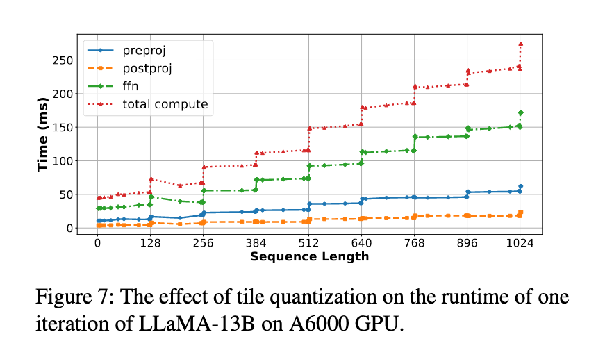

[图片来源：SARATHI: Efficient LLM Inference by Piggybacking Decodes with Chunked-Prefills](https://arxiv.org/abs/2308.16369)

当序列长度恰好是 tile size（128）的整数倍时，如 128、256、384 等，运行时间上升相对平稳；而一旦略微超过 tile 边界（例如从 256 到 257），计算时间则会急剧增加。

这是因为 GPU 的矩阵乘法是按 tile 并行执行的，如果维度不是 tile 的整数倍，部分 tile 无法充分利用，导致计算资源浪费，这就是所谓的 tile quantization overhead。

为避免这种问题，推荐的做法是：**选择合适的 chunk size，并使其与搭载（piggyback） 的 decode token 数之和是 tile size 的整数倍，从而保持矩阵维度对齐，确保计算效率最优**。

## 3 vLLM 中设置 Chunked-Prefills

在 vLLM v1 中，chunked-prefills 是默认启用的。在 vLLM 中可以通过调整 `max_num_batched_tokens` 参数来优化性能：

- 设置较小的值（例如 2048）可以提升 **token 间延迟（ITL，Inter-Token Latency， 也就是 TPOT）**，因为每轮调度中 prefill token 更少，不会拖慢 decode 的执行；
- 设置较大的值可以提升**首 token 响应时间（TTFT，Time To First Token）**，因为每轮可以处理更多的 prefill token；
- 如果追求最佳吞吐量，**建议将 `max_num_batched_tokens` 设置大于 8096**，特别是在使用小模型和大显存 GPU 的场景下。

```python
from vllm import LLM

# Set max_num_batched_tokens to tune performance
llm = LLM(model="meta-llama/Llama-3.1-8B-Instruct", max_num_batched_tokens=16384)
```

你可以使用 [benchmark_throughput.py](https://github.com/vllm-project/vllm/blob/main/benchmarks/benchmark_throughput.py) 脚本，在你的 GPU 服务器上测试不同参数组合，从而找到最优配置。

可以执行以下命令安装 vLLM 并下载测试数据集：

```bash
# 安装 uv，管理 python 虚拟环境
curl -LsSf https://astral.sh/uv/install.sh | sh
source $HOME/.local/bin/env

# 安装 GPU Driver
wget https://cn.download.nvidia.com/tesla/565.57.01/NVIDIA-Linux-x86_64-565.57.01.run
sh NVIDIA-Linux-x86_64-565.57.01.run --silent

# 安装 CUDA Toolkit（如 nvcc、include、lib64）
sudo apt update
sudo apt install -y nvidia-cuda-toolkit

# 创建 python 虚拟环境
uv venv vllm-demo --python 3.12 --seed
source vllm-demo/bin/activate

# 安装 vLLM
uv pip install vllm
# 安装 benchmark 所需依赖
uv pip install pandas datasets

# 下载测试数据集
git clone https://github.com/vllm-project/vllm.git
cd vllm/benchmark
wget https://huggingface.co/datasets/anon8231489123/ShareGPT_Vicuna_unfiltered/resolve/main/ShareGPT_V3_unfiltered_cleaned_split.json
```

`benchmark_throughput.py` 的主要参数如下：

- `--model`：指定要测试的模型。
- `--dataset`：指定测试数据集。
- `--max-model-len`：设置单个请求的最大序列长度（默认值: 使用模型配置中的值，比如 deepseek-ai/DeepSeek-R1-Distill-Llama-8B 模型中这个参数的值是 131072，这个长度至少需要 16.00 GiB 的显存用于存储 KV cache，如果 GPU 显存不够可以调小这个参数）。当输入提示长度超过该值时，vLLM 会抛出错误并拒绝处理该请求。
- `--max-num-batched-tokens`：设置单次迭代中处理的最大 token 总数（默认值: 对于启用分块预填充的情况为 2048，否则为 max(max_model_len, 2048)）。`max-num-batched-tokens` 也就是 token budget，决定了单次迭代中 chunk size 的上限，而实际的 chunk size 会根据当前批处理中的其他序列和剩余的 token budget 动态计算。
- `--num-prompts`：指定基准测试中要处理的 promt 数量。（默认值: 1000）

```bash
# vLLM v1 中默认开启 chunked-prefills，可以通过 --no-enable-chunked-prefill 参数禁用
python benchmark_throughput.py \
--backend vllm \
--model "deepseek-ai/DeepSeek-R1-Distill-Llama-8B" \
--dataset ShareGPT_V3_unfiltered_cleaned_split.json \
--max-model-len 8192 \
--max-num-batched-tokens 2048 \
--num-prompts 1000 \

# 输出结果
Throughput: 4.85 requests/s, 2007.66 total tokens/s, 962.92 output tokens/s
Total num prompt tokens:  215196
Total num output tokens:  198343
```

## 4 总结

文章介绍了大模型推理中 prefill 与 decode 阶段在资源利用上的差异所带来的调度挑战，并回顾了从 Static Batching 到 Continuous Batching 的策略演进。为解决传统静态或迭代调度中存在的资源浪费与延迟问题，Sarathi-Serve 提出了 chunked-prefills 和 stall-free scheduling 机制，通过将长 prompt 拆分为多个小块，并与 decode 请求混合调度，从而实现高吞吐与低延迟的平衡。

## 5 附录

### 5.1 推理中衡量延迟的几个术语

- **TTFT**（Time To First Token）：指从用户发出请求到模型生成第一个 token 所花费的时间，用于衡量 prefill 阶段的性能。
- **TBT**（Time Between Tokens）：指连续生成两个 token 之间所花费的时间，反映每个 token 的生成速度。
- **TPOT**（Time Per Output Token）：指所有输出 token 的平均生成时间，有时也称为 ITL（Inter-Token Latency），反映整体生成效率。

整体响应延迟可用以下公式计算：

$$
\text{Latency} = \text{TTFT} + (\text{TPOT} \times \text{生成 token 数})
$$
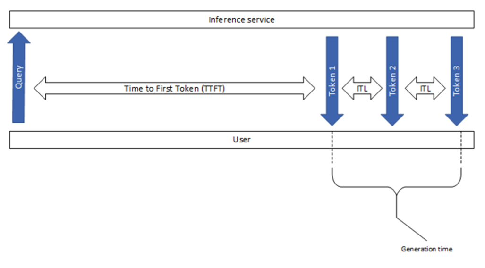

### 5.2 Batch 机制

在经典的批处理机制中，每次迭代时，Transformer 层会接收一个形状为 `[B, L, H]` 的三维输入张量，该张量是通过将一个 batch 中多个请求的 `[L, H]` 输入张量拼接而成的。其中：

- `B` 表示 batch 大小（请求数量）。
- `L` 表示每个请求中一起处理的 token 数。
- `H` 表示模型的隐藏层维度（hidden size）。


假设我们有一个 batch，里面包含 2 个请求，每个请求当前都需要处理 3 个 token，模型的 hidden size 为 10。那么这两个请求的输入张量分别是：

请求 1 的输入张量 `[3, 10]`：

```plaintext
[
  [0.1, 0.2, 0.3, 0.4, 0.5, 0.6, 0.7, 0.8, 0.9, 1.0],   ← 第 1 个 token
  [1.1, 1.2, 1.3, 1.4, 1.5, 1.6, 1.7, 1.8, 1.9, 2.0],   ← 第 2 个 token
  [2.1, 2.2, 2.3, 2.4, 2.5, 2.6, 2.7, 2.8, 2.9, 3.0]    ← 第 3 个 token
]
```

请求 2 的输入张量 `[3, 10]`：

```plaintext
[
  [0.0, 0.1, 0.0, 0.1, 0.0, 0.1, 0.0, 0.1, 0.0, 0.1],
  [0.2, 0.2, 0.2, 0.2, 0.2, 0.2, 0.2, 0.2, 0.2, 0.2],
  [0.3, 0.3, 0.3, 0.3, 0.3, 0.3, 0.3, 0.3, 0.3, 0.3]
]
```

合并后，整体输入张量为 `[2, 3, 10]`：

```plaintext
[
  [   ← 请求 1
    [0.1, 0.2, 0.3, 0.4, 0.5, 0.6, 0.7, 0.8, 0.9, 1.0],
    [1.1, 1.2, 1.3, 1.4, 1.5, 1.6, 1.7, 1.8, 1.9, 2.0],
    [2.1, 2.2, 2.3, 2.4, 2.5, 2.6, 2.7, 2.8, 2.9, 3.0]
  ],
  [   ← 请求 2
    [0.0, 0.1, 0.0, 0.1, 0.0, 0.1, 0.0, 0.1, 0.0, 0.1],
    [0.2, 0.2, 0.2, 0.2, 0.2, 0.2, 0.2, 0.2, 0.2, 0.2],
    [0.3, 0.3, 0.3, 0.3, 0.3, 0.3, 0.3, 0.3, 0.3, 0.3]
  ]
]
```

这个 `[B=2, L=3, H=10]` 的张量就可以作为 Transformer 一层的输入参与批处理计算。

### 5.3 张量并行和流水线并行

随着大语言模型（LLM）规模不断扩大，推理时必须跨多张 GPU 或多节点部署。为了解决单张 GPU 显存不足、单节点容量受限的问题，**模型并行（Model Parallelism）** 成为必要手段。而流水线并行（PP）是当前跨节点部署模型的主流方式，其核心优势是通信开销小、扩展性好。

在模型并行的常见方式中：

- **张量并行（Tensor Parallelism，TP）** 将每一层的权重切分到多个 GPU 上，各 GPU 协同完成每一层的计算，KV cache 也被均匀分配。但这种方式每层都需要执行两次 All Reduce 操作（Attention 和 FFN 各一次），通信量大、延迟高，只适合在同节点内、如 NVLink 连接的高带宽环境下使用。

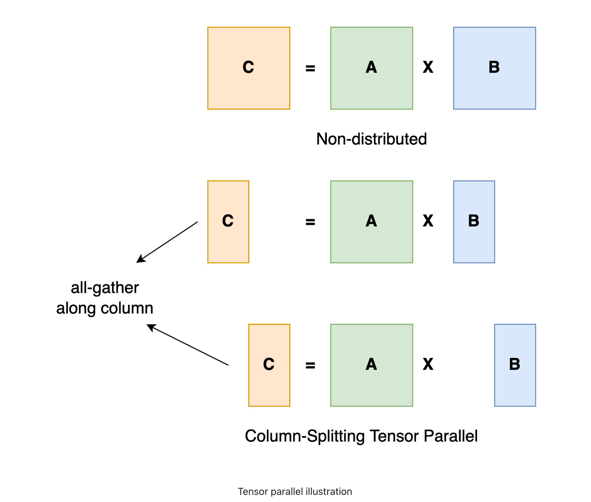

- **流水线并行（Pipeline Parallelism，PP）** 则将整个模型按层切分，每个 GPU 负责一部分连续的层，多个 micro-batch 像“流水线”一样依次通过每个 GPU。相较 TP，PP 只需要在层与层之间做一次激活值的通信，通信开销更小，尤其适合集群间带宽有限的环境。PP 的另一个优势是能释放部分 GPU 显存，支持更大的 batch size，从而提升 decode 阶段的吞吐效率。

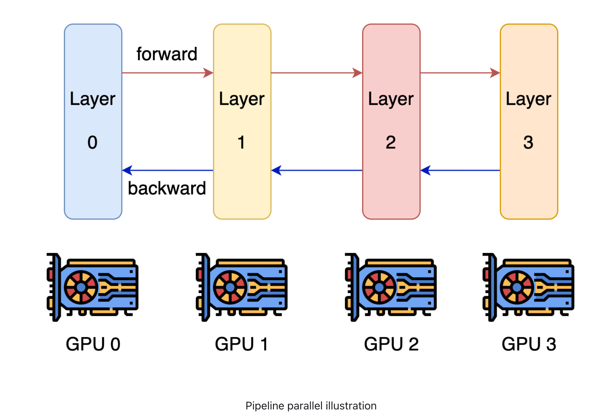

因此，在缺乏高速互联（如 NVLink）的跨节点部署中，PP 是唯一可行且高效的模型并行方式，能将每节点的最大 batch size 提高 2–3 倍，大幅增强推理吞吐。

### 5.4 micro-batch 微批

**micro-batch（微批）** 是将一个完整的 batch 拆分成多个更小的子批次，用于提升硬件资源利用率，尤其在**流水线并行（Pipeline Parallelism）** 中非常常见。

当大模型被划分为多个阶段并分布在不同 GPU 上时，如果直接处理整个 batch，会导致部分 GPU 处于空闲等待状态。为了解决这个问题，我们将 batch 拆分成多个 micro-batch，并让它们像“流水线”一样在各阶段依次推进。这样，每个阶段的 GPU 都可以同时处理不同的 micro-batch，大幅提高并行度和吞吐量，减少资源浪费。

举个例子，如果一个 batch 有 64 个样本，可以被拆成 8 个 micro-batch，每个包含 8 个样本，在模型各阶段中交错处理，从而避免 GPU 空转，提高执行效率。每个阶段表示模型中一部分连续的层，由一个 GPU 负责计算。例如，在一个 12 层的 Transformer 模型中，若使用 4 个 GPU，则每个阶段可能包含 3 层。

## 6 参考资料

- 图解大模型计算加速系列：分离式推理架构2，模糊分离与合并边界的Chunked-Prefills：https://zhuanlan.zhihu.com/p/710165390
- 大模型推理核心技术之Continuous Batching和我的WXG往事：https://zhuanlan.zhihu.com/p/676109470
- How continuous batching enables 23x throughput in LLM inference while reducing p50 latency：https://www.anyscale.com/blog/continuous-batching-llm-inference
- vllm调度笔记：chunked prefill调度策略：https://zhuanlan.zhihu.com/p/711209924
- vLLM调度器解密（下）：chunked prefill是如何进一步优化的？：https://zhuanlan.zhihu.com/p/6144374775
- vLLM Optimization and Tuning：https://docs.vllm.ai/en/latest/configuration/optimization.html
- [EXTERNAL] OSS Chunked Prefill Evaluation：https://docs.google.com/document/d/1W6t6wouQKgl1QivS7gbkkY5xtR9Q6wvXbmOL-1onMmk/edit?tab=t.0#heading=h.8um4c511b0b0
- [RFC] Upstream Chunked Prefill：https://github.com/vllm-project/vllm/issues/3130
- NVIDIA NIM LLMs Benchmarking：https://docs.nvidia.com/nim/benchmarking/llm/latest/metrics.html#inter-token-latency-itl
- Matrix-vector and Matrix-matrix Multiplication：https://www.youtube.com/watch?v=7CBkZq3eQ_0
- Paradigms of Parallelism：https://colossalai.org/docs/concepts/paradigms_of_parallelism

## 欢迎关注

