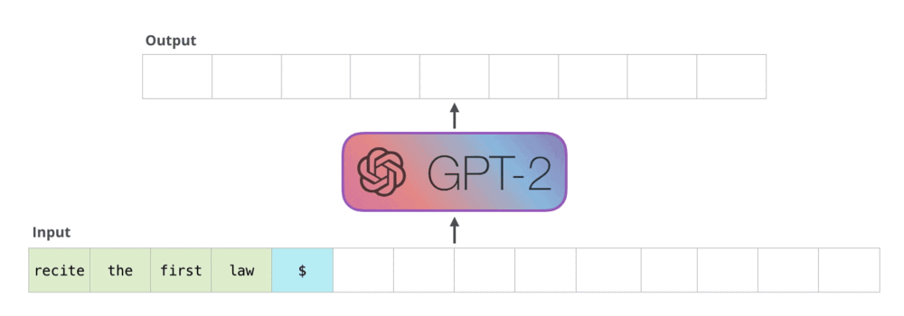
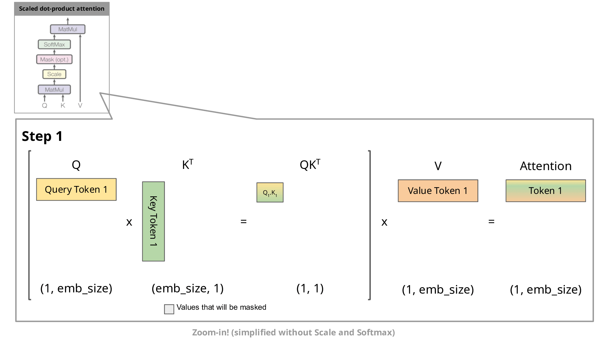
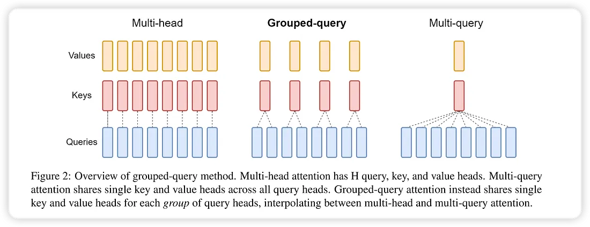
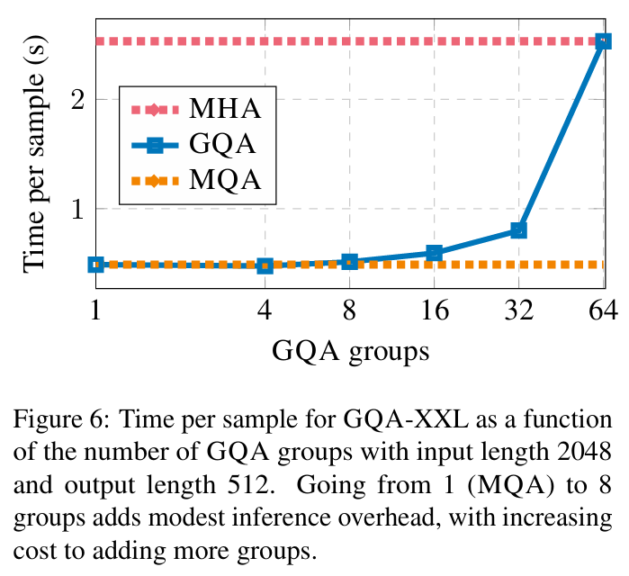

前置知识：[《机器学习中的Attention机制》](./Attention.md) [《Transformer结构》](./transformer.md) [《什么是BERT？》](./BERT.md)

KV Cache 是针对 Transformer 中 Decoder 组件的 masked self-attention 模块推理过程进行性能优化的一个常用技术，该技术以增加显存占用为代价提高 masked self-attention 推理性能，且不影响其计算精度，多用于 decoder-only 的大模型。

## 复习：masked self-attention 计算

Transformer 架构中的 decoder 运行流程：接收一串 token 输入，输出一个 token，输出的 token 会与输入 token 拼接在一起，然后作为下一次推理的输入，不断反复直到遇到终止符。

当今的大语言模型通常都是 decoder-only，没有 encoder：

而在 decoder 中，主要的性能瓶颈为 masked self-attention 模块的计算。

在[《Transformer结构》](./transformer.md)中，我们已推导出每次新增一个 token 后，输出矩阵中只需要计算一个新增行$MaskedAttention(Q_{1:t},K_{1:t},V_{1:t})_t$即可，其计算公式为：

$$MaskedAttention(Q_{1:t},K_{1:t},V_{1:t})_t=\sum_{i=1}^tsoftmax\left(\left[\frac{Q_tK^{\top}_1}{\sqrt{d_k}},\frac{Q_tK^{\top}_2}{\sqrt{d_k}},\cdots,\frac{Q_tK^{\top}_t}{\sqrt{d_k}}\right]\right)_iV_i\tag{1}$$

而[《机器学习中的Attention机制》](./Attention.md)中我们也分析了 self-attention 中的$K$、$Q$、$V$来源，即由输入的词向量$s_i$乘上3个矩阵$W^Q$、$W^K$、$W^V$得来：
$$
\begin{aligned}
Q_i=s_iW^Q\\
K_i=s_iW^K\\
V_i=s_iW^V\\
\end{aligned}
$$

## KV Cache 在 Cache 什么？

从公式$(1)$中可以看出，计算这个新增行需要之前的所有$K_i,V_i$，但是只需要最新的$Q_t$，所以直接就能理解 KV Cache 在干嘛：保存之前的所有$K_i,V_i$，避免每次都要重新计算$K_i=s_iW^K$和$V_i=s_iW^V$。

在没有KV Cache的情况下，每新增一个单词都需要花费$O(n)$计算之前的所有 token 的$K,V$，再花费$O(n)$计算新增行$MaskedAttention(Q,K,V)_i$；而有了KV Cache之后，虽然内存占用的增长随 token 数量增长呈$O(n)$线性增加，但每新增一个 token 就只需要花费$O(1)$计算这个最新 token 对应的$K_i,V_i$即可，再花费$O(n)$计算$MaskedAttention(Q,K,V)_i$。这样用空间的$O(n)$为代价换走了一个$O(n)$的计算过程，还是很划算的。

## KV Cache 的内存占用优化

那有了 KV Cache 用$O(n)$的内存占用增长换走了$O(n)$的计算复杂度，那之后的优化就都是围绕着内存占用来的了。

### 主要优化对象：多头注意力 MHA (Multi-Head Attention)

目前 KV Cache 内存占用的主要优化点都是针对 Multi-Head Attention 的。

多头注意力是 Transformer 中的标准 Attention 形式。在数学上，多头注意力 MHA 就是多个独立的单头注意力的拼接，也就是多个独立的$Attention(Q,K,V)$模块，每个模块都有自己的$W^Q$、$W^K$、$W^V$，分别独立训练独立推理，然后拼接输出。
这样，每个 Head 的 $Q,K,V$ 都不一样，所有都得有自己的一份 KV Cache，内存占用很高。

于是，这里最简单直接的优化思想是让多个 Head 共用同一份 KV Cache，也即每个 Head 有自己的$W^Q$，但 $W^K$、$W^V$ 和其他 Head 共用。

### MQA (Multi-Query Attention)

Multi-Query Attention，2019年由 Google 在论文 [Fast Transformer Decoding: One Write-Head is All You Need](https://arxiv.org/abs/1911.02150) 中提出。

MQA 的思路很简单，直接让所有 h 个 Attention Head 共享同一套 $K,V$，直接将 KV Cache 减少到了原来的 1/h。

使用 MQA 的模型包括 PaLM、StarCoder、Gemini 等。

### GQA (Grouped-Query Attention)

也有人担心 MQA 对 KV Cache 的压缩太严重，以至于会影响模型的学习效率以及最终效果。为此，一个 MHA 与 MQA 之间的过渡版本 GQA（Grouped-Query Attention）应运而生，出自 2023 年 Google 的论文 [GQA: Training Generalized Multi-Query Transformer Models from Multi-Head Checkpoints](https://arxiv.org/abs/2305.13245)。

GQA 的方法也很简单，它就是将所有 h 个 Head 分为 g 个组，每组共享同一套 $K,V$。
当 g=h 时就是原始 MHA、g=1时就是 MQA。
当 1 < g < h 时，它只将 KV Cache 压缩到 g/h，压缩率不如 MQA，但同时也提供了更大的自由度，效果上更有保证。

GQA 的模型包括 LLAMA2-70B，以及 LLAMA3 全系列，此外使用 GQA 的模型还有 TigerBot、DeepSeek-V1、StarCoder2、Yi、ChatGLM2、ChatGLM3、Qwen2 等，相比使用 MQA 的模型更多。

其效果也介于原始 MHA 和 MQA 之间：

## KV Cache 的计算性能优化

除了内存占用，KV Cache 当然还有性能层面的优化。作为一种 Cache，最重要的性能指标当然是访存性能，要低延迟与高吞吐，也是让各种古老的内存优化技巧焕发第二春。

继续学习性能优化：[《Chunked-Prefills 分块预填充机制详解》](./ChunkedPrefill.md)
