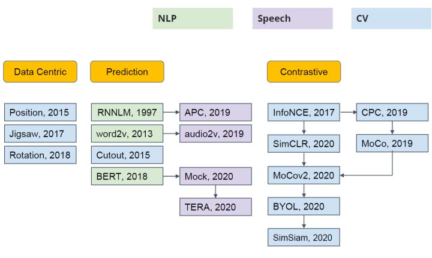
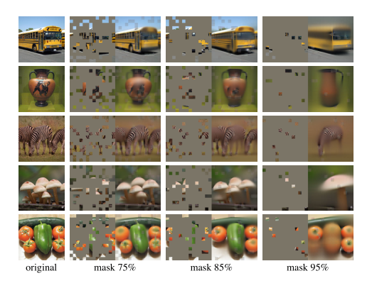
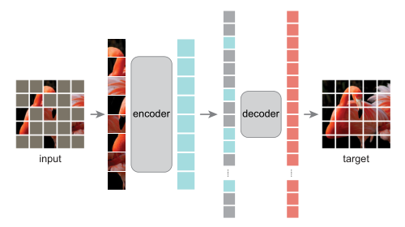
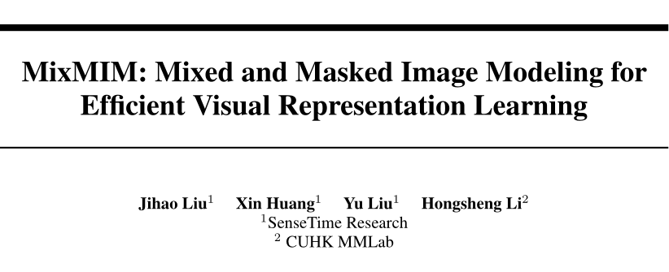
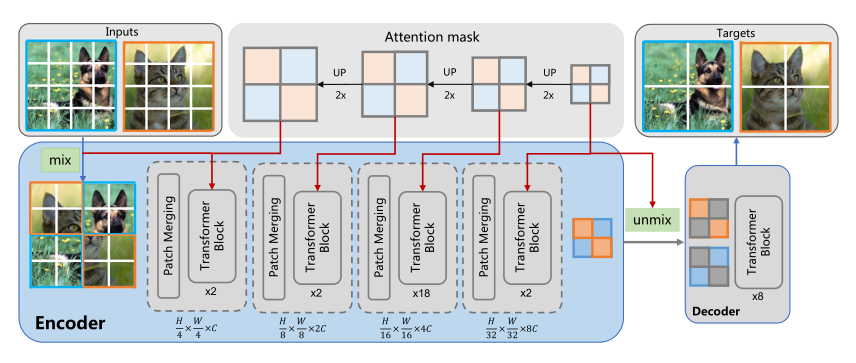
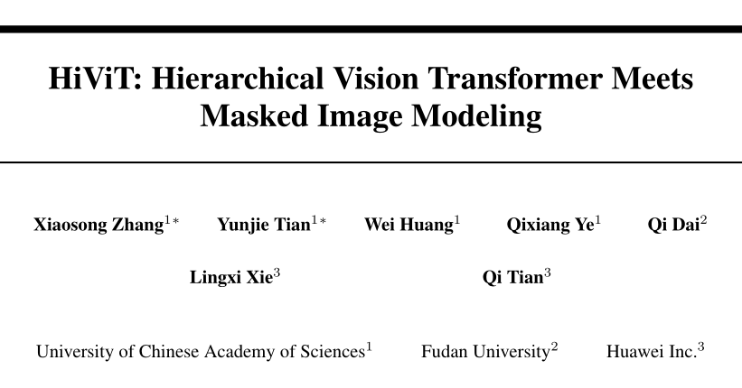
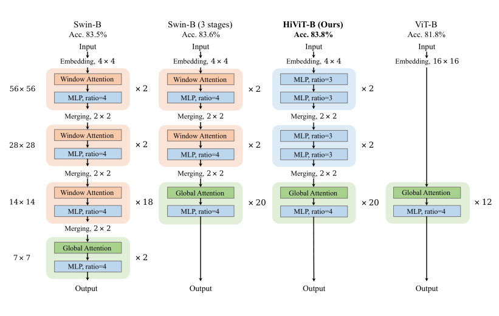
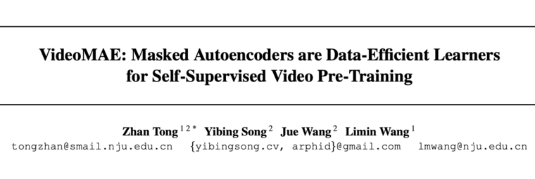
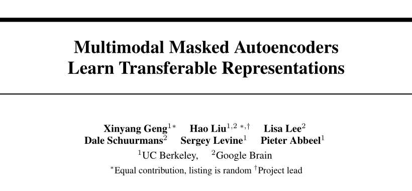

[原文](https://mp.weixin.qq.com/s/cKVQmGnrRan6k1rBv4riGA)

**©PaperWeekly 原创 · 作者 | **Jason

**研究方向 |**计算机视觉

## 写在前面

自去年 11 月份恺明大神提出 MAE 来，大家都被 MAE 简单的实现、极高的效率和惊艳的性能所吸引。近几个月，大家也纷纷 follow 恺明的工作，在 MAE 进行改进（如将 MAE 用到层次 Transformer 结构）或将 MAE 应用于图片之外的数据（如视频、多模态）。在本文中，我们将介绍关于 MAE 的一些先验知识，以及最近基于 MAE 所做的最新工作！

## 先验知识

### 2.1 自监督学习
 

在深度学习模型中，数据通常会通过 Backbone 来提取特征，常见的 Backbone 包括 ResNet、ResNeXt 和 Transformer 等。Backbone 之所有能够提取出对任务有用的特征，是因为它通常已经在带标签的大数据集（如 ImageNet）中已经进行训练。然而，人工进行标注数据是昂贵和费时的，如何在没有标注数据的情况下获得一个 strong 的 Backbone 是一个非常重要的问题。

自监督学习（Self-supervised learning）可以解决这个问题，它的目标是基于无标注的数据，设计辅助任务来将数据本身的某一部分的信息作为监督信号，从而基于这个监督信号来训练模型。基于这些无标签的数据，可以学习到一个模型，这个过程可以称为 **预训练（pre-train）**。

由于这个预训练之后的模型已经具备一定的知识，因此在进行具体的下游任务时，可以将它作为 Backbone 的初始化，进行下游任务的训练，这个过程成为 **微调（fine-tuning）**。由于模型在预训练阶段已经学习到了一定的知识，因此就可以大大减少微调阶段所需的数据集和训练时间。由于预训练阶段的数据是无需标注的，因此也就大大减少的标注数据的成本。

根据自监督训练阶段的辅助任务不同，可以大致将目前的自监督学习工作分为三类： **Data Centric, Prediction**和 **Contrastive**（如下所示）。由于本文介绍的 MAE 的辅助任务为预测 Mask 部分的图像内容，因此属于 **Prediction**这一类别。

### 2.2. MAE（Masked Autoencoders）

**论文标题：**

Masked Autoencoders Are Scalable Vision Learners

**论文地址：**

https://arxiv.org/abs/2111.06377

**代码地址：**

https://github.com/facebookresearch/mae

**论文动机：**

随着 BERT 的出现，Mask Language Modeling（MLM）的自监督学习方法逐渐进入人们的视野，这一方法在 NLP 领域中得到了广泛的应用。受到 MLM 的启发，一些工作也尝试在图像上进行 Mask Modeling（即，mask 图片的部分区域，然后对区域的内容进行重建），并且也取得了不错的效果。但目前的方法通常都采用对称的 encoder 和 decoder 结构，在 encoder 中，mask token 也需要消耗大量的计算，因此作者提出了一个非对称 encoder-decoder 的结构——masked autoencoders（MAE）。

MAE 方法很简单：mask 输入图像的随机 patch，并重建缺失的像素（上图展示了不同 mask 比率的重建结果）。它基于两个核心设计。首先，作者开发了一种非对称编码器-解码器结构，其中的编码器仅对可见的 patch 子集（不带 mask token）进行操作，而轻量级解码器则从潜在表示和 mask token 重建原始图像。其次，作者发现对输入图像的高比例（例如 75%）进行 mask 会产生一项困难且有意义的自监督任务。将这两种设计结合起来，能够高效地训练大型模型：加快训练速度（3 倍或更多）并提高精度。

**方法介绍：**

MAE 的结构如上图所示，与所有自动编码器一样，MAE 有一个编码器，将观察到的信号映射到潜在表示，还有一个解码器，从潜在表示重建原始信号。与经典的自动编码器不同，作者采用了一种非对称设计，允许编码器仅对部分观察信号（无mask token）进行操作，并采用一种轻量级解码器，从潜在表示和 mask token 重建完整信号。

具体来说，作者首先将图像划分为规则的非重叠 patch。然后，对一个子集的 patch 进行采样，并移除其余的 patch。然后将这些剩余的 patch 送入到编码器中，编码器是一个标准的 ViT 结构，由于编码器只处理很少一部分的 patch，因此可以用很少的计算和显存来训练非常大的编码器。编码器输出 token 后，作者在 mask 的位置加入了可学习的向量，组成完整的全套 token。

此外，作者向这个完整集合中的所有 token 添加位置嵌入；如果没有这一点，mask token 将没有关于其在图像中位置的信息。MAE 解码器仅在预训练期间用于执行图像重建任务（仅编码器用于生成用于识别的图像表示）。因此，可以以独立于编码器设计的方式灵活地设计解码器架构。作者用比编码器更窄、更浅的解码器进行实验。使用这种非对称设计，全套 token 仅由轻量级解码器处理，这大大减少了预训练时间。

## 工作介绍

### 3.1 图像MAE
 

**3.1.1 MixMIM**

**论文标题：**

MixMIM: Mixed and Masked Image Modeling for Efficient Visual Representation Learning

**论文地址：**

https://arxiv.org/abs/2205.13137

**论文动机：**

现有 MIM 方法通常使用特殊符号 [MASK] 替换部分输入 token，并旨在恢复原始图像块。然而，使用 [MASK] 符号会导致两个问题。一方面，预训练中使用的 [MASK] 符号从未出现在微调阶段，导致预训练微调不一致。另一方面，预训练网络在处理非信息性 [MASK] 符号时浪费了大量计算，使得预训练效率低下。当使用较大的掩蔽比时，这些问题变得更加严重。

虽然 MAE 不存在上述问题，因为它丢弃了 mask token，并且只在轻量级解码器中使用了 [MASK] 符号。此外，目前 MAE 只适用于标准的 ViT 架构，如何使用 MAE 有效地预训练具有局部域操作的层次 ViT 架构，例如 Swin Transformer，仍然是一个问题。

**方法介绍：**

为了解决上面的问题，作者提出了 MixMIM，该结构吸收了 BEiT 和 MAE 的优点。如上图所示，给定训练集中的两幅随机图像，MixMIM 创建了一幅以随机混合 mask 为输入的混合图像，并训练一个层次 ViT 来重建两幅原始图像以学习视觉表示。

由于作者在 encoder 中没有采用 mask token，因此大大缩短了预训练和微调之间的 gap，也消除了处理 mask token 所需要的时间，提高了计算效率。编码器在进行 attention 计算时，作者用了 attention mask，阻断了跨图片 token 之间的交互。在解码阶段，作者通过 attention mask 分别去除图像的 token，并进行图像重建。

**3.1.2 Uniform Masking**

**论文标题：**

Uniform Masking: Enabling MAE Pre-training for Pyramid-based Vision Transformers with Locality

**论文地址：**

https://arxiv.org/abs/2205.10063

**代码地址：**

https://github.com/implus/UM-MAE

**论文动机：**

MAE 中最有影响力的设计之一是非对称编码器-解码器体系结构。与接收整个 patch token 序列的解码器部分不同，编码器部分仅将可见图像 patch（通常仅占总 patch 的 25%）作为输入。有趣的是，这种设计不仅显著降低了预训练的复杂性，而且还获得了优异的微调性能。

然而，非对称结构的成功应用依赖于 Vanilla Vision Transformer（ViT）的“全局”特性，其自注意机制可以对离散图像块的任意子集进行推理。虽然目前金字塔结构的 ViT 通过引入局部窗口操作，取得了非常好的结果，但 MAE 并不能在金字塔结构的 ViT 上进行应用。

因为每个局部窗口中可见元素的数量通常不相等，这妨碍了基于窗口的操作的有效并行计算。为了成功地对具有局部性的基于金字塔的 VIT 进行 MAE 预训练（即采用有效的不对称结构），作者提出了包含均匀采样（US）和二次掩蔽（SM）步骤的 Uniform Masking（UM）策略。

**方法介绍：**

本文的 Uniform Masking（UM）策略如上图所示，主要分为两个步骤：第一步为均匀采样（US），使用均匀约束对 25% 的可见图像 patch 进行采样，这样，每个窗口将会留下 25% 的 token。与 MAE 中采用的随机采样相比，均匀采样（US）对均匀分布在 2D 空间上的图像块进行采样，使其与具有代表性的基于金字塔的 VIT 兼容。然而，通过相邻的低级别图像统计信息为像素重建提供更简单的方式，US 潜在地降低自监督任务的挑战性。

这已经在 MAE 中得到证明。为了解决这一问题，作者进一步提出了二次掩蔽（SM）策略，该策略为在第一步均匀采样后的特征图上进行随机 mask。与完全丢弃 mask token 的均匀采样阶段不同，SM 通过使用共享 mask token 来保持 mask patch，以确保基于金字塔的 VIT 与位置的兼容性。通过随机 mask token，大大提高了自监督任务的难度，从而提供了更好的自监督效果。

**3.1.3 HiViT**

**论文标题：**

HiViT: Hierarchical Vision Transformer Meets Masked Image Modeling

**论文地址：**

https://arxiv.org/abs/2205.14949

**论文动机：**

最近，掩蔽图像建模（MIM）为视觉 Transformer 的自监督预训练提供了一种新的方法。高效实现的一个关键思想是在整个目标网络（编码器）中丢弃掩蔽图像 patch（或 token），这要求编码器是普通视觉 Transformer（例如 ViT）。但是分层视觉 Transformer（例如 Swin Transformer）在形成视觉输入方面具有潜在更好的特性。在本文中，作者将分层视觉 Transformer 的操作分成了三种类型：“单元内操作”、“全局单元间操作”和“局部单元间操作”。

标准 Transformer 包含其中的两种操作：单元内操作”（即 patch embedding、LayerNorm、MLP）和“全局单元内操作”（即全局自注意力）。因此可以丢弃单元的空间坐标，并且可以将单元序列化以进行高效计算。但是层次视觉 Transformer 还包括局部单元间操作（如，shifting-window self-attentions, patch merging），这需要基于单元的空间坐标进行额外判断，并妨碍序列化以及移除 mask 单元。

**方法介绍：**

作者观察到，“局部单元间操作”对识别性能的贡献不大——真正有意义的是层次设计（即多尺度特征图）。因此，为了使分层视觉 Transformer 能够适合 MAE 的训练，作者删除了“局部单元间操作”，从而形成了一个简单的分层视觉 Transformer。在层次视觉 Transformer 中，通常有四个不同分辨率的阶段，其中第三阶段的层数最多，称之为主阶段。作者移除了 Swin Transformer 的最后一个阶段，并去掉了所有局部单元间窗口注意力，只在主阶段保留 token 之间的全局注意力。

在实现中，作者将最后一个阶段合并到主阶段，以保持模型的 FLOPs 不变。早期阶段的局部窗口注意力被具有相同 FLOPs 的 MLP 所取代。通过这些修改，作者删除了层次视觉 Transformer 中所有冗余的“局部单元间操作”。本文提出的 HiViT 结构如上图所示。由于去除了局部窗口的操作，HiViT 就能够进行 MAE 的预训练。

### 3.2. 视频MAE
 

**VideoMAE**

**论文标题：**

VideoMAE: Masked Autoencoders are Data-Efficient Learners for Self-Supervised Video Pre-Training

**论文地址：**

https://arxiv.org/abs/2203.12602

**代码地址：**

https://github.com/MCG-NJU/VideoMAE

**论文动机：**

随着 Mask Modeling 在图像和文本数据上的成功，一些研究人员也开始在视频数据上进行 MAE 的自监督预训练。本文的大致策略和图片 MAE 类似，但是作者通过将 MAE 运用在视频数据上得到了几个重要的发现：1）极高的掩蔽率（即 90%-95%）仍然可以产生良好的 VideoMAE 性能。2） VideoMAE 在非常小的数据集上取得了非常好的结果，而无需使用任何额外数据。3） 在 VideoMAE 中，数据质量比数据量更重要。

**方法介绍：**

在本文中，作者提出了一种新的自监督视频预训练方法——VideoMAE，其 Pipeline 如上图所示。相比于图片 MAE，视频 MAE 在时间维度上可能存在更高的冗余，由于视频的语义在时间维度上变化缓慢，相邻帧的内容通常非常相似，因此如果不采用特殊的 mask 策略，模型可能很容易从相邻帧学到重建的知识，降低了自监督训练任务的难度。

因此，对于时间冗余，作者采用了非常高的 mask ratio 从视频中删除时间立方体。由于采用了非对称的编码器-解码器结构，极高的 mask ratio 也大大降低了预训练的计算成本。此外，为了考虑时间的相关性，作者采用了 tube masking strategy，以减少重建过程中的信息泄露风险。

### 3.3 多模态MAE

**论文标题：**

Multimodal Masked Autoencoders Learn Transferable Representations

**论文地址：**

https://arxiv.org/abs/2205.14204

**论文动机：**

目前多模态数据的自监督学习主要是基于对比学习的方法，如 CLIP。但是对比学习方法会根据使用的数据增加引入抽样偏差，这会降低下游任务的性能。此外，这些方法仅限于成对的图像文本数据，无法利用广泛可用的未成对数据。随着 Mask Modeling 在 CV 和 NLP 领域的广泛应用，作者尝试在多模态数据上进行 Mask Modeling 来自监督学习，进而提出了多模态掩蔽自动编码器（M3AE），它通过 mask token 预测来学习视觉和语言数据的统一编码器。

**方法介绍：**

本文提出的 M3AE 结构如上图所示。M3AE 的第一步是将语言和图像组合为一个序列，对于文本，作者将其转换为了一系列离散 token；对于图像，作者和 ViT 一样将其转换为了一系列 patch token。然后，作者从均匀分布中采样了 s 个随机子集，并移除其他子集。

作者对文本 token 和图像 token 都应用了高掩蔽率，以消除信息冗余，并使任务变得非常困难，无法通过从可见的相邻 token 进行外推轻松解决。

与 MAE 一样，M3A

E 由编码器和解码器组成，编码器只接受未掩蔽语言 token 和图像 token 作为输入。

两个模态都加了相应的位置编码。

此外，为了区分模态，作者还添加了模态特定的嵌入。

可学习的 CLS 嵌入被预先设置到序列的开头。

然后，通过编码器中一系列 Transformer 块对组合语言和图像嵌入进行处理，以获得最终的编码表示。将一系列可学习的 token 加入到编码器的输出中，得到完整的 token 集合，并向完整的 token 集合中添加位置嵌入。完成的 token 集合通过解码器处理之后，作者采用了两个线性投影输出头来计算重建，从而进行自监督任务。

## 总结

目前，自监督学习是深度学习领域中一个重要的研究话题，它能来挖掘数据自身的表征特性作为监督信息，来提升模型的特征提取能力，大大降低模型对于标注数据的依赖性，因此减少了数据标注的成本以及人工标注数据引入的偏置。MAE 属于自监督学习方法的一种，由于其非对称的编码器-解码器结构，大大提升了模型的训练效率，这一工作也启发了后续大量基于 mask modeling 的科研工作，是一项里程碑式的工作。
