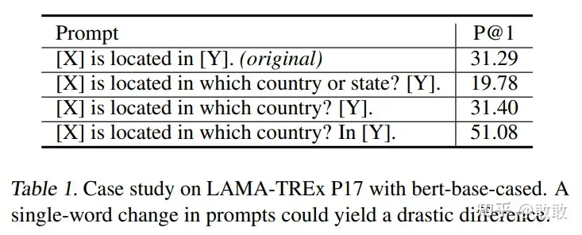
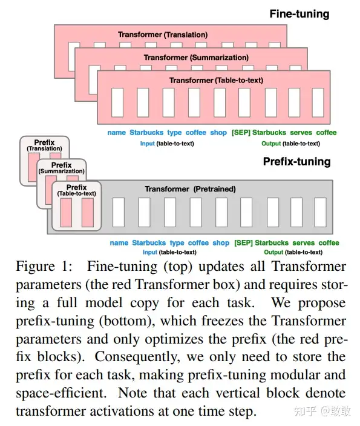
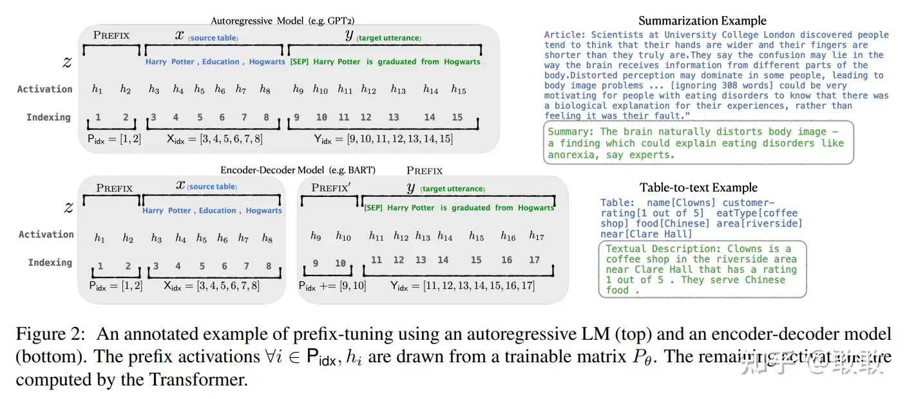

[原文在此](https://zhuanlan.zhihu.com/p/667381749)

## Discrete Prompt / Hard Prompt / Prompt Engineering

Discrete Prompt是一个实际的文本字符串，由人类编写，所以又称Hard Prompt。
编写Hard Prompt的过程又称Prompt Engineering。

编写Hard prompt一般需要作者在这个域上有比较多的经验，并且使用前需要知道这个模型的底层是什么样的。否则，写出来的Hard prompt的性能一般会比Fine-tuning的SOTA差很多。

根据2021年的两份研究，Hard Prompt有两个性质：
* 人类认为不错的Hard Prompt对于语言模型来说不一定是一个好的Hard Prompt，这个性质被称为Hard Prompt的sub-optimal（次优性）。且神经网络是连续的，Discrete Prompt无法达到最优。
* Hard Prompt的选择对下游任务的性能影响较大（如下图所示），效果甚至会因为单个单词改动发生巨大变化。

## Continuous Prompt / Soft Prompt

依靠人类写Prompt很显然是不行的。2020年，Soft Prompt被提出，将自然语言提示，替换为可训练的连续可微的提示嵌入(continuous prompt embeddings)，把Prompt的生成本身作为一个任务进行学习，相当于把Prompt的生成从人类一个一个尝试（离散）变换成机器自己进行学习（连续），减小了prompt挖掘、选择的成本。

由于prompt构造的目的是找到一种方法，使语言模型能够有效地执行任务，而不是供人类使用，因此没有必要将prompt限制为人类可解释的自然语言。soft prompt可以直接在模型的嵌入空间中执行提示。具体来说，**soft prompt放弃了“模板由自然语言构成”这一要求**。相反，prompt有自己的参数，这些参数可以根据下游任务的训练数据进行调优。即prompt本身是连续的向量而不是离散的词句。

## 针对文本生成的Soft Prompt

### Prefix-tuning

论文：[Prefix-Tuning: Optimizing Continuous Prompts for Generation](https://arxiv.org/abs/2101.00190)（2021.1）

如图所示，大概思路就是在输入句子的embedding序列前面加两个可训练的prefix embedding，然后冻结模型其他部分训练这个prefix embedding。对于T5类的encoder-decoder模型上，为编码器和编码器都添加prefix embedding：

注意，Prefix并非只添加在输入的部分，而是每一层都有对应的Prefix加在其输出的中间数据中输给下一层。
此外，作者还发现直接训练Prefix embedding不稳定，所以用一个MLP将一个较小的矩阵映射为各层的Prefix embedding：

prefix-tuning的主要贡献是提出任务特定的可训练的前缀，这样直接为不同任务保存不同的前缀即可。因此实现上只需要存储一个大型transformer模型和多个学习的任务特定的prefix参数。在实际使用时，挑选任务相关的Prefix和Transformer进行组装，实现可插拔式的应用。而且基于prefix的结构使得我们可以在一个batch里处理多个任务的样本。

### prompt tuning

论文：[The Power of Scale for Parameter-Efficient Prompt Tuning](https://arxiv.org/abs/2104.08691)（2021.9）

2021年，Lester B等人在prefix-tuning的基础上进行简化，提出 prompt tuning——一个简单但有效的学习soft prompt的机制。仅在input text的前面添加任务特定的prompt tokens，采用与目标任务相关的token对其进行初始化。

## 针对文本理解的Soft Prompt

### p-tuning v1

论文：[GPT Understands, Too](https://arxiv.org/abs/2103.10385)（2021.3）

很长一段时间，GPT风格的模型在NLU上的表现很差，所以认为其天然不适合NLU任务。如这篇清华文章的题目“GPT Understands, Too”，代表着它的表现想颠覆一直以来“GPT只能做生成，不能做理解”的结论。

相比Prefix Tuning，P-Tuning加入的可微的virtual token，但仅限于embedding层，没有在每一层都加；另外，virtual token的位置也不一定是前缀，插入的位置是可选的。

### p-tuning v2

论文：[P-Tuning v2: Prompt Tuning Can Be Comparable to Finetuning Universally Across Scales and Tasks](https://arxiv.org/abs/2110.07602)（2022.3）

在NLU任务中，prompt tuning和p-tuning v1在中小模型上表现不佳（规模不通用），且在比较难的序列标注任务上效果很差（任务不通用）。

P-Tuning v2并不是一个全新的方法，其实际上是将文本生成的prefix-tuning技术适配到NLU任务中，即把p-tuning v1里的仅限于embedding层的prefix改成了prompt tuning里的每一层都有的prefix：

如下图所示（黄色部分表示可训练的参数，蓝色表示被冻结的参数）：

