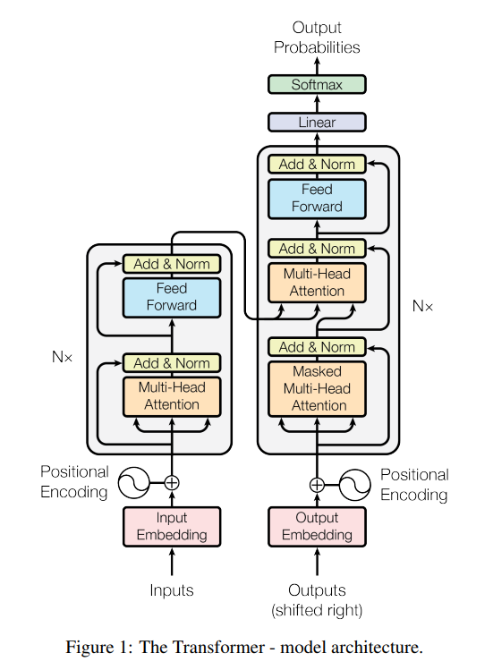
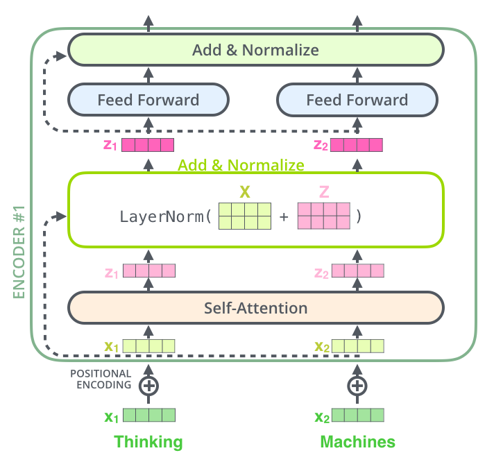
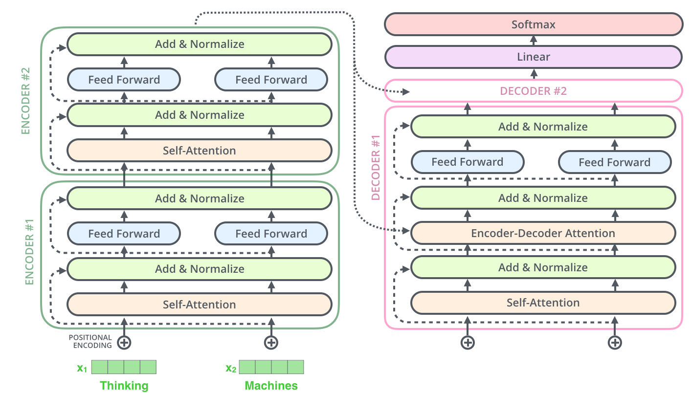
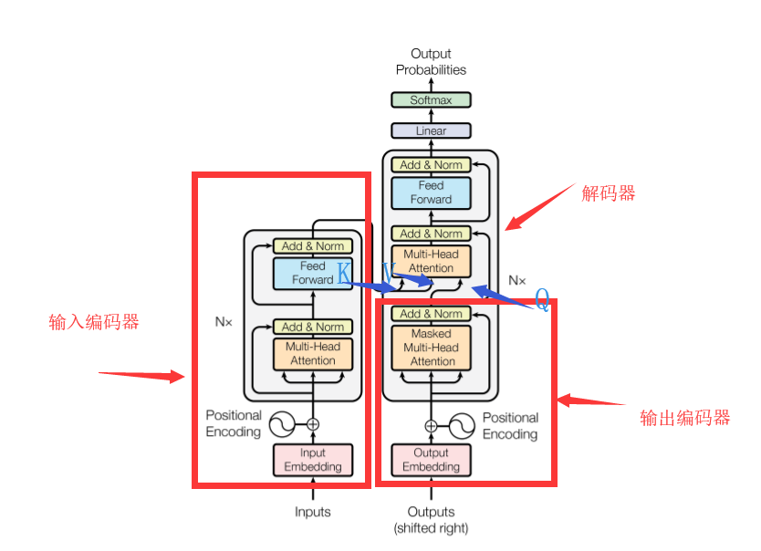
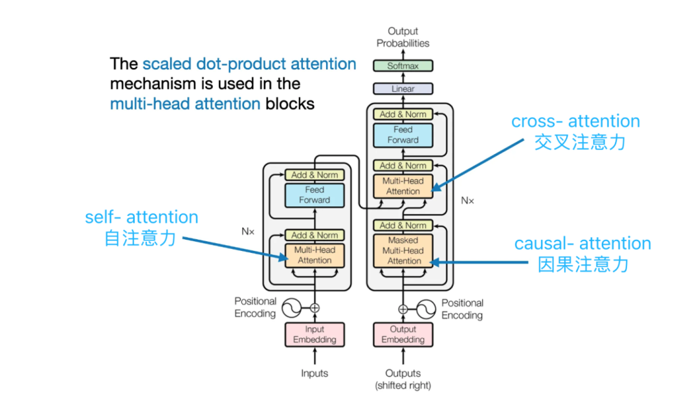

原文：[《Attention Is All You Need》](https://arxiv.org/pdf/1706.03762.pdf)

原文：[The Illustrated Transformer](https://jalammar.github.io/illustrated-transformer/)

学Transformer之前请先理解[《机器学习中的Attention机制》](Attention.md)，Transformer会用到里面讲的自注意力和多头注意力机制。

先看论文里给出的结构：

一看，也是和[《机器学习中的Attention机制》](Attention.md)里介绍的RNN很相似的Encoder-Decoder结构。结合网上的各自解析我们可以知道，这个Encoder和Decoder都是由一个个基本单位叠起来的（可以看到原图中也写了这个“Nx”表示堆叠了多个像这样的单元）。

## Encoder单元

Encoder单元内部长这样：

输入的词经过自注意力+多头注意力之后经过一个全连接层。并且这自注意力和全连接层还吸收了残差网络的思想做了Add和Normalize：

注意这里Encoder有全连接层为什么还能输入任意长度？因为可以看到这个全连接层一次只处理一个词的输出，从[《机器学习中的Attention机制》](Attention.md)里介绍的自注意力+多头注意力可以知道每个词的自注意力输出的大小是固定的。

## Decoder单元

下面这图左边就是Decoder单元：

右边是Encoder单元的对堆叠方式，因为Self Attention和Feed Forward都没改变输入的尺寸，所以Encoder单元的输出可以直接作为下一个Encoder单元的输入，Decoder单元也是同样的原理堆叠方式也是一样。

此外，还可以看到，这个Decoder的中间有一个Attention层既接收了编码器的输入又接收了解码器前面的输入，那么这一层的$K$、$Q$、$V$都是多少？看这就知道了：

## 具体的运行过程

大佬做的动图，首先是把Encoder输出的$K$、$V$矩阵放进Decoder里，然后输入一个起始字符：

第一步的输出就是输出句子的一个词向量。

接下来的步骤就和RNN里的Decoder有异曲同工之妙，就是把之前的输出作为输入再输进Decoder里：

## 深入运行过程：Transformer中的三种Attention

Encoder 和 Decoder 虽然长的一样，但其内部计算 attention 的过程并不相同。

### Encoder: self-attention 自注意力, 又称 full attention

self-attention 是最基本最容易理解的 attention，在[《机器学习中的Attention机制》](Attention.md)中就讲的很清楚了，就是由输入的词向量$s_i$乘上3个矩阵$W^Q$、$W^K$、$W^V$得到$K$、$Q$、$V$，即：
$$
\begin{aligned}
Q_i=s_iW^Q\\
K_i=s_iW^K\\
V_i=s_iW^V\\
\end{aligned}
$$

于是可以用矩阵运算一次算出一个句子里所有词的$K_i$、$Q_i$、$V_i$：

（图中的X表示所有的词向量$s_i$组成的矩阵）

最后，直接用矩阵计算出输出Attention值：
$$
Attention(Q,K,V)=softmax(\frac{QK^T}{\sqrt{d_k}})V
$$

其中，$d_k$是$K_i$、$Q_i$、$V_i$的维度，除以$\sqrt{d_k}$是为了保证训练时梯度的稳定。

矩阵图示为：

### Encoder 输出进入 Decoder 输入: cross-attention

cross-attention 和 self-attention 唯一的区别在于其$K$、$V$和$Q$来源于不同的计算过程。在Transformer中，$K$、$V$是Encoder的输出，$Q$是Decoder的输入经过一个masked self-attention计算得到。

其计算过程和 self-attention 完全一样：
$$
Attention(Q,K,V)=softmax(\frac{QK^T}{\sqrt{d_k}})V
$$

~~疑问：~~
* ~~如果按照上面几张图的Decoder结构，Decoder模块的输出向量数量应该和输入的一样多，即输到最后的Linear+Softmax的矩阵大小是不断增长的不可能由一个固定的Linear+Softmax完成，是我漏看了什么吗？~~

解答：
* 编码器输入到解码器中的两个矩阵是作为$K$和$V$的，解码器生成的序列作为$Q$，它们的特征维数都相同。
* 于是在$Attention(Q,K,V)=softmax(\frac{QK^T}{\sqrt{d_k}})V$中，$QK^T$计算得到的矩阵长宽分别为$Q$的样本数（$Q$的行数）和$K$的样本数（$K^T$的列数）。
* 而$K$的样本数和$V$的样本数相同，所以再乘上一个$V$之后的长宽就是$Q$的样本数和$V$的特征维数（等于$Q$的特征维数）。
* 所以解码器输出矩阵和输入$Q$的矩阵大小相同

### Decoder: masked self-attention 掩码自注意力, 又称 casual-attention 因果注意力

在原版 Transformer 中，masked self-attention 是 Decoder 中在 cross-attention 前对输入计算的 Attention。
Transformer 论文原图中在 Decoder 处的 Attention 标注为 Masked MultiHead Attention，说的就是 masked self-attention：

full attention 让输入的所有 token 之间都计算 attention，而 masked self-attention 和它相对，其的核心思想是让 token 只与其之前的 token 计算 attention。

为什么要设计 masked self-attention ？网上的教程通常会说：

>模型通常需要基于已经生成的词来预测下一个词。这种特性要求模型在训练时不能“看到”未来的信息。

但是下一个 token 本就是输出，在输入的时候下一个 token 还不存在呢，怎么“看到”未来的信息？

这些教程的表述给人一种感觉，会让人以为 masked self-attention 是为了提升训练效果而设计的。但实际上，这个 masked self-attention 主要是为了提升训练速度而设计的。

Encoder 的 full attention 每次输入一句话的所有 token 而输出一个 token 用于 cross-attention，因此对于 Encoder 来说，每个训练样本只需要一次前向和反向传播。
Decoder 当然也可以是一个 full attention，每次推理都对输入的所有 token 做 full attention 而输出下一个 token，问题在于 Decoder 的运行模式是多次运行出多个 token 拼成一句话，在训练时，这种运行模式就会导致一个训练样本中的每一个单词都要执行一次前向和反向传播，训练成本很高。

masked self-attention 就能解决这个问题。具体来说，

为了高效训练，我们**不想每次只拿一个 prefix 训练**，而是希望像 Encoder 那样**一次 forward/backward 就完成这个 batch 里所有位置的 next-token loss 计算和一次参数更新**。
这就需要模型在每个位置都产生一个 next-token prediction，并且这同时输出的每个位置的 prediction 得是和一个个输出的 prediction 是等价的才行。
这就是 masked self-attention 的设计目标。这个设计目标用公式表示为：

$$\forall t\leq T\quad MaskedAttention(Q_{1:T},K_{1:T},V_{1:T})_t=MaskedAttention(Q_{1:t},K_{1:t},V_{1:t})_t\tag{1}$$

用人话说就是：**一次性输入整段所有 token $Q_{1:T},K_{1:T},V_{1:T}$ 算 masked self-attention 得到的第 $t$ 个位置输出的 Attention 向量 $MaskedAttention(Q_{1:T},K_{1:T},V_{1:T})_t$ 等于只输入前缀 token $Q_{1:t},K_{1:t},V_{1:t}$ 算 masked self-attention 得到的最后位置的 Attention 向量 $MaskedAttention(Q_{1:t},K_{1:t},V_{1:t})_t$，对所有 $t\in T$ 成立。**

masked self-attention 的运行流程如下：

第一步，对于第一个 token，Q,K,V 都是向量，等价于 full attention 只输入一个 token 时的特殊情况：

$$MaskedAttention(Q_{1:1},K_{1:1},V_{1:1})=softmax\left(\frac{Q_1K^{\top}_1}{\sqrt{d_k}}\right)V_1$$

对于后续的 token，Q,K,V成为矩阵。从第二个 token 开始：

$$\begin{aligned}
MaskedAttention(Q_{1:2},K_{1:2},V_{1:2})&=softmax\left(\begin{bmatrix}\frac{Q_1K^{\top}_1}{\sqrt{d_k}} & 0 \\\frac{Q_2K^{\top}_1}{\sqrt{d_k}} & \frac{Q_2K^{\top}_2}{\sqrt{d_k}} \end{bmatrix}\right)\begin{bmatrix} V_1 \\ V_2 \end{bmatrix}\\
&=\left[\begin{aligned}&softmax\left(\frac{Q_1K^{\top}_1}{\sqrt{d_k}}\right)V_1 \\&softmax\left(\left[\frac{Q_2K^{\top}_1}{\sqrt{d_k}},\frac{Q_2K^{\top}_2}{\sqrt{d_k}}\right]\right)\begin{bmatrix}V_1\\V_2\end{bmatrix}\end{aligned}\right]
\end{aligned}$$

其中$softmax$为按行进行softmax。以此类推：

$$\begin{aligned}
MaskedAttention(Q_{1:t},K_{1:t},V_{1:t})&=softmax\left(\begin{bmatrix}\frac{Q_1K^{\top}_1}{\sqrt{d_k}} & 0 & \cdots & 0 \\\frac{Q_2K^{\top}_1}{\sqrt{d_k}} & \frac{Q_2K^{\top}_2}{\sqrt{d_k}} & \cdots & 0 \\\vdots & \vdots & \ddots & \vdots \\\frac{Q_tK^{\top}_1}{\sqrt{d_k}} & \frac{Q_tK^{\top}_2}{\sqrt{d_k}} & \cdots & \frac{Q_tK^{\top}_t}{\sqrt{d_k}} \end{bmatrix}\right)\begin{bmatrix}V_1\\V_2\\\vdots\\V_t\end{bmatrix}\\&=\left[\begin{aligned}&softmax\left(\frac{Q_1K^{\top}_1}{\sqrt{d_k}}\right)V_1 \\&softmax\left(\left[\frac{Q_2K^{\top}_1}{\sqrt{d_k}},\frac{Q_2K^{\top}_2}{\sqrt{d_k}}\right]\right)\begin{bmatrix}V_1\\V_2\end{bmatrix}\\&\cdots\\&softmax\left(\left[\frac{Q_tK^{\top}_1}{\sqrt{d_k}},\frac{Q_tK^{\top}_2}{\sqrt{d_k}},\cdots,\frac{Q_tK^{\top}_t}{\sqrt{d_k}}\right]\right)\begin{bmatrix}V_1\\V_2\\\vdots\\V_t\end{bmatrix}\end{aligned}\right]
\end{aligned}$$

可以看出，输入更多的 token 并不影响$MaskedAttention(Q_{1:t},K_{1:t},V_{1:t})$中$Q_{1:t}K_{1:t}^\top$之前的行，因为在上三角部分的那些新输入的$Q_t,K_t,V_t$有关的矩阵元素都被mask掉了。
这一性质用公式可以表达为：

$$MaskedAttention(Q_{1:t},K_{1:t},V_{1:t})_{1:t-1}=MaskedAttention(Q_{1:t-1},K_{1:t-1},V_{1:t-1})$$

于是带入$t=T$推导：

$$\begin{aligned}
MaskedAttention(Q_{1:T},K_{1:T},V_{1:T})_{1:T-1}&=MaskedAttention(Q_{1:T-1},K_{1:T-1},V_{1:T-1})\\
MaskedAttention(Q_{1:T},K_{1:T},V_{1:T})_{1:T-2}&=\left(MaskedAttention(Q_{1:T},K_{1:T},V_{1:T})_{1:T-1}\right)_{1:T-2}\\&=MaskedAttention(Q_{1:T-1},K_{1:T-1},V_{1:T-1})_{1:T-2}\\&=MaskedAttention(Q_{1:T-2},K_{1:T-2},V_{1:T-2})\\
\cdots\\
MaskedAttention(Q_{1:T},K_{1:T},V_{1:T})_{1:T-i}&=MaskedAttention(Q_{1:T-i},K_{1:T-i},V_{1:T-i}) & 0\leq i\leq T
\end{aligned}$$

最后带入$t=T-i$即得：

$$MaskedAttention(Q_{1:T},K_{1:T},V_{1:T})_{1:t}=MaskedAttention(Q_{1:t},K_{1:t},V_{1:t})$$

公式$(1)$得证，设计目标达成。

此外，还可以推导出每次新增一个 token 后，输出矩阵中的新增行$MaskedAttention(Q_{1:t},K_{1:t},V_{1:t})_t$的计算公式：

$$\begin{aligned}
MaskedAttention(Q_{1:1},K_{1:1},V_{1:1})_1&=softmax\left(\frac{Q_1K^{\top}_1}{\sqrt{d_k}}\right)V_1=1\cdot V_1\\
MaskedAttention(Q_{1:2},K_{1:2},V_{1:2})_2&=softmax\left(\left[\frac{Q_2K^{\top}_1}{\sqrt{d_k}},\frac{Q_2K^{\top}_2}{\sqrt{d_k}}\right]\right)\begin{bmatrix}V_1\\V_2\end{bmatrix}\\
&=softmax\left(\left[\frac{Q_2K^{\top}_1}{\sqrt{d_k}},\frac{Q_2K^{\top}_2}{\sqrt{d_k}}\right]\right)_1V_1+softmax\left(\left[\frac{Q_2K^{\top}_1}{\sqrt{d_k}},\frac{Q_2K^{\top}_2}{\sqrt{d_k}}\right]\right)_2V_2\\
\dots\\
MaskedAttention(Q_{1:t},K_{1:t},V_{1:t})_t&=softmax\left(\left[\frac{Q_tK^{\top}_1}{\sqrt{d_k}},\frac{Q_tK^{\top}_2}{\sqrt{d_k}},\cdots,\frac{Q_tK^{\top}_t}{\sqrt{d_k}}\right]\right)\begin{bmatrix}V_1\\V_2\\\vdots\\V_t\end{bmatrix}\\&=\sum_{i=1}^tsoftmax\left(\left[\frac{Q_tK^{\top}_1}{\sqrt{d_k}},\frac{Q_tK^{\top}_2}{\sqrt{d_k}},\cdots,\frac{Q_tK^{\top}_t}{\sqrt{d_k}}\right]\right)_iV_i
\end{aligned}$$

每当来一个新的 token，只需要按照这个公式计算新的一行即可，之前的行全不变。

如果用同样的符号写出 full attention：

$$Attention(Q_{1:T},K_{1:T},V_{1:T})_t=\sum_{i=1}^{T}softmax\left(\left[\frac{Q_tK^{\top}_1}{\sqrt{d_k}},\frac{Q_tK^{\top}_2}{\sqrt{d_k}},\cdots,\frac{Q_tK^{\top}_T}{\sqrt{d_k}}\right]\right)_iV_i$$

可以看出，每加一个 token $Q_T,K_T,V_T$不仅需要计算新的一行，还需要对之前的所有行都进行更新。
其中，对于第$t$行：
由于增加了一列$\frac{Q_tK^{\top}_T}{\sqrt{d_k}}$，从softmax这里就要重新计算$softmax\left(\left[\frac{Q_tK^{\top}_1}{\sqrt{d_k}},\frac{Q_tK^{\top}_2}{\sqrt{d_k}},\cdots,\frac{Q_tK^{\top}_T}{\sqrt{d_k}}\right]\right)$，之后的求和也得重新计算，并且求和这里还多加一项$softmax\left(\left[\frac{Q_tK^{\top}_1}{\sqrt{d_k}},\frac{Q_tK^{\top}_2}{\sqrt{d_k}},\cdots,\frac{Q_tK^{\top}_T}{\sqrt{d_k}}\right]\right)_TV_T$。

所以如果对已有计算结果做缓存，那 masked self-attention 会比 full attention 少很多计算量。

masked self-attention 还有一个很优美的性质：已知$MaskedAttention(Q_{1:t},K_{1:t},V_{1:t})$这里面每一行都是下一层 masked self-attention 的一个输入 token，每次加一个 token 都只需要加新的一行$MaskedAttention(Q_{1:t},K_{1:t},V_{1:t})_t$，而不改变之前的行$MaskedAttention(Q_{1:t-1},K_{1:t-1},V_{1:t-1})$，那在下一层看来就是之前的 token 输入全没变，只多加了一个新的 token，那这个 masked self-attention 也只需要加新的一行，而不改变之前的行，依此类推，串联的所有 masked self-attention 层都只需要计算新的一行，而不改变之前的行。

而 full attention 每次加一个 token 都要更新输出中的所有 token，这就改变了 full attention 的输入，所以下一层就得整个重新计算，难以优化。

masked self-attention 的这些独特性质带来一种新的加速方式：KV Cache。

继续学习：[《KV Cache 原理》](./KVCache.md)