## 自组织映射 Self-Organizing Maps

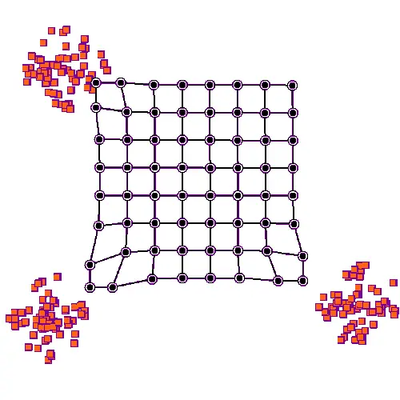

Self-Organizing Maps(SOM) 自组织映射，又称为自组织映射神经网络，或自组织竞争神经网络。
是神经网络的一种，用于将**相互关系复杂且非线性**的高维数据，映射到**具有简单几何结构及相互关系**的低维空间中展示。
低维映射能够**反映高维特征之间的拓扑结构**。

SOM是一种**无监督**的人工神经网络。不同于一般神经网络基于损失函数的反向传递来训练，它运用**竞争学习 (competitive learning)** 策略,依靠神经元之间互相竞争逐步优化网络。且使用**近邻关系函数 (neighborhood function)** 来维持输入空间的拓扑结构。

主要用于实现高维数据可视化，其降维功能还可以聚类，分类，特征抽取等任务但精度不高。

### SOM的特点

* 和PCA区别：PCA主要针对线性相关性进行降维，SOM没有线性相关性的要求，因此更适合非线性数据的降维
* 和K-means的区别：K-means虽然不要求数据线性分布，但是其聚类边界还是直线，而SOM的聚类边界是任意形状

说白了就是SOM有神经网络拟合任意函数的特性所以更加自由灵活

比如要有分布在球面附近的一些三维数据，在三维中他们分得很开：

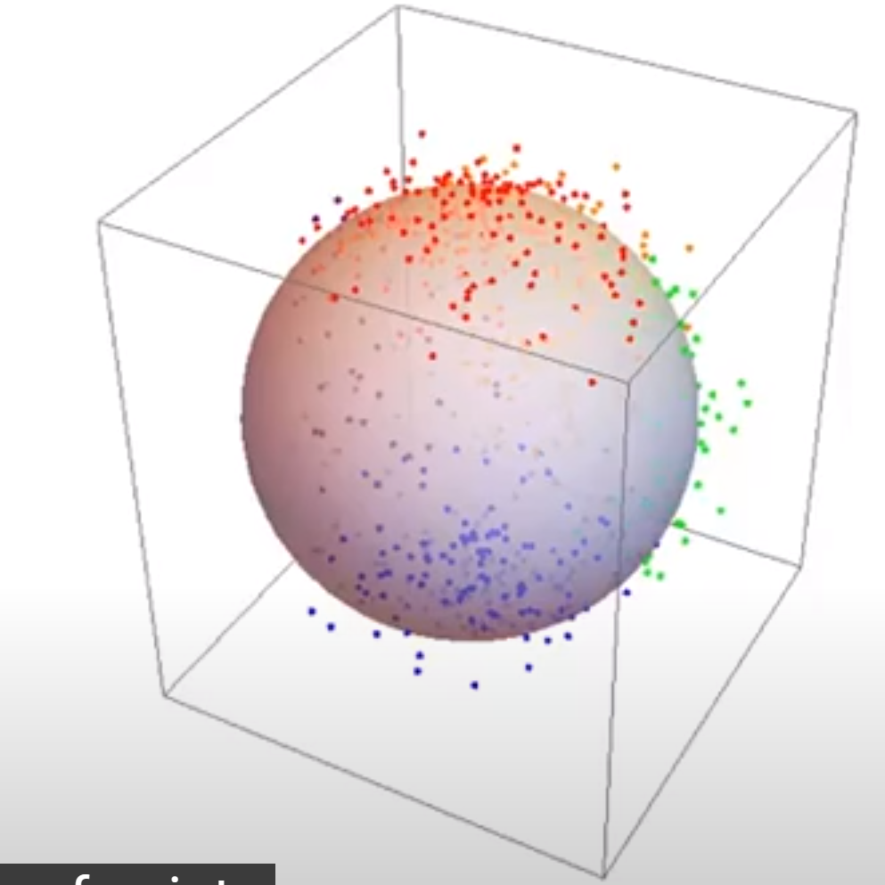

要将这些数据降至二维。

用PCA效果：可以看到只有离得较远的红蓝可以分得很开，另外三种颜色的混一起了

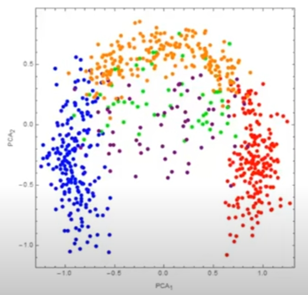

在三维视角看，PCA就是在空间中放了个平面然后投影，那当然搞不好这种非线性分布的数据。
如果只有红蓝两个的颜色这个PCA还算效果不错。

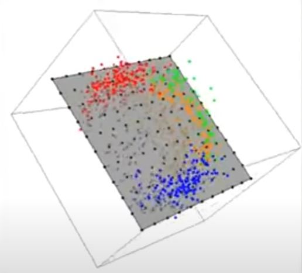

### SOM结构

原始$n$维数据$\bm x=\{x_1,x_2,\dots,x_n\}$对应输入层$n$个节点，输出层$X\times Y$个节点，每个输出层节点$(i,j)$都有$n$个权值$\bm W_{i,j}=\{w_{i,j,k}|k\in[1,n]\}$和输入层节点相连，共$X\times Y\times n$个权值：

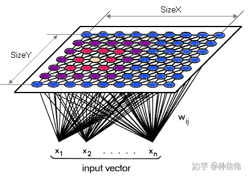

>竞争层也可以有更高的维度。不过出于可视化的目的，高维竞争层用的比较少

其中，二维平面通常有2种平面结构：Rectangular和Hexagonal

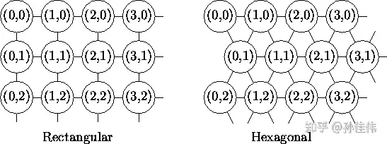

竞争层SOM神经元的数量决定了最终模型的粒度与规模；这对最终模型的准确性与泛化能力影响很大。
经验公式：竞争层$X=Y=\sqrt{5\sqrt{N}}$，$N$为训练样本个数

### SOM推理

对于输入向量$\bm x$：
1. 计算$\bm x$在每个节点$(i,j)$上的值$h_{i,j}=\|\bm W_{i,j}-\bm x\|$（和权值之间的欧氏距离）
2. 输出$y=\mathop{\text{argmax}}_{i,j}h_{i,j}$为$h_{i,j}$值最小的点的坐标（欧氏距离最小的点，又称优胜节点(winner node)或BMU(best matching unit)）

所以每个高维输入$\bm x$都对应了一个二维坐标$(i,j)$，于是实现了数据的降维。

### SOM和可视化

从另一个角度看SOM的推理过程：
* 权值$\bm W_{i,j}$可以看作是像素$(i,j)$的“颜色”
* $h_{i,j}=\|\bm W_{i,j}-\bm x\|$就可看作是输入的$\bm x$在和所有像素的“颜色”计算相似性
* 最后的输出$y=\mathop{\text{argmax}}_{i,j}h_{i,j}$就是相似性最大（“颜色”最相近）的像素位置。

而可视化的过程，就是把训练得到的这个权值$\bm W_{i,j}$作为颜色摆在一张$X\times Y$的图像上。

比如，输入是三维数据的情况下，权值$\bm W_{i,j}$也就是三维，正则化后就是RGB，可以直接摆在图上：

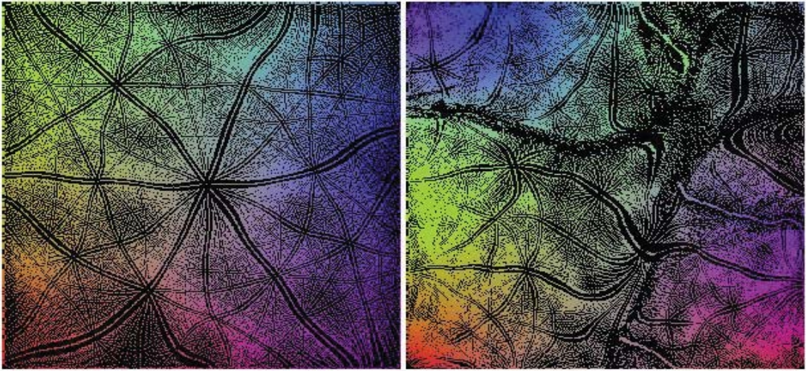

（图片来自[Emergent Patterns in Self-Organizing Maps](https://ieeexplore.ieee.org/document/7377977)，图中的黑色区域表示训练数据集里没有数据对应到这个像素点）

### SOM训练

SOM训练过程本质上就是在不断更新上面这张图片上各点的颜色，所以别把它当成神经网络，抛弃权值的概念而按照更新颜色的思想来讲解会更好理解。

超参数：邻域半径$\sigma$

开始前随机初始化$X\times Y\times n$个像素的颜色，然后iterate执行下面的步骤：

1. 随机取一个输入样本$\bm x$
2. forward: 计算$\bm x$的SOM输出$(i,j)$（与输入样本最相近的颜色所在的像素位置）
3. backward(更新颜色): 让$(i,j)$附近的像素颜色和$\bm x$的差距减小，距离$(i,j)$越远更新力度越小，如下图

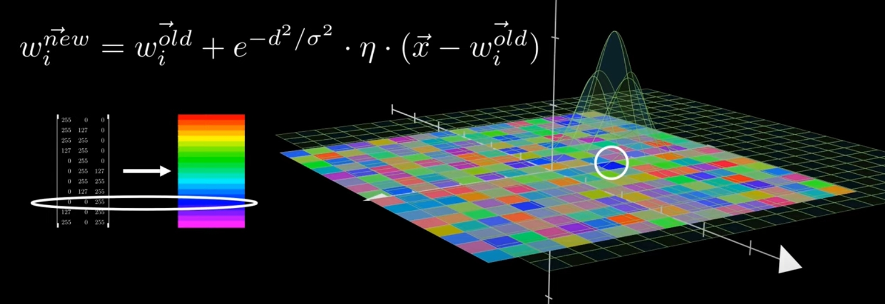
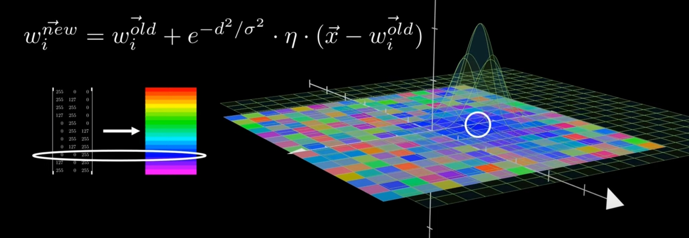

### SOM的涌现性

[Emergent Patterns in Self-Organizing Maps](https://ieeexplore.ieee.org/document/7377977)

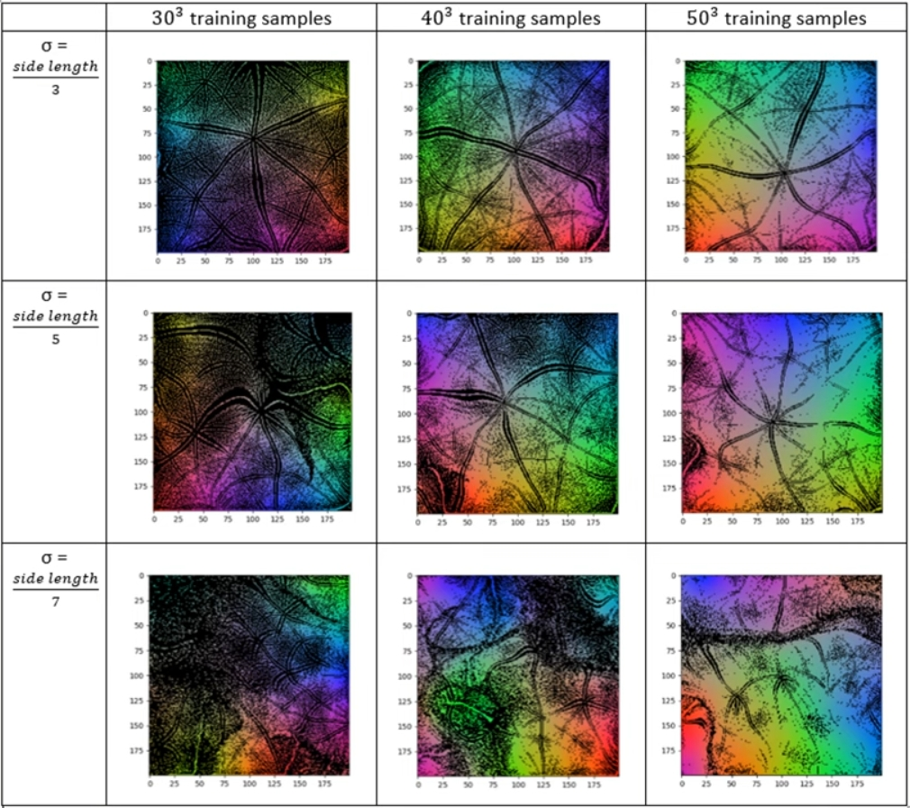

## 更进一步：Self-Sorting Map

论文：**Self-Sorting Map: An Efficient Algorithm for Presenting Multimedia Data in Structured Layouts**,IEEE Transactions on Multimedia, 2014

>Given a set of **data items** and a **dissimilarity measure** between each pair of them, the SSM places each item into a unique cell of a structured layout, where the most related items are placed together and the unrelated ones are spread apart.

显然，SOM并不能保证每个训练样本都有一个独立的编号，也不能保证最终的图上的像素值与训练样本完全相等。
而Self-Sorting Map(SSM)正如其名，是按照给定的dissimilarity measur对输入进行的排序，可以保证每个训练样本都有自己的ID，且出来的图上像素值与训练样本完全相等。

>Instead of solving the continuous optimization problem that other dimension reduction approaches do, the SSM transforms it into a **discrete labeling problem**.

并且因为是“排序”，不是SOM那种“训练”和“拟合”，所以构建SSM也不需要像SOM那种iteration求解优化问题，而是一个离散的贴标问题。

典型地，SSM可以做到下面这种效果，即在Self-Organizing的同时还能保证表达数据的精准无误：

其中的图(a)是在地图上标注，图标会重叠，不好看；图(b)是按首字母规则排序，没法按天气聚类，也不好看；图(c)是Self-Sorting Map二维情况，既有按地理位置聚类又有按地域聚类，很棒。

### 问题建模

不同于SOM的连续优化方案，SSM将问题建模为一个打标签问题(labeling problem)：

* 待排序的数据集合记为$\Omega$；集合中的元素为向量，其维度相同，下文中的$\bm s$、$\bm t$、$\bm u$、$\bm v$都表示$\Omega$中的元素
* 集合中数据不相似性(dissimilarity)度量记为$\delta(\cdot,\cdot)$；对于$\forall\bm s\in\Omega$，$\delta(\bm s,\bm s)=0$、$\delta(\bm s,\bm t)\ge 0$
* 数据在图像上的排布方案记为$M$，$M$中有$m$个cell，$m\geq|\Omega|$
* 在排布方案$M$中，每个元素$\bm s$都有会被分配一个位置$L_{\bm s}$，这个位置的坐标为$P(L_{\bm s})$

于是，SSM的优化问题定义为：

$$\mathop{\text{argmax}}\limits_{M}\sum_{\forall\bm s,\bm t\in\Omega}\frac{\left(\|P(L_{\bm s})-P(L_{\bm t})\|-\bar P\right)\left(\delta(\bm s,\bm t)-\bar\delta\right)}{\sigma_P\sigma_\delta}$$

其中，$\bar P$和$\bar\delta$分布表示图像上的像素点之间距离的均值和像素点的不相似性均值，$\sigma_P$和$\sigma_\delta$是它们的方差。

显然，这里$\bar P$和$\sigma_P$只和图像的尺寸有关、$\bar\delta$和$\sigma_\delta$只和元素有关，都和排布方案$M$没有关系，可以看作是常量。
于是对于求和子式，使其最大的方法就是在$\delta(\bm s,\bm t)$大的时候让$\|P(L_{\bm s})-P(L_{\bm t})\|$也尽可能大、在$\delta(\bm s,\bm t)$小的时候让$\|P(L_{\bm s})-P(L_{\bm t})\|$尽可能小

所以这个式子的含义其实就是要相似性大的聚在一起，相似性小的相互远离。

### 问题求解1：$\bm s$是标量且排布方案$M$是一维的情况

此时，SSM退化为一个排序问题。
现有很多排序算法，但是无法扩展到高维，作者提出了自己的排序算法，虽然复杂度比现有算法高但是可以扩展到高维：

第一步：数组分两个大小相等的块，前一块中的cell都与后一块相同位置的那个cell比大小，前一块的cell如果小了就和后一块的cell交换位置

>SSM first splits all cells into 2 blocks. Numbers in the first block are paired up with the ones at
the corresponding cells of the second block. The two numbers in each pair $(s,t)$ are compared against each other and an exchange is performed if $s>t$. After all pairs are processed in parallel, the first stage is completed.

第二步：两个块再等分为4个块，块1和2、块2和3、块3和4依次执行第一步中相同的比较和交换操作。和冒泡排序很像，小的cell被依次换到了后面，但是块与块之间是交换排序，并且只冒了一次泡没有执行很多轮。

>The second stage further splits each block in two, resulting in four smaller blocks. Corresponding cells in adjacent (even, odd)-numbered blocks are first compared and swapped if necessary, followed by corresponding cells in adjacent (odd, even)-numbered blocks. For example, block 1 and 2 are paired with each other first for swapping and then block 2 and 3 are paired. The even-odd swap and odd-even swap alternates until the process converges, i.e., all data at the corresponding cells of different blocks are sorted.

第三步：一直细分执行第二步，直到不可再分

>The process then continues to the next stage by dividing each block into two, until the final stage is reached where all blocks contain one cell only.

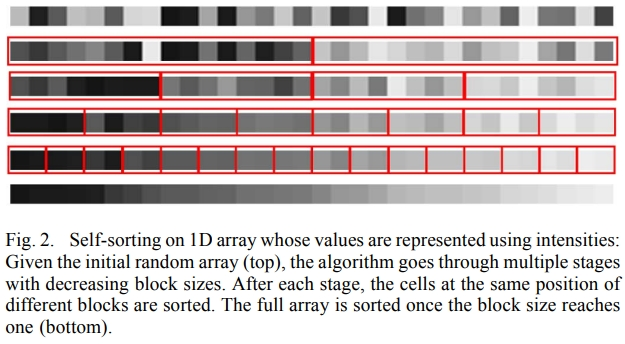

简单分析可知，划分为$b$块每块有$\frac{n}{b}$个元素，每一步算法要比$\frac{n}{b}(b-1)$次，复杂度为$O(n)$，共约$\text{log}(n)$轮，综合算法复杂度为$O(n\text{log}(n))$。

这个算法真能保证正确排序吗？似乎不能？不过看后面的扩展也不需要正确排序。本文的算法都没有严格的数学证明，并不能达到最优，非常启发式。

### 问题求解2：$\bm s$是矢量且排布方案$M$是一维的情况

$\bm s$从标量变矢量，就没法直接比大小了，需要换一种方法决定两个数是否需要交换。于是，还是基于上面的那个交换式的排序方法，作者修改了一下决定是否交换的策略。

对于某个分块$B_i$，定义$\Omega(B_i)$为它的临近分块的集合，进而定义一个“loss函数”：

$$T_i=\frac{1}{|\Omega(B_i)|}\sum_{B_j\in\Omega(B_i)}\frac{\sum_{\bm s\in B_j}\bm s}{|B_j|}$$

可以看出，这里$\frac{\sum_{\bm s\in B_j}\bm s}{|B_j|}$的结果是临近分块$B_j$中的元素$\bm s$各维度的均值组成的向量；$\frac{1}{|\Omega(B_i)|}\sum_{B_j\in\Omega(B_i)}$是对$B_i$的所有临近分块这个均值向量再求一层均值。嗯，很均。

接下来，就根据这个$T_i$决定要不要交换：

$$\mathop{\text{argmin}}\limits_{(\bm s,\bm t)}\left(\|\bm s-T_i\|+\|\bm t-T_{i+1}\|\right)$$

显然，这个式子中的两个差$\|\bm s-T_i\|+\|\bm t-T_{i+1}\|$就是$\bm s$和$\bm t$和临近分块之间的相似性；$\mathop{\text{argmin}}\limits_{(\bm s,\bm t)}$就是要让$\bm s$和$\bm t$换到和它们的值更接近的分块中去。

这里的临近分块的选择可以自定义：

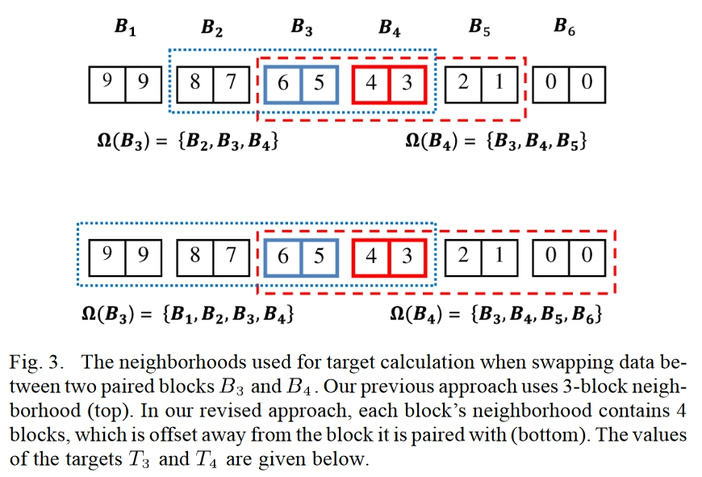

于是这样把$\bm s$和$\bm t$换到了和它们的值更接近的分块中，个分块中的值也就更接近了，从而达到了相近值放一块的效果：

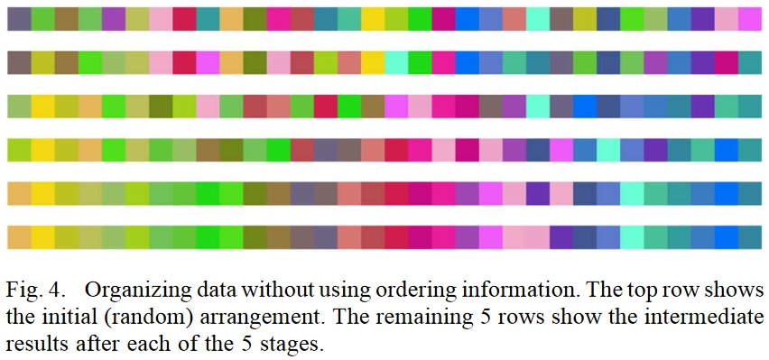

### 问题求解3：$\bm s$是矢量且排布方案$M$是二维的情况

再进一步，排布方案也变成二维，那么比较就得在上下左右两个维度进行，交换的方式也就不只有换或者不换，而是上下左右中共4个可交换cell的共4!=24种排列组合。

比如，下图是一个第二轮操作的例子，图被划分为四大块，每块里有四小块，这四大块已经在第一轮完成了交换操作，这里的第二轮是要在大块内对小块间进行交换操作。和之前同样的思想，所有右上角的cell就只和其他块的右上角cell进行交换，即每个cell$\bm s$（红色标记）只考虑和附近位于块中相同位置的3个cell$\bm t,\bm u,\bm v$（黄色标记）进行交换，于是共4!=24种排列组合：

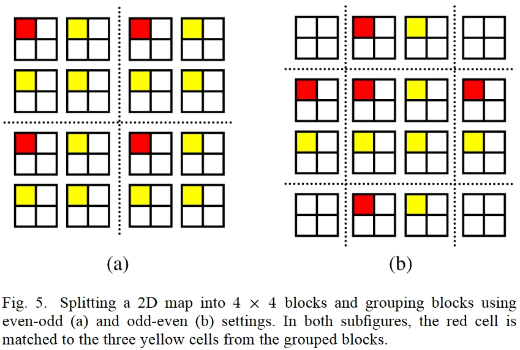

对于是否要交换的决策，这里作者进一步对相似性的概念泛化为dissimiliarty函数$\delta(\cdot,\cdot)$，并用区域内与所有其他cell整体相似性最高的值作为$T_i$：

$$T_i=\mathop{\text{argmin}}\limits_{\bm t\in\Omega(B_i)}\left(\sum_{\bm s\in\Omega(B_i)}\delta(\bm s,\bm t)\right)$$

进而，在于上述$(\bm s,\bm t,\bm u,\bm v)$的4!=24种排列组合中找最优解：

$$\mathop{\text{argmin}}\limits_{(\bm s,\bm t,\bm u,\bm v)}\left(\delta(\bm s,T_{i,j})+\delta(\bm t,T_{i+1,j}+\delta(\bm u,T_{i,j+1})+\delta(\bm v,T_{i+1,j+1}))\right)$$

### 进一步正则化

给$T_i$加点料就能实现让指定区域趋近于指定颜色，比如给某些区域的$T_i$加点颜色让指定颜色的cell向指定区域聚集：

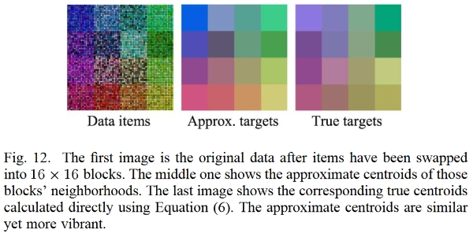

### 实验

总之就是非常炫酷

简单数据集：

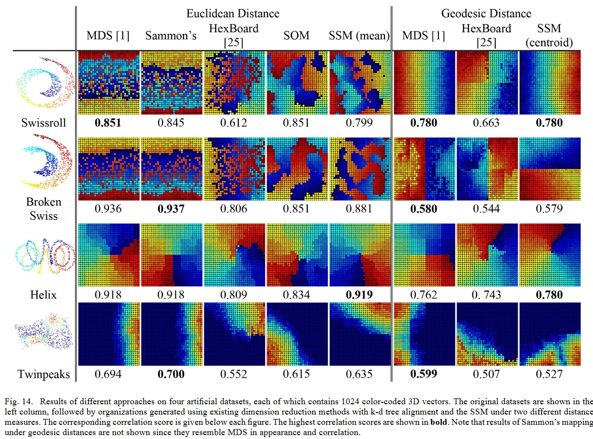

压缩不规则材质：

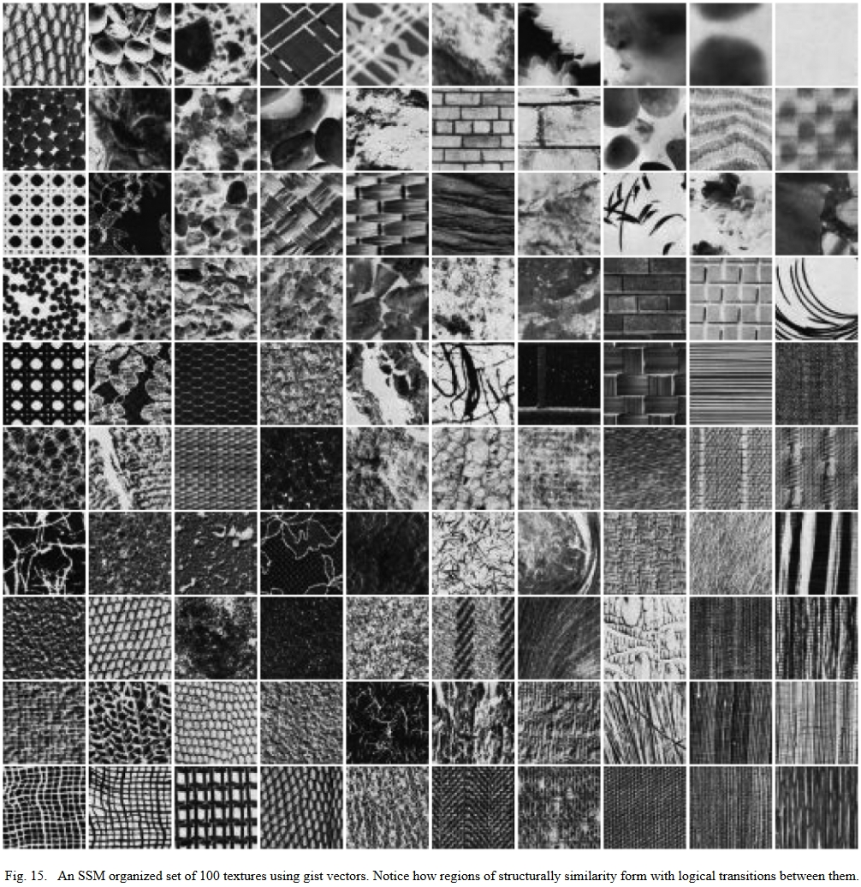

炫就完事了：

