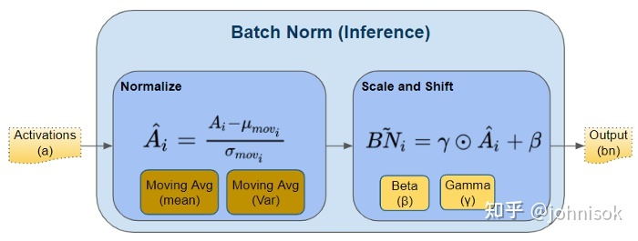
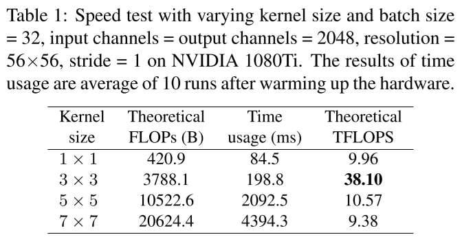

主要参考论文: RepVGG: Making VGG-style ConvNets Great Again

## 主要思想

训练时的模型和运行时的模型结构不同，但相互等价。

例如在RepVGG方案中，训练时的模型是一个类似ResNet的网络结构，由于有Identity Branch所以有ResNet的训练稳定性优势；而推断时Identity Branch被等效为3x3卷积，与主干卷积核直接相加进而成为一个3x3卷积核。于是，RepVGG方案在训练时是一个稳定的ResNet，推断时又是一个高效的全卷积网络。


## 训练时的RepVGG

符号|含义
-|-
$W^{(3)}\in\mathbb R^{C_1\times C_2\times 3\times 3}$|输入通道数为$C_1$、输出通道数为$C_2$，卷积核大小为$3\times 3$的卷积运算
$W^{(1)}\in\mathbb R^{C_1\times C_2}$|输入通道数为$C_1$、输出通道数为$C_2$，卷积核大小为$1\times 1$的卷积运算
$bn(M,\bm\mu,\bm\sigma,\bm\gamma,\bm\beta)$|输入为$M$、均值为$\bm\mu$、标准差为$\bm\sigma$、缩放参数为$\bm\gamma$和$\bm\sigma$的BatchNorm层

设输入矩阵$M_{:,:,:,:}$的四个维度依次对应样本编号、通道编号、图片宽度、图片长度，则BatchNorm层的计算可以表示为：
$$
bn(M,\bm\mu,\bm\sigma,\bm\gamma,\bm\beta)_{:,i,:,:}=(M_{:,i,:,:}-\bm\mu_i)\frac{\bm\gamma_i}{\bm\sigma_i}+\bm\beta_i
$$
其中$\bm\mu,\bm\sigma$分别表示BatchNorm层从训练中得到的均值、标准差，$\bm\gamma,\bm\beta$表示BatchNorm层学习到的缩放参数。



于是，训练时的RepVGG计算可以表示为：

$$
\begin{aligned}
    M^{(2)}=&bn(M^{(1)}\ast W^{(3)},\bm\mu^{(3)},\bm\sigma^{(3)},\bm\gamma^{(3)},\bm\beta^{(3)})\\
    +&bn(M^{(1)}\ast W^{(1)},\bm\mu^{(1)},\bm\sigma^{(1)},\bm\gamma^{(1)},\bm\beta^{(1)})\\
    +&bn(M^{(1)},\bm\mu^{(0)},\bm\sigma^{(0)},\bm\gamma^{(0)},\bm\beta^{(0)})\\
\end{aligned}
$$

其中$M^{(1)}\ast W^{(3)}$表示一个$3\times 3$卷积、$M^{(1)}\ast W^{(1)}$表示一个$1\times 1$卷积、最后一项没有卷积操作即为Identity Branch；上标为$(0),(1),(3)$的$\bm\mu,\bm\sigma,\bm\gamma,\bm\beta$分别表示在Identity Branch、$3\times 3$卷积和$1\times 1$卷积之后的BatchNorm层参数。

很明显，训练时的RepVGG Block是一个有两个卷积Branch和一个Identity Branch的网络，每个Branch上还都有一个BatchNorm。如下图所示：


## 推断时的RepVGG

将卷积运算带入上式中的BatchNorm：
$$
\begin{aligned}
    bn(M\ast W,\bm\mu,\bm\sigma,\bm\gamma,\bm\beta)_{:,i,:,:}&=(M_{:,i,:,:}\ast W_{i,:,:,:}-\bm\mu_i)\frac{\bm\gamma_i}{\bm\sigma_i}+\bm\beta_i\\
    &=M_{:,i,:,:}\ast \frac{\bm\gamma_i}{\bm\sigma_i}W_{i,:,:,:}-\frac{\bm\mu_i\bm\gamma_i}{\bm\sigma_i}+\bm\beta_i
\end{aligned}
$$

进而再带入RepVGG计算公式：

$$
\begin{aligned}
    M^{(2)}_{:,i,:,:}=&{}&&bn(M^{(1)}\ast W^{(3)},\bm\mu^{(3)},\bm\sigma^{(3)},\bm\gamma^{(3)},\bm\beta^{(3)})_{:,i,:,:}\\
    &+&&bn(M^{(1)}\ast W^{(1)},\bm\mu^{(1)},\bm\sigma^{(1)},\bm\gamma^{(1)},\bm\beta^{(1)})_{:,i,:,:}\\
    &+&&bn(M^{(1)},\bm\mu^{(0)},\bm\sigma^{(0)},\bm\gamma^{(0)},\bm\beta^{(0)})_{:,i,:,:}\\
    =&{}&&M_{:,i,:,:}^{(1)}\ast \frac{\bm\gamma_i^{(3)}}{\bm\sigma_i^{(3)}}W_{i,:,:,:}^{(3)}-\frac{\bm\mu_i^{(3)}\bm\gamma_i^{(3)}}{\bm\sigma_i^{(3)}}+\bm\beta_i^{(3)}\\
    &+&&M_{:,i,:,:}^{(1)}\ast \frac{\bm\gamma_i^{(1)}}{\bm\sigma_i^{(1)}}W_{i,:,:,:}^{(1)}-\frac{\bm\mu_i^{(1)}\bm\gamma_i^{(1)}}{\bm\sigma_i^{(1)}}+\bm\beta_i^{(1)}\\
    &+&&M_{:,i,:,:}^{(1)}\frac{\bm\gamma_i^{(0)}}{\bm\sigma_i^{(0)}}-\frac{\bm\mu_i^{(0)}\bm\gamma_i^{(0)}}{\bm\sigma_i^{(0)}}+\bm\beta_i^{(0)}
\end{aligned}
$$

而其中，一个1x1的卷积核可以表示为一个3x3的卷积核：
```
     0 0 0
k -> 0 k 0
     0 0 0
```

一个Identity Branch也可以表示为一个kernel为1的1x1的卷积核，进而也可以表示为一个3x3的卷积核。

于是，令$W^{(3,1)}$表示与卷积$W^{(1)}$等效的3x3的卷积、令$W^{(3,I)}$表示与Identity Branch等效的3x3的卷积。那么RepVGG计算公式可进一步表示为：

$$
\begin{aligned}
    M^{(2)}_{:,i,:,:}
    =&{}&&M_{:,i,:,:}^{(1)}\ast \frac{\bm\gamma_i^{(3)}}{\bm\sigma_i^{(3)}}W_{i,:,:,:}^{(3)}-\frac{\bm\mu_i^{(3)}\bm\gamma_i^{(3)}}{\bm\sigma_i^{(3)}}+\bm\beta_i^{(3)}\\
    &+&&M_{:,i,:,:}^{(1)}\ast \frac{\bm\gamma_i^{(1)}}{\bm\sigma_i^{(1)}}W_{i,:,:,:}^{(3,1)}-\frac{\bm\mu_i^{(1)}\bm\gamma_i^{(1)}}{\bm\sigma_i^{(1)}}+\bm\beta_i^{(1)}\\
    &+&&M_{:,i,:,:}^{(1)}\ast \frac{\bm\gamma_i^{(0)}}{\bm\sigma_i^{(0)}}W_{i,:,:,:}^{(3,I)}-\frac{\bm\mu_i^{(0)}\bm\gamma_i^{(0)}}{\bm\sigma_i^{(0)}}+\bm\beta_i^{(0)}
\end{aligned}
$$

显然，最终可以合并为一个卷积：

$$
\begin{aligned}
    M^{(2)}_{:,i,:,:}&=M_{:,i,:,:}^{(1)}\ast W'_{i,:,:,:}+\bm b_i'\\
    W'_{i,:,:,:}&=\frac{\bm\gamma_i^{(3)}}{\bm\sigma_i^{(3)}}W_{i,:,:,:}^{(3)}+\frac{\bm\gamma_i^{(1)}}{\bm\sigma_i^{(1)}}W_{i,:,:,:}^{(3,1)}+\frac{\bm\gamma_i^{(0)}}{\bm\sigma_i^{(0)}}W_{i,:,:,:}^{(3,I)}\\
    \bm b_i'&=\bm\beta_i^{(3)}-\frac{\bm\mu_i^{(3)}\bm\gamma_i^{(3)}}{\bm\sigma_i^{(3)}}+\bm\beta_i^{(1)}-\frac{\bm\mu_i^{(1)}\bm\gamma_i^{(1)}}{\bm\sigma_i^{(1)}}+\bm\beta_i^{(0)}-\frac{\bm\mu_i^{(0)}\bm\gamma_i^{(0)}}{\bm\sigma_i^{(0)}}
\end{aligned}
$$

最终合并所有通道可得：
$$
\begin{aligned}
    M^{(2)}&=M^{(1)}\ast W'+\bm b'\\
    W'&=\frac{\bm\gamma^{(3)}}{\bm\sigma^{(3)}}W^{(3)}+\frac{\bm\gamma^{(1)}}{\bm\sigma^{(1)}}W^{(3,1)}+\frac{\bm\gamma^{(0)}}{\bm\sigma^{(0)}}W^{(3,I)}\\
    \bm b'&=\bm\beta^{(3)}-\frac{\bm\mu^{(3)}\bm\gamma^{(3)}}{\bm\sigma^{(3)}}+\bm\beta^{(1)}-\frac{\bm\mu^{(1)}\bm\gamma^{(1)}}{\bm\sigma^{(1)}}+\bm\beta^{(0)}-\frac{\bm\mu^{(0)}\bm\gamma^{(0)}}{\bm\sigma^{(0)}}
\end{aligned}
$$

## 为什么选择3x3和1x1的做分支？

很显然，上面的公式可以很容易地推广到更大的卷积核上。3x3卷积核还可以配上5x5的7x7的这种“大一圈”的卷积核作为分支，那作者为什么只选了3x3卷积核？

首先很明显，推断时的网络结构中卷积核的大小就是训练时卷积核最大的那个分支的卷积核大小，所以设计训练网络时选择的卷积核大小要考虑到推断网络中卷积核大小对计算速度的影响。

而作者用cuDNN 7.5.0做了一个实验验证了推断网络中3x3的卷积核计算速度比较快：



并且还解释了这是因为3x3卷积加速算法Winograd的广泛应用。

所以并不是3x3卷积有什么独特的性质，只是由于有个牛逼的加速算法广泛应用让3x3卷积在各种设备上都比较快。

Winograd算法: Andrew Lavin and Scott Gray. Fast algorithms for convolutional neural networks. In Proceedings of the IEEE Conference on Computer Vision and Pattern Recognition, pages
4013–4021, 2016. 3

## RepVGG作者在Related Works中引用的其他重参数化方案

* DiracNet: Sergey Zagoruyko and Nikos Komodakis. Diracnets: Training very deep neural networks without skip-connections.
arXiv preprint arXiv:1706.00388, 2017. 3, 7, 8
* **Asym Conv Block (ACB)**: Xiaohan Ding, Yuchen Guo, Guiguang Ding, and Jungong Han. Acnet: Strengthening the kernel skeletons for powerful cnn via asymmetric convolution blocks. In Proceedings of the IEEE International Conference on Computer Vision, pages 1911–1920, 2019. 3, 7, 8
* **DO-Conv**: Jinming Cao, Yangyan Li, Mingchao Sun, Ying Chen, Dani Lischinski, Daniel Cohen-Or, Baoquan Chen, and Changhe Tu. Do-conv: Depthwise over-parameterized convolutional
layer. arXiv preprint arXiv:2006.12030, 2020. 3
* **ExpandNet**: Shuxuan Guo, Jose M Alvarez, and Mathieu Salzmann. Expandnets: Linear over-parameterization to train compact convolutional networks. Advances in Neural Information
Processing Systems, 33, 2020. 3