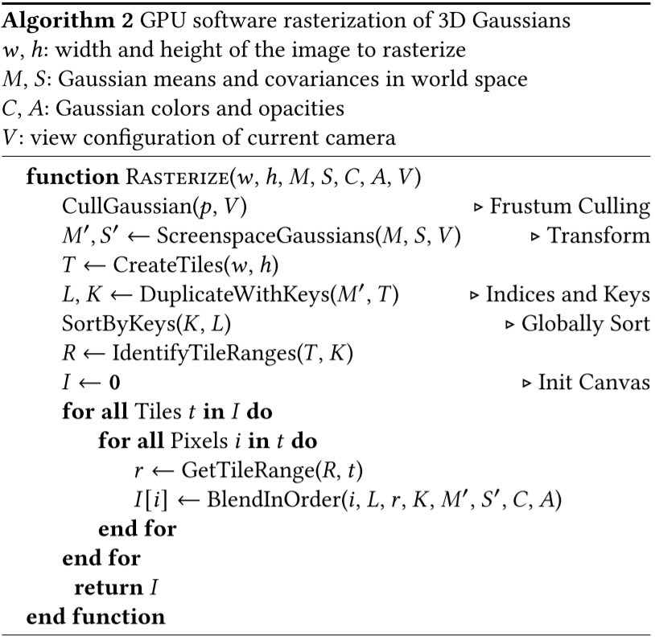
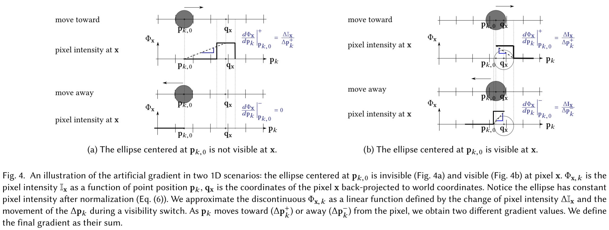
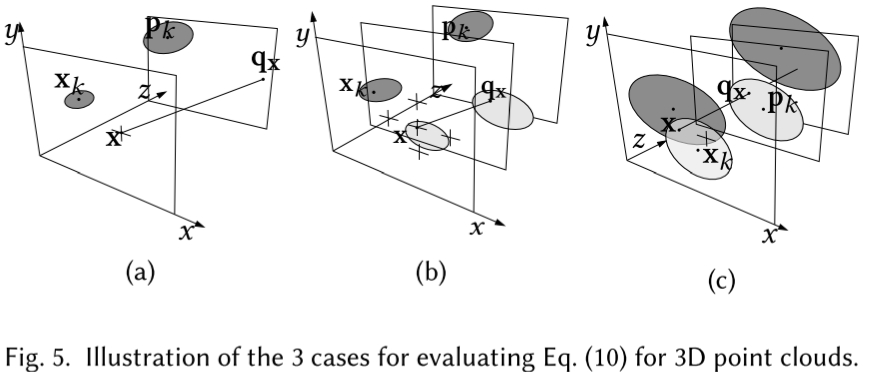

## Splatting

抛雪球算法的英文名称为Splatting方法，也称为足迹法（Footprint），它与光线投射法不同，是反复对体素的投影叠加效果进行运算。它用一个称为足迹的函数计算每一体素投影的影响范围，用高斯函数定义点或者小区域像素的强度分布，从而计算出其对图像的总体贡献，并加以合成，形成最后的图像。由于这个方法模仿了雪球被抛到墙壁上所留下的一个扩散状痕迹的现象，因而取名为“抛雪球法”。

## 如何表示Gaussian点

### 1D → 3D？

前置知识：
* [多元正态分布](../数学/多元高斯分布.md)

论文原文对3D高斯（3D Gaussians）的定义不太直观，笔者计划从高（中）数（学）角度开始梳理。1D高斯即正态分布：

$$N_{\mu ,\sigma}\left( x \right) =\frac{1}{\sqrt{2\pi}\sigma}e^{-\frac{\left( x-\mu \right) ^2}{2\sigma ^2}}$$

其图像为一个单钟形对称曲线，均值$\mu$控制对称轴进而控制图形位置，标准差$\sigma$控制密度集中程度。对一段$x$区间进行积分可以得到分布中的数据落在这一区间的概率，其中绝大多数落在$\left[ \mu -3\sigma ,\mu +3\sigma \right]$（概率：0.9974）。

从其形式可知，高斯分布只有两个参数$\mu,\sigma$，所以一组$\mu,\sigma$可以确定一个1D高斯分布函数，进而对应一条1D线段$\left[ \mu -3\sigma ,\mu +3\sigma \right]$，其位置决定于$\mu$、长度决定于$\sigma$，通过改变$\mu,\sigma$可以表达1D数轴上不同位置和长度的线段。

同样的思想，二维高斯分布的图形是一个椭圆，三维高斯分布的图形是一个**椭球**，这个椭球分别以xyz轴对称。概率论中学的三元正态分布函数通常写成：

$$N_{\mu _x,\sigma _x,\mu _y,\sigma _y,\mu _z,\sigma _z}\left( x,y,z \right) =\frac{1}{\sqrt{2\pi} ^3\sigma _x\sigma _y\sigma _z}\exp \left( -\frac{\left( x-\mu _x \right) ^2}{2{\sigma _x}^2}-\frac{\left( y-\mu _y \right) ^2}{2{\sigma _y}^2}-\frac{\left( z-\mu _z \right) ^2}{2{\sigma _z}^2} \right)$$

这个形式其实是这三个变量为**互不相关的独立变量**且**椭球的坐标系和世界坐标系平行**的情况。
但在本文中的3D Gaussian点可以旋转，所以它的对称轴（后文称为 **模型坐标系** ）不一定和世界坐标系重叠，
复习[多元正态分布](../数学/多元高斯分布.md)中的知识可以回忆起来，对称轴不和世界坐标系重叠的多元正态分布意味着各随机变量相互之间并不是独立变量。

### 3D Gaussian点思想来源

首先复习[多元正态分布](../数学/多元高斯分布.md)联合概率密度函数：

$$p(x_1, \cdots, x_n) = \frac{1}{(2 \pi)^{\frac{n}{2}} \left| \Sigma \right|^{\frac{1}{2}}} \cdot e^{-\frac{1}{2} \cdot [(\vec{X} - \vec{\mu})^\top \Sigma^{-1}(\vec{X} - \vec{\mu})]}$$

三维的情况，用$\bm x=[x,y,z]^T$表示三维空间中的坐标：

$$p(\bm x) = \frac{1}{\sqrt{2\pi}^3\det(\Sigma)} \cdot e^{-\frac{1}{2}(\bm x - \bm\mu)^T \Sigma^{-1}(\bm x - \bm\mu)}$$

此时协方差矩阵$\Sigma$为：

$$\Sigma=
\left[ \begin{matrix} 
	\sigma _{x}^{2}&		\mathrm{Cov}\left( x,y \right)&		\mathrm{Cov}\left( x,z \right)\\
 	\mathrm{Cov}\left( y,x \right)&		\sigma _{y}^{2}&		\mathrm{Cov}\left( y,z \right)\\
 	\mathrm{Cov}\left( z,x \right)&		\mathrm{Cov}\left( z,y \right)&		\sigma _{z}^{2}\\
\end{matrix} \right]$$

### “3D Gaussians” 3D Gaussian点

就像给3个顶点能表达任意一个3D三角形，研究者自然希望构筑的基础元素能覆盖足够多样的几何，而多元正态分布能涵盖空间中任意形状（椭球的三个轴长）任意位姿（包括平移旋转）的椭球：

$$G_s\left(\bm x \right) = \frac{1}{\sqrt{2\pi}^3\det(\Sigma)} \cdot e^{-\frac{1}{2}(\bm x - \bm\mu)^T \Sigma^{-1}(\bm x - \bm\mu)}$$

其中$\bm\mu$是椭球中心（控制世界空间位置平移），协方差矩阵$\Sigma$控制椭球在3轴向的伸缩和旋转（模型坐标系），协方差矩阵的特征向量就是椭球对称轴。

注：在数学上每个高斯分布都覆盖整个空间，当它是椭球是因为它的等高线是椭球。计算的时候显然不能每个像素点上对每个高斯点都采个样，所以实际使用中会把距离中心较远的地方截掉（本文是在概率积分$99\%$的等高线截），截了就看着是一个中心透明度高周围透明度低的椭球。

论文中则是这样定义：

$$G\left(\bm x \right) =e^{-\frac{1}{2}\left(\bm x \right) ^T\Sigma ^{-1}\left(\bm x \right)}$$

和标准形式对比可以看到：
* 默认模型坐标中心在坐标系原点，方便旋转放缩，放入世界坐标系时再加上平移
* 去掉了指数部分前面的尺度系数，所以在空间上的积分不为1，而是在$\bm x=[0,0,0]^T$处值等于1，所以是一个中间不透明（$G\left(\bm x \right)$值为1），越往四周越透明的椭球。
  * 论文中用一个不透明度值$\alpha$控制Gaussian点整体的透明度，可以让Gaussian点中间也透明

### 如何表示Gaussian点的颜色

用[球谐系数](./球谐系数.md)来表示每个高斯的颜色 ，不同视角颜色不同。

## 如何渲染Gaussian点

渲染Gaussian点就是按照相机位置将3D Gaussian点变换到成像平面上。

比较复杂，需学习[《3D Gaussian Splatting中的数学推导》](./3D高斯数学推导.md)和论文
Matthias Zwicker, Hanspeter Pfister, Jeroen Van Baar, and Markus Gross. 2001a. **EWA volume splatting**. *In Proceedings Visualization*, 2001. VIS’01. IEEE, 29–538.

## 如何训练Gaussian点

### 如何训练Gaussian点参数

按照论文中的定义，Gaussian点的参数只有$\Sigma$，其决定了椭球的形状和对称轴方向，不决定椭球的位置。
椭球的位置有另外的训练方法。

训练过程就是用渲染图和原图比较计算视野中高斯点的矩阵$\Sigma$的梯度，然后梯度下降调$\Sigma$。

其梯度计算原理比较复杂，需学习[《3D Gaussian Splatting中的数学推导》](./3D高斯数学推导.md)，相关方法主要来自于论文
Matthias Zwicker, Hanspeter Pfister, Jeroen Van Baar, and Markus Gross. 2001a. **EWA volume splatting**. *In Proceedings Visualization*, 2001. VIS’01. IEEE, 29–538.

### 如何训练Gaussian点位置

文中只提了一嘴“位置梯度”但是没有细讲，不知道具体什么实现。
但是可以参考另一篇基于EWA Splatting的文章《Differentiable surface splatting for point-based geometry processing》。具体见后文对这篇文章的解读。

### 如何增加Gaussian点

需要增加Gaussian点的区域分两种：

* “欠重构区”(under-reconstruction)：缺少Gaussian点的区域
* “过重构区”(over-reconstruction)：每个Gaussian点覆盖很大范围的区域

寻找这些区域：

* “欠重构区”(under-reconstruction)：位置梯度很大但值很小的Gaussian点
* “过重构区”(over-reconstruction)：位置梯度很大且值很大的Gaussian点

增加Gaussian点：

* “欠重构区”(under-reconstruction)：复制这个Gaussian点，再沿位置梯度进行移动
* “过重构区”(over-reconstruction)：减小这个Gaussian点的值，再复制这个Gaussian点，再沿位置梯度进行移动

### 如何减少Gaussian点

减少Gaussian点主要是为了：

* 删除不重要的Gaussian点以减小计算量
* 应对相机面前的错误点(floaters close to the input cameras)

减少Gaussian点的方法：

* 删除不重要的Gaussian点以减小计算量：在训练过程中会有一些Gaussian点的透明度不断下降到小于给定阈值，这些Gaussian点在训练过程中删除
* 应对相机面前的错误点：
  1. 每隔一段时间就将所有Gaussian点的透明度设为0
  2. 禁用点的增减和移动功能，仅对Gaussian点的参数进行一段时间训练
     * 有些Gaussian点会在训练过程中变大，盖住其他点或者盖住相机，删除这些点
  3. 训练完成后会有一些Gaussian点透明度仍然接近0，删除这些点

#### 相机面前的错误点(floaters close to the input cameras)是什么

理论上讲，在每个输入视角面前摆上输入图片，就可以让NeRF训练误差降到0。
这也是NeRF的一种过拟合，正因为如此，NeRF在训练过程中会有概率在输入视角附近训练出一些错误点。
尤其是在相机参数的有误差的时候，输入图像上的某些点时无解的，这是如果用DNN较大的NeRF进行过度的训练，NeRF不管怎么样都没法在场景中找到某些点的最优解，就会将点放在相机面前。

## Gaussian点 → Gaussian点云

### forward pass: Gaussian点云快速光栅化方法

本质上是一个基于画家算法的$\alpha$-Blending。本文所用的$\alpha$-Blending公式是：

前置知识：
* [光栅化 Rasterization](./投影和光栅化.md)
* [$\alpha$-Blending](./alpha-blending.md)

具体过程：

1. 将屏幕划分为16x16的tiles（对于Gaussian点来说就是bins）
2. 计算每个Gaussian点所处的tiles和相对视平面的深度
3. 根据Gaussian点相交的tiles和深度对所有Gaussian点进行排序
   * 排序方法：GPU Radix sort，每个bins里按Gaussian点深度进行排序
   * 排序完成后，每个tile都有一个list(bins of Gaussian点)，和这个tile相交的所有Gaussian点在这个list里面从近到远依次存放
4. 给每个tile在GPU里开一个thread block，将tile对应的list加载进block的shared memory里
5. thread block中的每个thread对应tile中的一个像素，执行$\alpha$-Blending
   1. 计算list里下一个高斯点在当前像素投影出的颜色和$\alpha$值（很显然这样无法处理两个高斯点相交的情况，所以作者强调了这个$\alpha$-Blending是approximate的）
   2. 将颜色与[frame buffer](./投影和光栅化.md)中的颜色混合
   3. 将$\alpha$与透明度buffer中的透明度值相加
   4. 如果透明度值大于阈值则退出计算，否则回到步骤1

### backward pass: Gaussian点云光栅化过程如何求微分

* 问题描述：已知某个像素与ground-truth之间的loss，如何求相关Gaussian点的微分？
* 解决思路：根据上述光栅化方法可知，像素的值是多个高斯点的值的加权平均，所以求相关Gaussian点的微分就是把loss值按照加权平均时的权值分配给这些Gaussian点。

所以，只要知道像素的loss和在forward pass时各Gaussian点的权值就能计算出各高斯点的微分了。

具体过程：

1. 在光栅化Gaussian点时，每个像素计算完成后都记录下最终的$\alpha$值和最后一个有用的Gaussian点在list中的位置
2. 对每个像素，从其对应的list的最后一个Gaussian点开始遍历，对之前记录的最终的$\alpha$值进行分解，从而得到当前像素的loss该给每个Gaussian点分配多少

TBD: 为什么要从最后一个Gaussian点开始遍历？按理说最后一个Gaussian点的光线穿过前面的Gaussian点会有衰减，衰减多少应该是由前面的Gaussian点的$\alpha$决定的啊？

为什么要记录最终的$\alpha$值？因为不是每个像素都会在$\alpha\rightarrow 1$时停下，有些方向可能Gaussian点少或者透明的点太多，所有Gaussian点算完了都没法$\alpha=1$。

## 类似工作：(2019 ACM Trans. Graph.) Differentiable surface splatting for point-based geometry processing

3D Gaussian Splatting文中只提了一嘴“位置梯度”但是没有细讲，不知道具体什么实现。
但是可以参考另一篇基于EWA Splatting的文章《Differentiable surface splatting for point-based geometry processing》，这篇文章和3D Gaussian Splatting非常相似，几乎就是缺了各向异性和$\alpha$的3D Gaussian Splatting。

### 如何定义Gaussian点

和3D Gaussian Splatting一样都是三维正态分布：

$$G_s\left(\bm x \right) = \frac{1}{\sqrt{2\pi}^3\det(\Sigma)} \cdot e^{-\frac{1}{2}(\bm x - \bm\mu)^T \Sigma^{-1}(\bm x - \bm\mu)}$$

唯一的不同是本文没有把这公式改成$G\left(\bm x \right) =e^{-\frac{1}{2}\left(\bm x \right) ^T\Sigma ^{-1}\left(\bm x \right)}$，这意味着本文中的高斯点的位置和旋转都是直接由$\Sigma$（在文中是$\bm J_k$）决定的，没有说要独立出来。但是文中也说了$\bm J_k$由高斯点位置$\bm p_k$和法向量$\bm n_k$决定，求梯度的时候也是针对$\bm p_k$和$\bm n_k$在操作。

### 如何渲染Gaussian点

具体来说，这篇文章将图像上像素$\bm x$处的计算结果定义为$\mathbb I_{\bm x}$：

$$\mathbb I_{\bm x}=\frac{\sum_{k=0}^{N-1}\rho_k(\bm x)\bm w_k}{\sum_{k=0}^{N-1}\rho_k(\bm x)}$$

其中，$w_k$为高斯点$k$的Attributes，可以是颜色；$\rho_k(\bm x)$是高斯点$k$在像素$\bm x$处的概率密度值。
所以这个$\mathbb I_{\bm x}$公式其实就是简化版的Gaussian Splatting，比上面讲的Gaussian Splatting少了基于球谐系数的各向异性和透明度$\alpha$。想想也挺符合这个文章标题“surface splatting”，只管构建表面不管高斯点中心要不要半透明。

回到上面那个公式，其中的$\rho_k(\bm x)$表达式如下：

$$
\rho_k(\bm x)=
\left\{
\begin{aligned}
    &0&&\text{if }\frac{1}{2}\bm x^T(\bm J\bm V_k\bm J)\bm x>\mathcal C\\
    &0&&\text{if }\bm p_{k}\text{ is occluded}\\
    &\bar\rho_k(\bm x)&&\text{otherwise}
\end{aligned}
\right.
$$

从公式里看很明显，这个$\frac{1}{2}\bm x^T(\bm J\bm V_k\bm J)\bm x>\mathcal C$就是和Gaussian Splatting一样把高斯分布较远的地方截掉，此外也一样考虑了高斯点的顺序和遮挡。文中提到遮挡判断的条件很简单，就是对每个像素只求最近的5个高斯点，$\mathbb I_{\bm x}$公式里的$N=5$。

### 如何训练Gaussian点位置

作者先从一维的情况开始解释，然后扩展到三维的情况。

#### 一维的场景

基本思想是用正态分布中心$\bm p_{k,0}$到像素中心$\bm q_x$和边界之间的距离和像素值$\Phi_{\bm x}$（和$\mathbb I_x$一个意思）的比值定义位置梯度：

从图上就能看个大概，其实就是以“高斯点中心像素中心越远值越小”为基础的“启发式”梯度😀

具体点，中心在$\bm p_{k,0}$的高斯点的对像素$\bm x$位置梯度定义为：

$$
\left.\frac{d\Phi_{\bm x}}{d\bm p_{k,0}}\right\vert_{\bm p_{k,0}}=
\left\{
\begin{aligned}
    &\frac{\Delta\mathbb I_x}{\left\|\Delta\bm p_k^+\right\|+\epsilon}\Delta\bm p_k^+&&\bm p_k\text{ invisible at }\bm x\\
    &\frac{\Delta\mathbb I_x}{\left\|\Delta\bm p_k^+\right\|+\epsilon}\Delta\bm p_k^++\frac{\Delta\mathbb I_x}{\left\|\Delta\bm p_k^-\right\|+\epsilon}\Delta\bm p_k^-&&\text{otherwise}\\
\end{aligned}
\right.
$$

其中$\epsilon$防止除数为0梯度爆炸，$\Delta\bm p_k^+$和$\Delta\bm p_k^-$在高斯点和像素相交与不相交时分别有不同的表示。如上图：

* 如上图左所示，高斯点和像素不相交时$\Delta\bm p_k^+=\mathbb I_x/\|\overrightarrow{\bm p_{k,0}\bm q_x}\|$，$\Delta\bm p_k^-=0$
* 如上图右所示，高斯点和像素相交时$\Delta\bm p_k^+$和$\Delta\bm p_k^-$分别是$\mathbb I_x$除高斯点中心和像素左侧和右侧的距离

#### 三维的场景

推广到三维的场景，其实就是基于输出的图片在xy两个方向上计算上述值。从实际出发，作者考虑以下三种情况：

* (a) 高斯点$k$没被任何像素渲染，像素$\bm x$也没有需要渲染的高斯点
* (b) 高斯点$k$没被任何像素渲染，像素$\bm x$被其他高斯点覆盖
  * $\bm p_k$ must move forward in order to become visible, resulting in a negative depth gradient.
  * 为什么？
* (c) 高斯点$k$被某个像素渲染，像素$\bm x$被其他高斯点覆盖
  * 需要把梯度分两份给两个高斯点

文中提到自己的方法和NMR《Neural 3d mesh renderer》很类似，要深入了解可以再去这篇里看看

### Surface regularization

通过一些正则化方法避免局部最优。

* Repulsion term: is aimed at **generating uniform point distributions** by **maximizing the
distances between its neighbors on a local projection plane**
* Projection term: **preserves clean surfaces** by **minimizing the distance from the point to the surface tangent plane**

