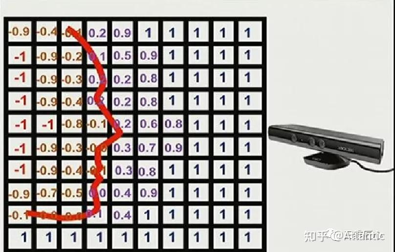
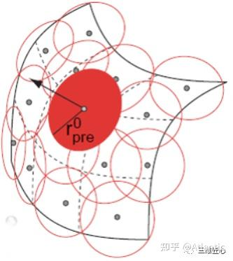
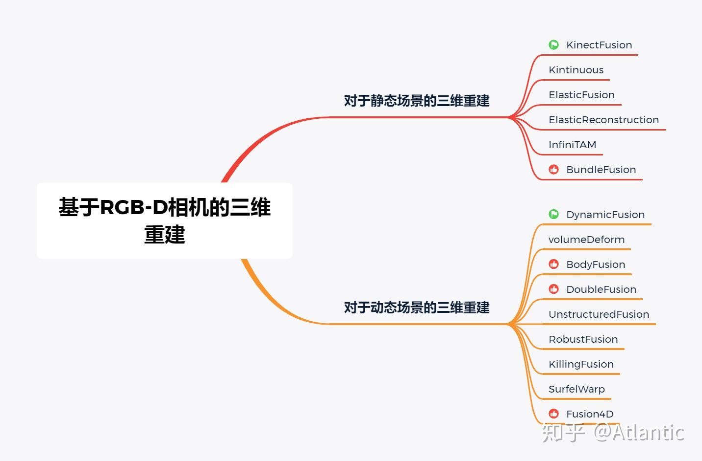
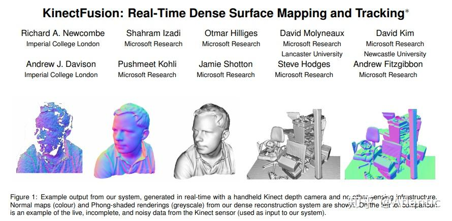
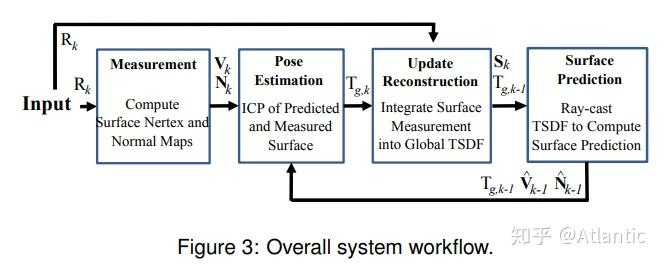
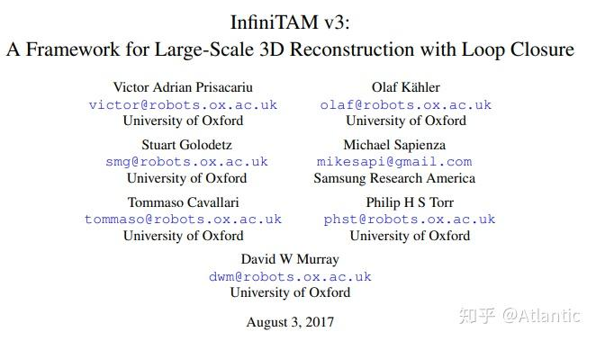
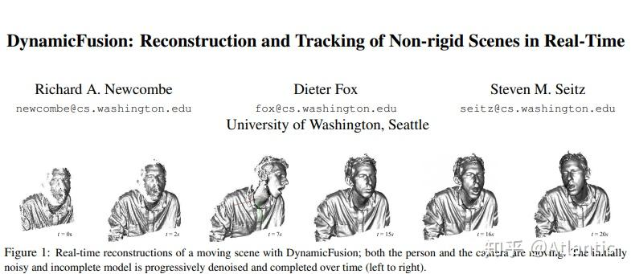
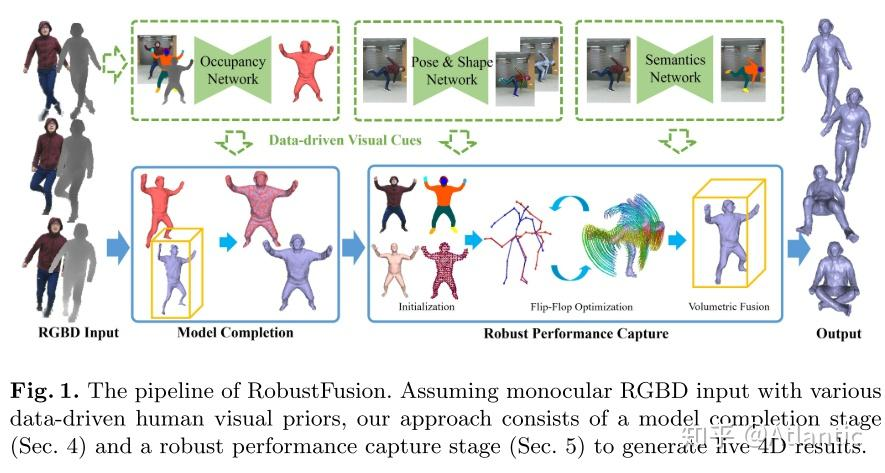
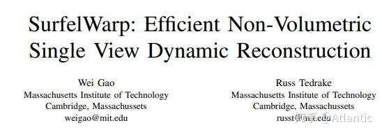

[原文在此](https://mp.weixin.qq.com/s/u3CSKys2CxvfvGzlXgnnXw)

相关综述：[State of the Art on 3D Reconstruction with RGB-D Cameras](https://zollhoefer.com/papers/EG18_RecoSTAR/paper.pdf)

 **近年来，随着AR，VR，虚拟试衣，自动驾驶等领域的兴起，三维重建技术得到了广泛的应用。** 

三维匠自接触三维重建以来，一直为基于RGB-D相机的三维重建所惊艳 **。** 同时，心头一直盘旋着写个总结的想法，相信大家也能体会三维匠的感受， **空中阁楼，如鲠在喉。** 

最后亲身实践一番后，终于可以了却心愿。故先写个总览作为备忘，也可给各位小伙伴提供按图索骥的便利。后续还会写具体文章的分析，分享下对相关论文的理解，希望各位小伙伴也不吝赐教。

 **到这里，很多小伙伴可能会问“基于RGB-D相机的三维重建"和传统的SFM和SLAM算法有什么区别？** 

 **首先，输入数据流不同** 。在基于RGB-D相机的三维重建中，输入有深度信息和彩色信息，并且深度信息起主导作用，而在SLAM和SFM算法中输入的是主要是彩色信息，个别工作也有结合深度信息。

 **其次，侧重点不同** 。SLAM框架类算法中， **定位还是主体** 。我们通常需要定位能实时响应，而稠密地图的构建通常规模和计算量都较大，因此地图的构建却不一定需要实时。当然，地图比较稀疏时，也能实时建图，但并不满足实际需求。另一种思路是 **以建图为主体** ，定位次之，旨在构建稠密准确的高质量地图，这种高质量地图可以提供给SLAM算法定位使用，而基于RGB-D相机的三维重建”便是满足上述需求的一种方法。

“基于RGB-D相机的三维重建”以及“基于深度相机的三维重建“和“基于fusion系列方法的三维重建”其实是三种等价的说法。由于该领域发表的大多数工作都在标题里带有“fusion”，业内也简称这些相关工作为“基于fusion系列方法”，所以本文中也使用“基于fusion系列方法”来描述 **。** 

基于fusion系列的三维重建其实可以大体分为两种，一种是对于静态场景的三维重建，以KinectFusion为典型代表，一种是对于动态场景的三维重建，以 **DynamicFusion为典型代表** 。而不论是静态场景亦或是动态场景的fusion系列重建，最大特点就是使用了 **TSDF** 模型（截断符号距离函数模型），当然也有个别工作使用了 **面元** （Surfel）的表示方法（面元简单来讲就是 **点，法线，颜色，权重，半径以及时间戳** 等属性的集合）。 **值得一提的是，基于动态场景的三维重建的难度远大于基于静态场景的三维重建** ，当然，对于拓扑不会发生变化的重建（比如驱动一个三维网格模板模型），难度会下降很多。

为了更好的理解fusion系列方法，这里在介绍下TSDF模型。TSDF全称是Truncated Signed Distance Function缩写，译为 **截断符号距离函数** 。通常我们先选定要建模的三维空间，比如2m×2m×2m那么大，然后将这个三维空间分割成许多小块，分辨率通常为256×256×256或是128×128×128，每一个小块被称为 **体素** 。

 **TSDF模型中每个体素存储的是该小块与其最近的物体表面的距离。** 如果该小块在该物体表面的的前面，则它存储一个正值；如果该小块位于物体表面之后，那么就存储一个负值。进一步，通常认为物体表面是有厚度的，所以把值太大和值太小的都置为1或是-1，这样就得到了截断之后的距离，也就是所谓的TSDF模型。最后按照定义， **TSDF为0的地方就是重建表面所在** 。换种说法就是TSDF数值由负数过渡到正数的地方。如下图中人脸就出现在TSDF值改变符号，即TSDF值为0的地方，如下图。

再来说说Surfel，如下图。

Surfel这种表示方法最早于2000年提出用于模型渲染，如下图所示，每一个Surfel可以理解成一个小面片，包含以下要素：

* 空间点坐标，即面片位置；
* 空间法向量，即面片方向；
* 颜色；
* 权重，即根据当前点到相机的距离进行初始化，距离越远，权重越小
* 半径，即由当前表面到相机光心的距离决定，距离越大，半径越大
* 时间戳

## 静态场景的三维重建

### (ISMAR 2011)KinectFusion

Newcombe的经典之作

KinectFusion是Richard A. Newcombe的经典之作。该系统仅需要一个移动的低成本深度相机，便可以重建任意并且较为复杂的室内场景。其核心思想将Kinect传感器采集的深度数据流实时融入到（fusion into）一个当前场景对应的全局的隐式表面模型（TSDF模型）中，并使用一个由粗到精的迭代最近点（ICP）算法跟踪当前采集的深度帧数据与上文的全局的隐式表面模型之间的相对关系，从而获得Kinect传感器的位姿变化。

同时这个系统也有着不足之处，该系统只能重建小于7立方米的体空间。主要原因有两点：由于该系统采用稠密的体积表示方式，因此需要消耗大量内存；另外在重建较大建筑时不断累积的误差会造成“飘移”现象。以上两点原因使得Kinectfusion无法重建较大建筑。

[**paper**](https://www.microsoft.com/en-us/research/wp-content/uploads/2016/02/ismar2011.pdf)

[**code**](https://github.com/ParikaGoel/KinectFusion)

<iframe width="560" height="315" src="https://www.youtube.com/embed/KOUSSlKUJ-A?si=ByhsMv5kLe3I_sGb&amp;controls=0" title="YouTube video player" frameborder="0" allow="accelerometer; autoplay; clipboard-write; encrypted-media; gyroscope; picture-in-picture; web-share" referrerpolicy="strict-origin-when-cross-origin" allowfullscreen></iframe>

### (AAAI 2012 Video Competition Contribution) Kintinuous

上述 KinectFusion 算法使用固定体积的网格模型（如256 * 256 * 256）表示重建的三维场景，从而使得只能重建固定大小的场景；另外当重建体积较大，或者网格的空间分辨率较高时很消耗显存。而且 KinectFusion 算法没有回环检测和回环优化，这也造成当相机移动距离大时，不可避免的会有累积误差。这个算法是比较完善的三维重建系统，融合了回环检测和回环优化，还在实时三维刚体重建中使用了deformation graph做非刚体变换，根据回环优化的结果，更新点的坐标，使得回环的地方两次重建的可以对齐。该算法适合大场景的三维重建。

[**paper**](http://www.thomaswhelan.ie/Whelan12rssw.pdf)

[**code**](https://github.com/mp3guy/Kintinuous)

<iframe width="560" height="315" src="https://www.youtube.com/embed/ggvGX4fwT5g?si=NwCGMVbj270-1Mnd" title="YouTube video player" frameborder="0" allow="accelerometer; autoplay; clipboard-write; encrypted-media; gyroscope; picture-in-picture; web-share" referrerpolicy="strict-origin-when-cross-origin" allowfullscreen></iframe>

### (RSS '15, IJRR '16) ElasticFusion

该算法的作者同时也是Kintinuous的作者，不同于Kintinuous的是，ElasticFusion使用了面元（Surfel）的表示方法，并且是用于小场景重建。该工作的主要贡献有两点：将许多“model-to-model”的 **局部闭环** 和较大规模的 **全局闭环** 结合在一起。因此可以保证重建地图的分布的尽可能相近，并且保证了重建结果的 **全局一致性** ；另外该算法对探测 **离散的多点光源环境** 比较高效，也能在该条件下获得较好的重建结果。

另外该算法也面临巨大的挑战，如何解决整个房间以外的 **地图可扩展性** 问题以及如何随着时间变化，保证重建地图的全局一致的稳定性。

[**paper**](http://roboticsproceedings.org/rss11/p01.pdf)

[**code**](https://github.com/mp3guy/ElasticFusion)

<iframe width="560" height="315" src="https://www.youtube.com/embed/XySrhZpODYs?si=gEFu41j-QLvRruPn" title="YouTube video player" frameborder="0" allow="accelerometer; autoplay; clipboard-write; encrypted-media; gyroscope; picture-in-picture; web-share" referrerpolicy="strict-origin-when-cross-origin" allowfullscreen></iframe>

### (CVPR 2015) ElasticReconstruction

该工作提供一种从RGB-D视频重建室内场景重建的方法，其核心思想在于将场景片段的[几何配准](https://zhida.zhihu.com/search?q=%E5%87%A0%E4%BD%95%E9%85%8D%E5%87%86)和全局优化相结合。场景片段是通过将输入RGB-D[视频流](https://zhida.zhihu.com/search?q=%E8%A7%86%E9%A2%91%E6%B5%81)分割成若干帧为一组的场景片段得到的。这种以场景片段为单位进行深度信息的融合可以有效地去除深度图的噪声，从而获得更加准确的表面法向信息以及重建结果。

[**paper**](http://vladlen.info/papers/indoor.pdf)

[**code**](https://github.com/qianyizh/ElasticReconstruction)

### InfiniTAM

 InfiniTAM是一个开源、跨平台、实时的大范围深度信息融合与跟踪技术框架。该算法有好几个版本，有很大的借鉴意义。值得一提的是，InfiniTAM能够比KinectFusion重建更加大范围的3D环境，其关键因素在于InfiniTAM采用了 **哈希表** 的方式来存储隐式的体积表示，极大地节省了内存空间的消耗。

[**paper**](https://arxiv.org/abs/1708.00783)

[**code**](https://github.com/victorprad/InfiniTAM)

<iframe width="560" height="315" src="https://www.youtube.com/embed/PHVQSAoOBjU?si=e3q5duRKVkZTMk0x" title="YouTube video player" frameborder="0" allow="accelerometer; autoplay; clipboard-write; encrypted-media; gyroscope; picture-in-picture; web-share" referrerpolicy="strict-origin-when-cross-origin" allowfullscreen></iframe>

### (ACM Transactions on Graphics 2017 (TOG)) BundleFusion

Bundlefusion应该是目前静态场景重建效果最佳的方案了。该方法提出一个并行化的优化框架，充分利用了基于 **稀疏特征** 以及 **稠密几何** 和 **光度匹配** 提取的对应关系，实时地估计了BA优化的姿态，并具有从追踪失败中恢复（即 **重定位** ）的鲁棒追踪能力。

[**paper**](https://arxiv.org/pdf/1604.01093.pdf)

[**code**](https://github.com/niessner/BundleFusion)

<iframe width="560" height="315" src="https://www.youtube.com/embed/keIirXrRb1k?si=rz8d1qxas113B0UZ" title="YouTube video player" frameborder="0" allow="accelerometer; autoplay; clipboard-write; encrypted-media; gyroscope; picture-in-picture; web-share" referrerpolicy="strict-origin-when-cross-origin" allowfullscreen></iframe>

## 动态场景的三维重建

### (CVPR 2015 Best Paper) DynamicFusion

DynamicFusion获得了2015年CVPR的 **Best Paper Award** ，其作者是Newcombe，和KinectFusion是一个作者。DynamicFusion是 **不基于任何模板先验信息** 的动态重建算法，可是说是 **实时动态重建** 的开山之作。DynamicFusion系统在重建场景的 **几何** 的同时也在估计稠密体积表示的 **6D形变域** 。类似KinectFusion，该系统能随着深度数据的采集，而获得一个 **逐渐去噪，保留细节并且较为完整** 的重建结果。

但同时由于DynamicFusion没有采用任何先验信息使得该算法对于帧间 **较大的运动** 以及 **遮挡区域的运动** 都不具备[鲁棒性](https://zhida.zhihu.com/search?q=%E9%B2%81%E6%A3%92%E6%80%A7)；此外DynamicFusion可以较好得处理封闭拓扑的表面重建，对于 **拓扑发生变化** 就无能为力了。例如我们嘴一开始闭着，后面再打开的情况就没法处理；另外由于追踪的累积误差，使得 **回环闭合失败** 。

[**paper**](https://rse-lab.cs.washington.edu/papers/dynamic-fusion-cvpr-2015.pdf)

<iframe width="560" height="315" src="https://www.youtube.com/embed/i1eZekcc_lM?si=z1YY6i0JZ1bB81bD" title="YouTube video player" frameborder="0" allow="accelerometer; autoplay; clipboard-write; encrypted-media; gyroscope; picture-in-picture; web-share" referrerpolicy="strict-origin-when-cross-origin" allowfullscreen></iframe>

### (ECCV 2016) VolumeDeform

 volumeDeform算法和dynamicFusion类似，都无需预先定义的模板，同样采用体积表示（volumetric representation）的方法来 **参数化重建模型的几何以及运动** 。该算法的[运动追踪](https://zhida.zhihu.com/search?q=%E8%BF%90%E5%8A%A8%E8%BF%BD%E8%B8%AA)基于提取的 **全局稀疏彩色特征** （如SIFT算子）以及 **稠密的深度** 图两者的结合，增强了特征匹配点寻找准确的鲁棒性，进而极大地减小了重建模型的累积误差以及漂移现象 。

该算法的不足之处在于尽管全局SITF特征算子的匹配提高了系统的鲁棒性，减小了对齐的误差，但 **漂移** 现象仍然不能完全消除；另外由于 **正则项** 的设置使得极度弯曲的物体的重建结果在运动上会显得平滑，变得不那么弯曲。

[**paper**](https://graphics.stanford.edu/~niessner/papers/2016/5volumeDeform/innmann2016deform.pdf)

<iframe width="560" height="315" src="https://www.youtube.com/embed/lk_yX-O_Y5c?si=Q0Syi7WnTMBy5EBD" title="YouTube video player" frameborder="0" allow="accelerometer; autoplay; clipboard-write; encrypted-media; gyroscope; picture-in-picture; web-share" referrerpolicy="strict-origin-when-cross-origin" allowfullscreen></iframe>

### (ICCV 2017) BodyFusion

从BodyFusion开始就变得更有意思了。BodyFusion使用 **人体骨架** 作为先验信息，实现鲁棒了的人体动态重建。人体骨架的引入减少了重建表面图节点的 **非刚性形变参数化的歧义性** ，也是在一定程度上缩小了解空间。

不足之处在于所使用的人体骨骼所包含的 **关节点太过稀疏** ，并且运动较快时，会在深度图上出现 **运动模糊** 的情况，从而造成重建方法受限。

[**paper**](http://www.liuyebin.com/bodyfusion/bodyfusion_files/BdyFu_ICCV17.pdf)

<iframe width="560" height="315" src="https://www.youtube.com/embed/tyIWois6sRc?si=I390v3srMg9E2cCv" title="YouTube video player" frameborder="0" allow="accelerometer; autoplay; clipboard-write; encrypted-media; gyroscope; picture-in-picture; web-share" referrerpolicy="strict-origin-when-cross-origin" allowfullscreen></iframe>

### (CVPR 2018 Oral) DoubleFusion

DoubleFusion非常惊艳，该系统将 **数字驱动的模板** （SMPL模型）以及实时重建的稠密 **几何** 、 **非刚性运动** 以及 **内层人体形状** 充分结合在一起。该系统的关键贡献之一在于提出了 **双层表面** 的表示，这里的两层主要是指里层的 **参数化模型表面** （inner body），也就是SMPL模型的shape，以及外层通过 **深度融合得到的表面** （outer surface）。该算法的另一个关键贡献在于提出了一个基于双层表面表示的 **联合运动追踪** ，使得整个系统可以在快速运动的情况下仍然具有鲁棒性。

不足之处在于当用户穿着比较肥大的时候，估计的人体也偏胖;并且无法处理外层表面发生分离的情况，以及无法处理 **人和物体交互** 的情况。

[**paper**](http://www.liuyebin.com/doublefusion/doublefusion_files/doublefusion.pdf)

<iframe width="560" height="315" src="https://www.youtube.com/embed/23LMfj2soNQ?si=yRdX7g8bNttI_mR6" title="YouTube video player" frameborder="0" allow="accelerometer; autoplay; clipboard-write; encrypted-media; gyroscope; picture-in-picture; web-share" referrerpolicy="strict-origin-when-cross-origin" allowfullscreen></iframe>

### (T-PAMI 2019) UnstructuredFusion

通常[多相机系统](https://zhida.zhihu.com/search?q=%E5%A4%9A%E7%9B%B8%E6%9C%BA%E7%B3%BB%E7%BB%9F)需要一些特殊设计的相机以及预先精细的[相机标定](https://zhida.zhihu.com/search?q=%E7%9B%B8%E6%9C%BA%E6%A0%87%E5%AE%9A)操作，但UnstructuredFusion算法可以使用 **未经预先标定以及同步** 的三个深度相机以一种互补并灵活的方式覆盖整个人体，从而实现实时，高质量，完整的动态人体重建。

该算法也有不足之处。由于输入深度图分辨率受限，该算法无法重建目标非常细小的部分，比如人的脸部区域；该算法也无法处理 **网格拓扑分离** 的情况；该算法也无法处理人-物交互情况。

[**paper**](https://ieeexplore.ieee.org/document/8708933)

<iframe width="560" height="315" src="https://www.youtube.com/embed/jnLyQ5-ni-0?si=QQuKIYeCHISAbrgt" title="YouTube video player" frameborder="0" allow="accelerometer; autoplay; clipboard-write; encrypted-media; gyroscope; picture-in-picture; web-share" referrerpolicy="strict-origin-when-cross-origin" allowfullscreen></iframe>

### (ECCV 2020) RobustFusion

诚如算法名字所示，该算法使用了各种数据驱动的视觉线索提高动态重建算法的鲁棒性。

诚如算法名字RobustFusion所示，该算法使用了各种 **数据驱动的视觉线索** 提高动态重建算法的鲁棒性。这些数据驱动的视觉线索具体包括Occupancy Network，Pose&Shape Network以及Semantic Network。 该算法充分利用了上述数据驱动的视觉线索，避免了预先扫描模板的使用，具备了重新初始化的能力，使得该系统能够处理极具挑战性的运动和几何的重建。

该系统的不足之处有：该系统无法实时运行；不能处理重建 **网格拓扑发生分离** 的情况，比如脱掉衣服；不能实现 **人和物的交互** ；当一些极端运动姿态在上述网络训练时没有出现过，那上述数据驱动的视觉线索就不能很好地提供先验信息。

[**paper**](https://www.ecva.net/papers/eccv_2020/papers_ECCV/papers/123490239.pdf)

<iframe width="560" height="315" src="https://www.youtube.com/embed/jnLyQ5-ni-0?si=ZOED_LOp19_InOQT" title="YouTube video player" frameborder="0" allow="accelerometer; autoplay; clipboard-write; encrypted-media; gyroscope; picture-in-picture; web-share" referrerpolicy="strict-origin-when-cross-origin" allowfullscreen></iframe>

### (CVPR 2017) KillingFusion

KillFusion是基于Killing Vector Fields提出的实时三维重建方法，也是不需要任何预先扫描的模板信息以或是形状先验。KillingFusion **不需要显式地进行对应匹配点的搜索** ，当给定感兴趣区域的一对SDF（signed distance fields）,该算法可以估计出一个稠密形变域来对齐给定的SDF。具体的，该算法定义一个和SDF相同分辨率的位移向量域（displacement vector field）,并通过最优化迭代求解。

该算法的不足之处也是由于其优点造成， **不显式地寻找对应点也使得该算法在某些需要显式的对应点的操作上无法应用** ，比如 **纹理映射** 就需要显式的对应点。

[**paper**](http://campar.in.tum.de/pub/slavcheva2017cvpr/slavcheva2017cvpr.pdf)

<iframe width="560" height="315" src="https://www.youtube.com/embed/h0T_XtDwmEc?si=6byi4mPfwgb7pbnN" title="YouTube video player" frameborder="0" allow="accelerometer; autoplay; clipboard-write; encrypted-media; gyroscope; picture-in-picture; web-share" referrerpolicy="strict-origin-when-cross-origin" allowfullscreen></iframe>

### (RSS 2018) SurfelWarp

 SurfelWarp是三维动态重建方案中为数不多的基于面元的算法。类似的，该算法输入一个深度图序列，对非刚性场景进行实时重建，无需任何模板或是先验信息。与现有的方法相比，该算法 **无需维持体积数据结构** ，比如TSDF模型，该系统采用面元（surfel）的几何表示，极大地增强了拓扑发生改变时的追踪能力，从而获得一致的重建结果。

该算法的不足之处在于，模型重初始化可以极大地提高系统的鲁棒性，然而清除错误的面元会 **破坏模型的完整性** 。

[**paper**](https://arxiv.org/pdf/1904.13073.pdf)

[**code**](https://github.com/weigao95/surfelwarp)

<iframe width="560" height="315" src="https://www.youtube.com/embed/fexYm61VGMA?si=L4U6usU8Zn495Blm" title="YouTube video player" frameborder="0" allow="accelerometer; autoplay; clipboard-write; encrypted-media; gyroscope; picture-in-picture; web-share" referrerpolicy="strict-origin-when-cross-origin" allowfullscreen></iframe>

### (SIGGRAPH 2016) Fusion4D

Fusion4D的重建结果也非常惊艳。该算法是基于 **多视角** 方案，没有使用任何先验信息，因此理论上可以重建任何场景或是物体。如视频所示，除了对人体动态重建，还能对狗子动态重建。该算法很重要的一点贡献是引入了 **key volume** ,因此对于 **较大的帧间运动** 以及 **网格拓扑发生改变** 时都有很强的鲁棒性；另外Fusion4D还引入了 **体素碰撞检测** ，从而得到正确的TSDF模型。

该系统不足之处在于当RGBD输入流 **帧率过低或者帧间运动过大** 时，会使帧间对应匹配[点估计](https://zhida.zhihu.com/search?q=%E7%82%B9%E4%BC%B0%E8%AE%A1)不准确，造成非刚性对齐过程无法收敛。

[**paper**](https://www.microsoft.com/en-us/research/wp-content/uploads/2016/11/a114-dou.pdf) 

<iframe width="560" height="315" src="https://www.youtube.com/embed/2dkcJ1YhYw4?si=JjBXqGGilH4nroGF" title="YouTube video player" frameborder="0" allow="accelerometer; autoplay; clipboard-write; encrypted-media; gyroscope; picture-in-picture; web-share" referrerpolicy="strict-origin-when-cross-origin" allowfullscreen></iframe>
