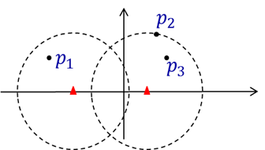

**Description**

海面上有一些船需要与陆地进行通信，需要在海岸线上布置一些基站。现将问题抽象为，在x轴上方，给出n条船的坐标p1,p2,…,pn，其中pi=(xi,yi)，0≤yi≤d, 1≤i≤n，在x轴安放的基站可以覆盖半径为d的区域内的所有船只，问在x轴至少要安放几个基站才可以将x轴上方的船只都覆盖到。 

## 问题分析

直接贪心即可。

从最左边的点开始，对每个点找与其距离为$d$的$x$轴上右边的点，删去这个点覆盖的其他点，再重复这个过程即可。

（最好的方案就是刚好覆盖点的方案）