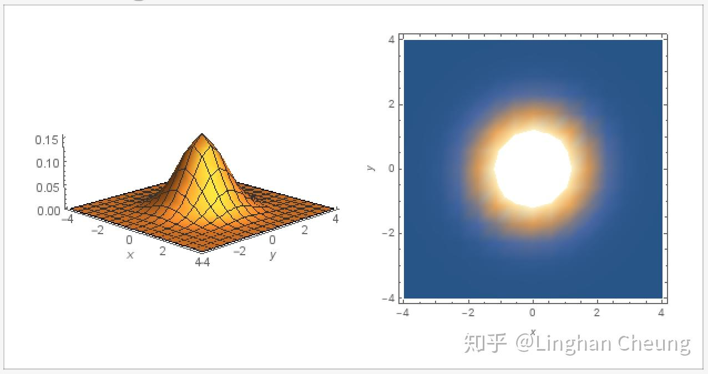
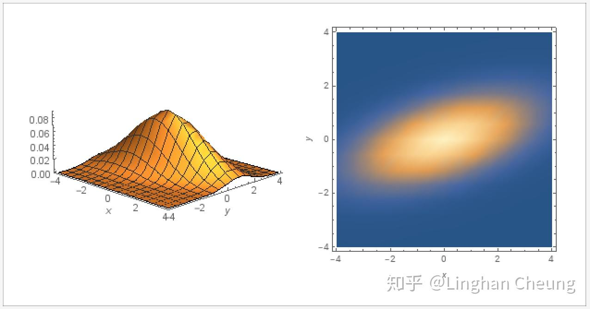
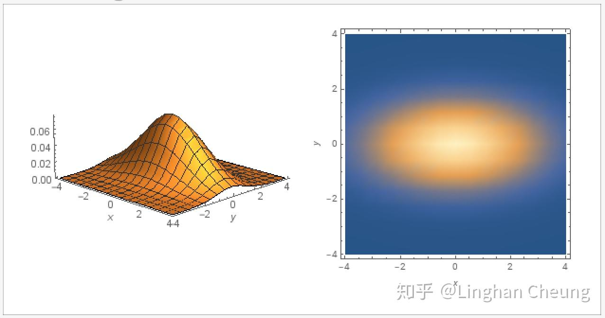
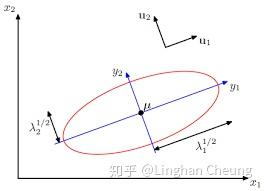

[原文在此](https://zhuanlan.zhihu.com/p/58987388)

## 摘要

高斯分布被誉为"上帝的分布", 其强悍的建模能力和优美的数学性质使得高斯分布在现实中得到广泛的应用. 由中心极限定理  $^{[1]}$  我们知道, 大量独立同分布的随机变量的均值在做适当标准化之后会依分布收敛于高斯分布, 这使得高斯分布具有普适性的建模能力. 数学上, 当使用高斯分布对贝叶斯推断的似然和先验进行建模时, 得到的后验同样为高斯分布, 即其具有共轭先验性质. 在随机过程理论中, 多元高斯分布则是高斯过程的理论基础. 这种种场景使得高斯分布颇受重视, 并发展出一套成熟完整的理论体系. 本文主要介绍多元高斯分布的由来与其背后的几何原理, 分为如下章节:

1. 阐述多元标准高斯分布;
1. 由多元标准高斯分布导出多元高斯分布;
1. 阐述多元高斯分布的几何意义;
1. 总结.

关键词: 多元高斯分布, 高斯过程, 概率论与数理统计, 机器学习

校对: [@叶定南](https://www.zhihu.com/people/b864c4a73363fac5ac08494c5806ce32), [@Towser](https://www.zhihu.com/people/157deec64cc5e062b2207aeece42f50f), [@Syous](https://www.zhihu.com/people/8c52f34f147b2f02559e90cad5b29b12) 

## 多元标准高斯分布

熟悉一元高斯分布的同学都知道, 若随机变量  $X \sim \mathcal{N}(\mu, \sigma^2)$  , 则有如下的概率密度函数

$$p(x) = \frac{1}{\sigma \sqrt{2 \pi}} \cdot e^{-\frac{1}{2} \cdot (\frac{x - \mu}{\sigma})^2} \tag{1}$$

$$1 = \int_{- \infty}^{+ \infty}{p(x)dx} \tag{2}$$

而如果我们对随机变量  $X$  进行标准化, 用  $Z = \frac{X - \mu}{\sigma}$  对(1)进行换元, 继而有

$$\begin{aligned} \because x(z) & = z \cdot \sigma + \mu \\ \therefore p(x(z)) & = \frac{1}{\sigma \sqrt{2 \pi}} \cdot e^{-\frac{1}{2} \cdot (z)^2} \\ 1 & = \int_{-\infty}^{+\infty}{p(x(z))dx} \\ & = \int_{-\infty}^{+\infty}{ \frac{1}{\sigma \sqrt{2 \pi}} \cdot e^{-\frac{1}{2} \cdot (z)^2}dx} \\ & = \int_{-\infty}^{+\infty}{ \frac{1}{\sqrt{2 \pi}} \cdot e^{-\frac{1}{2} \cdot (z)^2} dz} \tag{3} \end{aligned} $$

此时我们说随机变量  $Z \sim \mathcal{N}(0, 1)$  服从一元标准高斯分布, 其均值  $\mu = 0$  , 方差  $\sigma^2 = 1$  , 其概率密度函数为

$$p(z) = \frac{1}{\sqrt{2 \pi}} \cdot e^{-\frac{1}{2} \cdot (z)^2} \tag4$$

需要注意的是, 为了保证概率密度函数在  $R$  上的积分为1, 换元时需要求  $dx = \sigma \cdot dz$  , 从而得到(3).

 **随机变量**  $X$  **标准化的过程, 实际上的消除量纲影响和分布差异的过程. 通过将随机变量的值减去其均值再除以标准差, 使得随机变量与其均值的差距可以用若干个标准差来衡量, 从而实现了不同随机变量与其对应均值的差距, 可以以一种相对的距离来进行比较.** 

一元标准高斯分布与我们讨论多元标准高斯分布有什么关系呢? 事实上, 多元标准高斯分布的概率密度函数正是从(4)导出的. 假设我们有随机向量  $\vec{Z} = [Z_1, \cdots, Z_n]^\top$  , 其中  $Z_i \sim \mathcal{N}(0, 1) (i = 1, \cdots, n)$  且  $Z_i, Z_j(i, j = 1, \cdots, n \wedge i \neq j)$  彼此独立, 即随机向量中的每个随机变量  $Z_{i}$  都服从标准高斯分布且两两彼此独立. 则由(4)与独立随机变量概率密度函数之间的关系, 我们可得随机向量  $\vec{Z} = [Z_1, \cdots, Z_n]^\top$  的联合概率密度函数为

$$\begin{aligned} p(z_1, \cdots, z_n) & = \prod_{i=1}^{n} \frac{1}{\sqrt{2 \pi}} \cdot e^{-\frac{1}{2} \cdot (z_i)^2} \\ & = \frac{1}{(2 \pi)^{\frac{n}{2}}} \cdot e^{-\frac{1}{2} \cdot (Z^\top Z)} \\ 1 & = \int_{-\infty}^{+\infty} \cdots \int_{-\infty}^{+\infty} p(z_1, \cdots, z_n) \ dz_1 \cdots dz_n \tag5 \end{aligned}$$

我们称随机向量  $\vec{Z} \sim \mathcal{N}(\vec{0}, \mathbf{I})$  , 即随机向量服从均值为零向量, 协方差矩阵为单位矩阵的高斯分布. 在这里, 随机向量  $\vec{Z}$  的协方差矩阵是  $Conv(Z_i, Z_j), i, j = 1, \cdots, n$  组成的矩阵, 即

$$\begin{aligned} [Conv(Z_i, Z_j)]_{n \times n} & = \mathbf{E}[(Z - \vec{\mu})(Z - \vec{\mu})^\top] \\ & = \mathbf{I} \tag6 \end{aligned}$$

由于随机向量  $\vec{Z} \sim \mathcal{N}(\vec{0}, \mathbf{I})$  , 所以其协方差矩阵的对角线元素为1, 其余元素为0. 如果我们取常数  $c = p(z_1, \cdots, z_n)$  , 则可得函数  $p(z_1, \cdots, z_n)$  的等高线为  $c' = Z^\top Z$  , 当随机向量  $\vec{Z}$  为二维向量时, 我们有

$$c' = Z^\top \cdot Z = (z_1 - 0)^2 + (z_2 - 0)^2 \tag7$$

由(7)我们可知, 其等高线为以(0, 0)为圆心的同心圆.

## 多元高斯分布

由上一节我们知道, 当随机向量  $\vec{Z} \sim \mathcal{N}(\vec{0}, \mathbf{I})$  时, 其每个随机变量  $Z_i \sim \mathcal{N}(0, 1) (i = 1, \cdots, n)$  彼此独立, 我们可通过(4)与独立随机变量概率密度函数之间的关系得出其联合概率密度函数(5). 那对于普通的随机向量  $\vec{X} \sim \mathcal{N}(\vec{\mu}, \Sigma)$  , 即其每个随机变量  $X_i \sim \mathcal{N}(\mu_i, \sigma_i^2) (i = 1, \cdots, n)$  且  $X_i, X_j(i, j = 1, \cdots, n)$  彼此不独立的情况下, 我们该如何求随机向量  $\vec{X}$  的联合概率密度函数呢? 一个很自然的想法是,  **如果我们能通过线性变换, 使得随机向量**  $\vec{X} = [X_1, \cdots, X_n]^\top$  **中的每个随机变量彼此独立, 则我们也可以通过独立随机变量概率密度函数之间的关系求出其联合概率密度函数** . 事实上, 我们有如下定理可完成这个工作  $^{[2]}$  

>定理1: 若存在随机向量  $\vec{X} \sim \mathcal{N}(\vec{\mu}, \Sigma)$  , 其中  $\vec{\mu} \in R^n$  为均值向量,  $\Sigma \in S^{n \times n}_{++}$  半正定实对称矩阵为  $\vec{X}$  的协方差矩阵, 则存在满秩矩阵  $B \in R^{n \times n}$  , 使得  $\vec{Z} = B^{-1}(\vec{X} - \vec{\mu})$  , 而  $\vec{Z} \sim \mathcal{N}(\vec{0}, \mathbf{I})$  .

有了定理1, 我们就可以对随机向量  $\vec{X}$  做相应的线性变换, 使其随机变量在线性变换后彼此独立, 从而求出其联合概率密度函数, 具体地

$$\begin{aligned} & \because & \vec{Z} & = B^{-1}(\vec{X} - \vec{\mu}), \vec{Z} \sim \mathcal{N}(\vec{0}, I) \tag8 \\ & \therefore & p(z_1, \cdots, z_n) & = \frac{1}{(2 \pi)^{\frac{n}{2}}} \cdot e^{-\frac{1}{2} \cdot (Z^\top Z)} \\ & & p(z_1(x_1, \cdots, x_n), \cdots) & = \frac{1}{(2 \pi)^{\frac{n}{2}}} \cdot e^{-\frac{1}{2} \cdot [(B^{-1}(\vec{X} - \vec{\mu}))^\top (B^{-1}(\vec{X} - \vec{\mu}))]} \\ & & & = \frac{1}{(2 \pi)^{\frac{n}{2}}} \cdot e^{-\frac{1}{2} \cdot [(\vec{X} - \vec{\mu})^\top (BB^\top)^{-1}(\vec{X} - \vec{\mu})]} \end{aligned}$$

$$\begin{aligned} & \therefore & 1 = \int_{-\infty}^{+\infty} & \cdots \int_{-\infty}^{+\infty} p(z_1(x_1, \cdots, x_n), \cdots) \ dz_1 \cdots dz_n \\ & & = \int_{-\infty}^{+\infty} & \cdots \int_{-\infty}^{+\infty} \frac{1}{(2 \pi)^{\frac{n}{2}}} \cdot e^{-\frac{1}{2} \cdot [(\vec{X} - \vec{\mu})^\top (BB^\top)^{-1}(\vec{X} - \vec{\mu})]} \ dz_1 \cdots dz_n \tag9 \end{aligned}$$

由多元函数换元变换公式, 我们还需要求出雅可比行列式  $J(\vec{Z} \to \vec{X})$  , 由(8)可得

$$J(\vec{Z} \to \vec{X}) = \left| B^{-1} \right| = \left| B \right|^{-1} = \left| B \right|^{-\frac{1}{2}} \cdot \left| B^\top \right|^{-\frac{1}{2}} = \left| B B^\top \right|^{-\frac{1}{2}} \tag{10}$$

由(9)(10), 我们可进一步得

$$1 = \int_{-\infty}^{+\infty} \cdots \int_{-\infty}^{+\infty} \frac{1}{(2 \pi)^{\frac{n}{2}} \left| B B^\top \right|^{\frac{1}{2}}} \cdot e^{-\frac{1}{2} \cdot [(\vec{X} - \vec{\mu})^\top (BB^\top)^{-1}(\vec{X} - \vec{\mu})]} \ dx_1 \cdots dx_n \tag{11}$$

我们得到随机向量  $\vec{X} \sim \mathcal{N}(\vec{\mu}, \Sigma)$  的联合概率密度函数为

$$p(x_1, \cdots, x_n) = \frac{1}{(2 \pi)^{\frac{n}{2}} \left| B B^\top \right|^{\frac{1}{2}}} \cdot e^{-\frac{1}{2} \cdot [(\vec{X} - \vec{\mu})^\top (BB^\top)^{-1}(\vec{X} - \vec{\mu})]} \tag{12}$$

在(12)中, 随机向量  $\vec{X}$  的协方差矩阵还未得到体现, 我们可通过线性变换(8)做进一步处理

$$\begin{aligned} \Sigma & = \mathbf{E}[(\vec{X} - \vec{\mu})(\vec{X} - \vec{\mu})^\top] \\ & = \mathbf{E}[(B\vec{Z} - \vec{0})(B\vec{Z} - \vec{0})^\top] \\ & = \mathbf{Conv}(B\vec{Z}, B\vec{Z}) \\ & = B \mathbf{Conv}(\vec{Z}, \vec{Z}) B^\top \\ & = BB^\top \tag{13} \end{aligned}$$

我们发现, (12)中  $BB^\top$  就是线性变换前的随机向量  $\vec{X} \sim \mathcal{N}(\vec{\mu}, \Sigma)$  的协方差矩阵  $\Sigma$  , 所以由(12)(13), 我们可以得到联合概率密度函数的最终形式

$$p(x_1, \cdots, x_n) = \frac{1}{(2 \pi)^{\frac{n}{2}} \left| \Sigma \right|^{\frac{1}{2}}} \cdot e^{-\frac{1}{2} \cdot [(\vec{X} - \vec{\mu})^\top \Sigma^{-1}(\vec{X} - \vec{\mu})]} \tag{14}$$

 **原本由定理1, 我们还需要求线性变换矩阵**  $B$  **, 才能确定随机向量**  $\vec{X}$  **的联合概率密度函数的表达式, 现在由(13)我们即可得最终形式(14), 随机向量**  $\vec{X}$  **的联合概率密度函数由其均值向量**  $\vec{\mu}$  **和其协方差矩阵**  $\Sigma$  **唯一确定, 但我们需要明白的是, 这是通过定理1的线性变换**  $\vec{Z} = B^{-1}(\vec{X} - \vec{\mu})$  **得到的, 即此线性变换隐含其中.** 

如果我们取常数  $c = p(x_1, \cdots, x_n)$  , 则可得函数  $p(x_1, \cdots, x_n)$  的等高线为 $c' = (\vec{X} - \vec{\mu})^\top \Sigma^{-1}(\vec{X} - \vec{\mu})$  , 当随机向量  $\vec{X}$  为二维向量时, 我们对协方差矩阵  $\Sigma$  进行分解, 因为其为实对称矩阵, 可正交对角化

$$\begin{aligned} \Sigma & = Q \Lambda Q^\top \\ c' & = (\vec{X} - \vec{\mu})^\top (Q \Lambda Q^\top)^{-1}(\vec{X} - \vec{\mu}) \\ & = (\vec{X} - \vec{\mu})^\top Q \Lambda^{-1} Q^\top(\vec{X} - \vec{\mu}) \\ & = [Q^\top (\vec{X} - \vec{\mu})]^\top \Lambda^{-1} [Q^\top(\vec{X} - \vec{\mu})] \tag{15} \end{aligned}$$

由于矩阵  $Q$  是酉矩阵, 所以  $Q^\top (\vec{X} - \vec{\mu}) = Q^\top \vec{X} - Q^\top \vec{u}$  可以理解为将随机向量  $\vec{X}$  , 均值向量  $\vec{\mu}$  在矩阵  $Q$  的列向量所组成的单位正交基上进行投影并在该单位正交基上进行相减. 我们不妨记投影后的向量分别为  $\vec{X}_Q = Q^\top \vec{X}, \vec{u}_Q = Q^\top \vec{\mu}$  , 同时记矩阵  $\Lambda = \begin{bmatrix} \lambda_1 & 0 \\ 0 & \lambda_2\end{bmatrix}, \lambda_1 \geq \lambda_2$  , 则(15)的二次型可表示为

$$c' = (\frac{X_{Q_1} - \mu_{Q_1}}{\sqrt{\lambda_1}})^2 + (\frac{X_{Q_2} - \mu_{Q_2}}{\sqrt{\lambda_2}})^2 \tag{16}$$

由(16)我们可知, 此时函数  $p(x_1, \cdots, x_n)$  的等高线是在矩阵  $Q$  的列向量所组成的单位正交基上的一个椭圆, 椭圆的中心是  $\vec{u}_{Q} = [\mu_{Q_1}, \mu_{Q_2}]^\top$  , 长半轴为  $\sqrt{\lambda_1}$  , 短半轴为  $\sqrt{\lambda_{2}}$  . 

如果协方差矩阵  $\Sigma$  不是对角矩阵, 则正交对角化得到的酉矩阵  $Q$  不是标准正交基, 其代表一个旋转, 此时的椭圆应该是一个倾斜的椭圆, 随机向量  $\vec{X}$  中的随机变量不是彼此独立的; 

如果协方差矩阵  $\Sigma$  是对角矩阵, 则正交对角化得到的酉矩阵  $Q$  就是标准正交基, 则前述的投影是在标准正交基上完成的, 此时的椭圆应该是一个水平的椭圆, 随机向量  $\vec{X}$  中的随机变量就是彼此独立的.

## 多元高斯分布的几何意义

现在我们知道, 随机向量  $\vec{X} \sim \mathcal{N}(\vec{\mu}, \Sigma)$  的联合概率密度函数是通过线性变换  $\vec{Z} = B^{-1}(\vec{X} - \vec{\mu})$  的帮助, 将随机向量  $\vec{X}$  的各个随机变量去相关性, 然后利用独立随机变量概率密度函数之间的关系得出的, 亦既是定理1所表述的内容. 那具体地, 线性变化  $\vec{Z} = B^{-1}(\vec{X} - \vec{\mu})$  是怎么去相关性使随机向量  $\vec{X}$  的各个随机变量彼此独立的呢? 我们不妨在二维平面上, 再次由定理1和(15)出发来看看这个去相关性的过程.

由定理1我们有

$$\begin{aligned} & \because & \vec{Z} & = B^{-1}(\vec{X} - \vec{\mu}), \vec{Z} \sim \mathcal{N}(\vec{0}, I) \\ &\therefore & \vec{Z}^\top \vec{Z} & = (B^{-1}(\vec{X} - \vec{\mu}))^\top (B^{-1}(\vec{X} - \vec{\mu})) \\ & & & = (\vec{X} - \vec{\mu})^\top (BB^\top)^{-1}(\vec{X} - \vec{\mu}) \\ & & & = (\vec{X} - \vec{\mu})^\top \Sigma^{-1}(\vec{X} - \vec{\mu}) \tag{17} \end{aligned}$$

再由(15)(17)可得

$$\begin{aligned} \vec{Z}^\top \vec{Z} & = [Q^\top (\vec{X} - \vec{\mu})]^\top \Lambda^{-1} [Q^\top(\vec{X} - \vec{\mu})] \\ & = [Q^\top (\vec{X} - \vec{\mu})]^\top (\Lambda^{-\frac{1}{2}})^\top \Lambda^{-\frac{1}{2}} [Q^\top(\vec{X} - \vec{\mu})] \\ & = [\Lambda^{-\frac{1}{2}}Q^\top (\vec{X} - \vec{\mu})]^\top [\Lambda^{-\frac{1}{2}} Q^\top(\vec{X} - \vec{\mu})] \\ & = [(Q \Lambda^{-\frac{1}{2}})^\top (\vec{X} - \vec{\mu})]^\top [(Q \Lambda^{-\frac{1}{2}})^\top (\vec{X} - \vec{\mu})] \\ & = [(Q \cdot \begin{bmatrix} \frac{1}{\sqrt{\lambda_1}} & 0 \\ 0 & \frac{1}{\sqrt{\lambda_2}} \end{bmatrix})^\top (\vec{X} - \vec{\mu})]^\top \\ & \cdot \ \ [(Q \cdot \begin{bmatrix} \frac{1}{\sqrt{\lambda_1}} & 0 \\ 0 & \frac{1}{\sqrt{\lambda_2}} \end{bmatrix})^\top (\vec{X} - \vec{\mu})] \tag{18} \end{aligned}$$

由(18)我们已经可以非常明显地看出线性变换  $\vec{Z} = B^{-1}(\vec{X} - \vec{\mu})$  的具体操作了

$$\underbrace{(\underbrace{Q \cdot \underbrace{\begin{bmatrix} \frac{1}{\sqrt{\lambda_1}} & 0 \\ 0 & \frac{1}{\sqrt{\lambda_2}} \end{bmatrix}}_\text{对标准正交基拉伸}}_\text{对拉伸后的正交基旋转} )^\top (\vec{X} - \vec{\mu})}_{\text{将随机向量}\vec{X}\text{去均值后在新正交基上投影}} \tag{19}$$

我们先对标准正交基进行拉伸, 横轴和纵轴分别拉伸  $\frac{1}{\sqrt{\lambda_1}}, \frac{1}{\sqrt{\lambda_2}}$  倍, 再使用酉矩阵  $Q$  对拉伸后的正交基进行旋转, 最后将去均值的随机向量  $\vec{X} - \vec{\mu}$  在新的正交基上进行投影, 从而使完成线性变换  $\vec{Z} = B^{-1}(\vec{X} - \vec{\mu})$  后的随机变量在新的正交基上彼此独立. 值得注意的是, 如果随机向量  $\vec{X}$  本来就是独立随机变量组成的, 此时其协方差矩阵是一个对角矩阵, 则酉矩阵  $Q$  是一个单位矩阵  $\mathbf{I}$  , 此线性变换中只有拉伸而没有旋转.

 **而如果我们只保留**  $(Q \Lambda^{-\frac{1}{2}})^\top (\vec{X} - \vec{\mu})$  **这个投影后坐标轴长度较长的对应的坐标, 我们就可以达到将随机向量**  $\vec{X}$  **进行降维的效果, 而这, 就是所谓的PCA(principal component analysis, 主成分分析).** 

## 总结

本文从多元标准高斯分布出发, 阐述了如何通过线性变换, 将任意的服从多元高斯分布的随机向量去相关性, 并求出其联合概率密度函数的过程, 最后给出了线性变换的具体过程阐述. 多元高斯分布是许多其他理论工具的基础, 掌握它是进行其他相关理论研究的关键.

引用

[1] Wikipedia contributors. "中心极限定理."维基百科, 自由的百科全书. 维基百科, 自由的百科全书, 9 May 2018. Web. 9 May 2018.‹[https://zh.wikipedia.org/w/index.php?title=%E4%B8%AD%E5%BF%83%E6%9E%81%E9%99%90%E5%AE%9A%E7%90%86&oldid=49494817](https://zh.wikipedia.org/w/index.php?title=%E4%B8%AD%E5%BF%83%E6%9E%81%E9%99%90%E5%AE%9A%E7%90%86&oldid=49494817)›.

[2] Do, C. (2008).The Multivariate Gaussian Distribution. [online] Cs229.stanford.edu. Available at: [http://cs229.stanford.edu/section/gaussians.pdf](http://cs229.stanford.edu/section/gaussians.pdf) [Accessed 13 Mar. 2019].

[3] 张, 伟. (2019). 多元正态分布. [online] Staff.ustc.edu.cn. Available at: [http://staff.ustc.edu.cn/~zwp/teach/MVA/Lec4_slides.pdf](http://staff.ustc.edu.cn/~zwp/teach/MVA/Lec4_slides.pdf) [Accessed 13 Mar. 2019].

[4] Wikipedia contributors. "多元正态分布."维基百科, 自由的百科全书. 维基百科, 自由的百科全书, 16 Sep. 2018. Web. 16 Sep. 2018.‹[https://zh.wikipedia.org/w/index.php?title=%E5%A4%9A%E5%85%83%E6%AD%A3%E6%80%81%E5%88%86%E5%B8%83&oldid=51304757](https://zh.wikipedia.org/w/index.php?title=%E5%A4%9A%E5%85%83%E6%AD%A3%E6%80%81%E5%88%86%E5%B8%83&oldid=51304757)›.

[5] Wikipedia contributors. "雅可比矩阵."维基百科, 自由的百科全书. 维基百科, 自由的百科全书, 7 Dec. 2018. Web. 7 Dec. 2018.‹[https://zh.wikipedia.org/w/index.php?title=%E9%9B%85%E5%8F%AF%E6%AF%94%E7%9F%A9%E9%98%B5&oldid=52294204](https://zh.wikipedia.org/w/index.php?title=%E9%9B%85%E5%8F%AF%E6%AF%94%E7%9F%A9%E9%98%B5&oldid=52294204)›.
