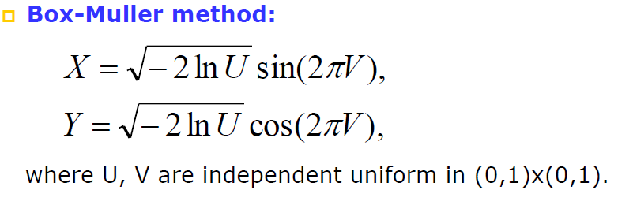

## 如何通过一个输出为**均匀分布**的随机函数构造能输出指定概率分布的随机函数

设有一随机变量$X_0$概率累积函数为$P(X_0>x)=F_0(x)$，要求用此随机变量构造一个概率累积函数为$P(X>x)=F(x)$的随机变量$X$，求$X$相对$X_0$的表达式

解：

设$X$相对$X_0$的表达式为$X=G(X_0)$

$\because$ 概率累积函数必为单调递增函数

$\therefore$

$$
\begin{aligned}
P(X>x)&=P(G(X_0)>x)\\
&=P(X_0>G^{-1}(x))\\
&=F_0(G^{-1}(x))
\end{aligned}
$$

$\because$ 随机变量$X$的概率累积函数为$P(X>x)=F(x)$

$\therefore$ 原问题即可转化为求解：

$$F_0(G^{-1}(x))=F(x)$$

即

$$G^{-1}(x)=F_0^{-1}(F(x))$$

$\therefore$ 原问题转化为求解函数方程 $G^{-1}(x)=F_0^{-1}(F(x))$

## 应用

### 1.现有一随机变量$X_0\sim U(a,b)$，求$G(x)$，使$X=G(X_0)$满足概率分布$P(X\ge l)=1/C^l$ $(l\in \mathbb N)$

解：

$\because$ $X_0\sim U(a,b)$依上文所述

$\therefore$

$$
P(X_0\ge x)=F_0(x)=
\left\{
\begin{aligned}
&0&x<a\\
&\frac{x-a}{b-a}&a\le x\le b\\
&1&x>b
\end{aligned}
\right.
$$

$\therefore$ $F_0^{-1}(y)=(b-a)y+a\quad(0\le y\le 1)$

$\because$ $P(X\ge l)=F(l)=1/C^l\quad(l\in \mathbb N)$，以及显然$P(X\ge l)\in [0,1]$

$\therefore$ 依上文所述，$l\in \mathbb N$时有

$$
\begin{aligned}
G^{-1}(l)&=F_0^{-1}(F(l))\\
G^{-1}(l)&=(b-a)F(l)+a\\
G^{-1}(l)&=(b-a)/C^l+a
\end{aligned}
$$

解此函数方程：

$$
\begin{aligned}
G^{-1}(l)=x&=(b-a)/C^l+a\\
C^l&=\frac{b-a}{x-a}\\
G(x)=l&=log_C\left(\frac{b-a}{x-a}\right)
\end{aligned}
$$

即得：

$$G(x)=log_C\left(\frac{b-a}{x-a}\right)$$

题中所给的条件是确保在 $l\in \mathbb N$ 时满足概率分布，但没有给出在 $l\notin \mathbb N$时的分布情况。而显然上述结果在$l\in \mathbb R$时也可以满足题中所给的概率分布；且其输入的随机变量为$X_0$，满足$X_0\sim U(a,b)$，不会出现奇异点。

综述所述，满足题中所给条件的$G(x)=log_C\left(\frac{b-a}{x-a}\right)$。

### 2.现有一随机变量$X_0\sim U(a,b)$，求$G(x)$，使$X=G(X_0)$满足概率分布：

$$
P(X\ge l)=
\left\{
\begin{aligned}
&1/C^l&(0\le l<L+1)\\
&0&(l\ge L+1)
\end{aligned}
\right.
$$

同理可得：

$$
P(X_0\ge x)=F_0(x)=
\left\{
\begin{aligned}
&0&x<a\\
&\frac{x-a}{b-a}&a\le x\le b\\
&1&x>b
\end{aligned}
\right.
$$

$$F_0^{-1}(y)=(b-a)y+a\quad(0\le y\le 1)$$

$\therefore$

$$
\begin{aligned}
G^{-1}(l)&=F_0^{-1}(F(l))\\
G^{-1}(l)&=(b-a)F(l)+a\\

G^{-1}(l)&=
\left\{
\begin{aligned}
&(b-a)/C^l+a&(0\le l<L+1)\\
&a&(l\ge L+1)
\end{aligned}
\right.\\

G(x)&=
\left\{
\begin{aligned}
&log_C\left(\frac{b-a}{x-a}\right)&((b-a)/C^{L+1}+a<x\le b)\\
&\ge L+1&(x=a)
\end{aligned}
\right.
\end{aligned}
$$

由于$G^{-1}(l)$在$l\ge L+1$时为常量$a$，因此$G(x)$在$x=a$处不符合函数定义，而且根据均匀分布的随机变量概率的定义，$P(x=a)=0$，即$G(x)$只能取$X_0$的一部分输出而要舍去$X_0\le (b-a)/C^{L+1}+a$的情况，因此综合得：

$$G(x)=log_C\left(\frac{b-a}{x-a}\right)\quad((b-a)/C^{L+1}+a<x\le b)$$

### Box-Muller

Box-Muller是一种将均匀分布转换为正态分布的方法：

证明待补充