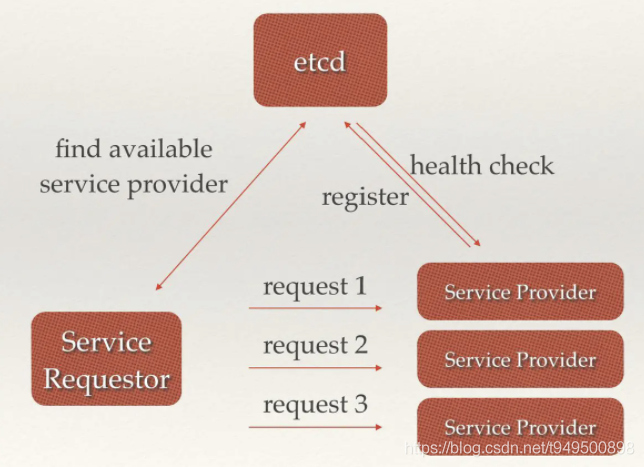
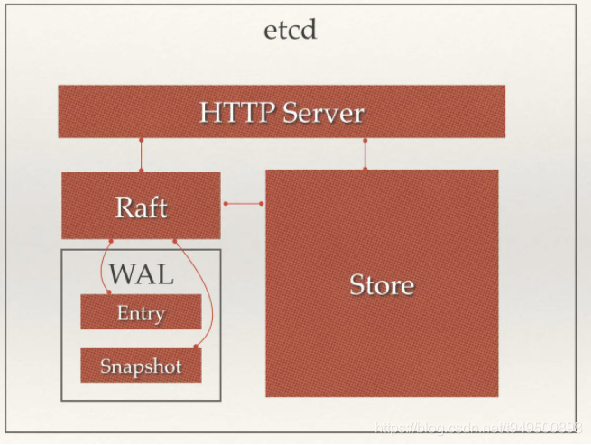

百闻不如一见，先上一个`etcdctl`的help，看看etcd都能做啥：

```sh
$ etcdctl -h
NAME:
   etcdctl - A simple command line client for etcd.

USAGE:
   etcdctl [global options] command [command options] [arguments...]

VERSION:
   3.1.5

COMMANDS:
     backup          backup an etcd directory
     cluster-health  check the health of the etcd cluster
     mk              make a new key with a given value
     mkdir           make a new directory
     rm              remove a key or a directory
     rmdir           removes the key if it is an empty directory or a key-value pair
     get             retrieve the value of a key
     ls              retrieve a directory
     set             set the value of a key
     setdir          create a new directory or update an existing directory TTL
     update          update an existing key with a given value
     updatedir       update an existing directory
     watch           watch a key for changes
     exec-watch      watch a key for changes and exec an executable
     member          member add, remove and list subcommands
     user            user add, grant and revoke subcommands
     role            role add, grant and revoke subcommands
     auth            overall auth controls
     help, h         Shows a list of commands or help for one command

GLOBAL OPTIONS:
   --debug                          output cURL commands which can be used to reproduce the request
   --no-sync                        don't synchronize cluster information before sending request
   --output simple, -o simple       output response in the given format (simple, `extended` or `json`) (default: "simple")
   --discovery-srv value, -D value  domain name to query for SRV records describing cluster endpoints
   --insecure-discovery             accept insecure SRV records describing cluster endpoints
   --peers value, -C value          DEPRECATED - "--endpoints" should be used instead
   --endpoint value                 DEPRECATED - "--endpoints" should be used instead
   --endpoints value                a comma-delimited list of machine addresses in the cluster (default: "http://127.0.0.1:2379,http://127.0.0.1:4001")
   --cert-file value                identify HTTPS client using this SSL certificate file
   --key-file value                 identify HTTPS client using this SSL key file
   --ca-file value                  verify certificates of HTTPS-enabled servers using this CA bundle
   --username value, -u value       provide username[:password] and prompt if password is not supplied.
   --timeout value                  connection timeout per request (default: 2s)
   --total-timeout value            timeout for the command execution (except watch) (default: 5s)
   --help, -h                       show help
   --version, -v                    print the version
```

etcd 是 CoreOS 团队于 2013 年 6 月发起的开源项目，它的目标是构建一个高可用的分布式键值(key-value)数据库，具有一定的一致性、高性能、高可用的方案。

etcd 提供了一种可靠的方式来存储需要由分布式系统或机器集群访问的数据。etcd 机器之间的通信通过 Raft 算法处理，可以优雅地处理网络分区期间的 leader 选举，以应对机器的故障。

etcd 采用 Go 语言编写，它具有出色的跨平台支持，很小的二进制文件和强大的社区。 类似的 zookeeper，但没有 zookeeper 那么重，功能也没有覆盖那么多。

etcd 比较多的应用场景是用于服务注册与发现，除此之外，也可以用于键值对存储，应用程序可以读取和写入 etcd 中的数据。

[《Raft算法》](Raft.md)

## etcd主要功能

### 键值对存储

etcd 是一个键值存储的组件，其他的应用都是基于其键值存储的功能展开。

etcd采用kv型数据存储，一般情况下比关系型数据库快。支持动态存储(内存)以及静态存储(磁盘)。

存储方式，采用类似目录结构。分布式存储，可集成为多节点集群。

只有叶子节点才能真正存储数据，叶子节点的父节点一定是目录，目录不能存储数据。

### 消息发布与订阅

etcd可以构建为一个配置共享中心，数据提供者在这个配置中心发布消息，而消息使用者则订阅他们关心的主题，一旦主题有消息发布，就会实时通知订阅者。通过这种方式可以做到分布式系统配置的集中式管理与动态更新。

## etcd的使用场景

### 服务注册与发现

服务发现要解决的也是分布式系统中最常见的问题之一，即在同一个分布式集群中的进程或服务，要如何才能找到对方并建立连接。本质上来说，服务发现就是想要了解集群中是否有进程在监听udp或tcp端口，并且通过名字就可以查找和连接。要解决服务发现的问题，需要有下面三大支柱，缺一不可。

* 一个强一致性、高可用的服务存储目录。基于Raft算法的etcd天生就是这样一个强一致性高可用的服务存储目录。
* 一种注册服务和监控服务健康状态的机制。用户可以在etcd中注册服务，并且对注册的服务设置key TTL，定时保持服务的心跳以达到监控健康状态的效果。
* 一种查找和连接服务的机制。通过在etcd指定的主题下注册的服务也能在对应的主题下查找到。为了确保连接，我们可以在每个服务机器上都部署一个Proxy模式的etcd，这样就可以确保能访问etcd集群的服务都能互相连接。

### 消息发布与订阅

比如，应用中用到的一些配置信息放到etcd上进行集中管理。应用在启动的时候主动从etcd获取一次配置信息，在etcd节点上注册一个`Watcher`并等待，以后每次配置有更新的时候，etcd都会实时通知订阅者，以此达到获取最新配置信息的目的。

### 分布式通知与协调

* 通过etcd进行低耦合的心跳检测：检测系统和被检测系统通过etcd上某个目录关联而非直接关联起来，这样可以大大减少系统的耦合性。
* 通过etcd完成系统调度：某系统有控制台和推送系统两部分组成，控制台的职责是控制推送系统进行相应的推送工作。管理人员在控制台作的一些操作，实际上是修改了etcd上某些目录节点的状态，而etcd就把这些变化通知给注册了Watcher的推送系统客户端，推送系统再作出相应的推送任务。
* 通过etcd完成工作汇报：大部分类似的任务分发系统，子任务启动后，到etcd来注册一个临时工作目录，并且定时将自己的进度进行汇报（将进度写入到这个临时目录），这样任务管理者就能够实时知道任务进度。

### 集群监控

通过etcd来进行监控实现起来非常简单并且实时性强。

前面几个场景已经提到Watcher机制，当某个节点消失或有变动时，Watcher会第一时间发现并告知用户。

节点可以设置TTL key，比如每隔30s发送一次心跳使代表该机器存活的节点继续存在，否则节点消失。

这样就可以第一时间检测到各节点的健康状态，以完成集群的监控要求。

### 负载均衡

* etcd自己的负载均衡：etcd本身分布式架构存储的信息访问支持负载均衡。etcd集群化以后，每个etcd的核心节点都可以处理用户的请求。所以，把数据量小但是访问频繁的消息数据直接存储到etcd中也是个不错的选择，如业务系统中常用的二级代码表（在表中存储代码，在etcd中存储代码所代表的具体含义，业务系统调用查表的过程，就需要查找表中代码的含义）。
* etcd给其他应用提供负载均衡功能：利用etcd维护一个负载均衡节点表。etcd可以监控一个集群中多个节点的状态，当有一个请求发过来后，可以轮询式的把请求转发给存活着的多个状态。类似KafkaMQ，通过ZooKeeper来维护生产者和消费者的负载均衡。同样也可以用etcd来做ZooKeeper的工作。



### 分布式锁

因为etcd使用Raft算法保持了数据的强一致性，某次操作存储到集群中的值必然是全局一致的，所以很容易实现分布式锁。锁服务有两种使用方式，一是保持独占，二是控制时序。
* 保持独占：etcd为此提供了一套实现分布式锁原子操作CAS（CompareAndSwap）的API。通过设置prevExist值，可以保证在多个节点同时去创建某个目录时，只有一个成功。而创建成功的用户就可以认为是获得了锁
* 控制时序：即所有想要获得锁的用户都会被安排执行，但是获得锁的顺序也是全局唯一的，同时决定了执行顺序。etcd为此也提供了一套API（自动创建有序键）

### 分布式队列

分布式队列的常规用法与场景五中所描述的分布式锁的控制时序用法类似，即创建一个先进先出的队列，保证顺序。

### Leader竞选

使用分布式锁，可以完成Leader竞选。这种场景通常是一些长时间CPU计算或者使用IO操作的机器，只需要竞选出的Leader计算或处理一次，就可以把结果复制给其他的Follower。从而避免重复劳动，节省计算资源。

## 原理



从etcd的架构图中我们可以看到，etcd主要分为四个部分。

* HTTP Server： 用于处理用户发送的API请求以及其它etcd节点的同步与心跳信息请求。
* Store：用于处理etcd支持的各类功能的事务，包括数据索引、节点状态变更、监控与反馈、事件处理与执行等等，是etcd对用户提供的大多数API功能的具体实现。
* Raft：Raft强一致性算法的具体实现，是etcd的核心。
* WAL：Write Ahead Log（预写式日志），是etcd的数据存储方式。除了在内存中存有所有数据的状态以及节点的索引以外，etcd就通过WAL进行持久化存储。WAL中，所有的数据提交前都会事先记录日志。Snapshot是为了防止数据过多而进行的状态快照；Entry表示存储的具体日志内容。

通常，一个用户的请求发送过来，会经由HTTP Server转发给Store进行具体的事务处理，如果涉及到节点的修改，则交给Raft模块进行状态的变更、日志的记录，然后再同步给别的etcd节点以确认数据提交，最后进行数据的提交，再次同步。

## etcd vs ZooKeeper

etcd实现的这些功能，ZooKeeper都能实现。那么为什么要用etcd而非直接使用ZooKeeper？

* ZooKeeper的部署维护复杂，管理员需要掌握一系列的知识和技能。而Paxos强一致性算法也是素来以复杂难懂而闻名于世。ZooKeeper的使用也比较复杂，需要安装客户端，官方只提供了Java和C两种语言的接口。
* Java编写，Java本身就偏向于重型应用，它会引入大量的依赖。而运维人员则普遍希望保持强一致、高可用的机器集群尽可能简单，维护起来也不易出错。
* 发展缓慢，由于基金会庞大的结构以及松散的管理导致项目发展缓慢。

相比ZooKeeper，etcd有以下优点：

* 简单。使用Go语言编写部署简单。使用HTTP作为接口使用简单，使用Raft算法保证强一致性让用户易于理解。
* 数据持久化，etcd默认数据一更新就进行持久化。
* 安全，etcd支持SSL客户端安全认证。
* 发展迅速，etcd正处于高速迭代开发中。

etcd现在还没有经过大型项目长时间的检验，但是目前CoreOS、Kubernetes和CloudFoundry等知名项目均在生产环境中使用了etcd。所以总的来说，etcd值得去学习和尝试的。