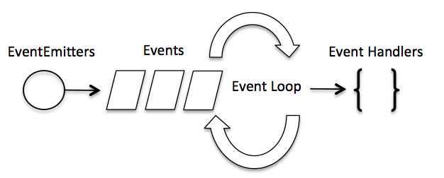

## 回调函数

如果看见某个函数定义长下面这样👇那它就应该是个带回调的函数。这类的函数一般为js内置，在调用的时候都是作为一个新线程运行的。

```javascript
function some_function(param1,param2,callback){}
```

callback里面写上一个自己定义的函数函数，例如

```javascript
function another_function(err,data){}
```

然后调用

```javascript
statement1

some_function(param1,param2,another_function)

statement2
```

那么`some_function`会和`statement2`并行执行，`some_function`执行完后就会调用`another_function`然后给`another_function`传两个个参数`err`和`data`。nodejs中带回调的函数都把错误信息作为回调的第一个参数，返回的数据作为第二个参数。回调函数`another_function`也将是并行执行的。

## 事件循环

引入模块👇创建对象👇

```javascript
var events = require('events');
var eventEmitter = new events.EventEmitter();
```

把某个事件`'eventName'`绑定到某个函数`eventHandler`上

```javascript
eventEmitter.on('eventName', eventHandler);
```

然后就可以触发事件了👇

```javascript
eventEmitter.emit('eventName');
```

### 触发事件的内部机制是？



事件循环👆每次`eventEmitter.emit`都会有一个事件名称（'eventName'）入队列，在队列的另一端是一群处理函数（eventHandler）在不断从队列中取事件进行处理。

### eventEmitter还有这些功能👇

```javascript
addListener(event, listener)
//为指定事件添加一个监听器到监听器数组的尾部。

on(event, listener)
//为指定事件注册一个监听器，接受一个字符串 event 和一个回调函数。 

once(event, listener)
//为指定事件注册一个单次监听器，即 监听器最多只会触发一次，触发后立刻解除该监听器。

removeListener(event, listener)
//移除指定事件的某个监听器，监听器必须是该事件已经注册过的监听器。
它接受两个参数，第一个是事件名称，第二个是回调函数名称。

removeAllListeners([event])
//移除所有事件的所有监听器， 如果指定事件，则移除指定事件的所有监听器。

setMaxListeners(n)
//默认情况下， EventEmitters 如果你添加的监听器超过 10 个就会输出警告信息。 setMaxListeners 函数用于提高监听器的默认限制的数量。

emit(event, [arg1], [arg2], [...])
//按监听器的顺序执行执行每个监听器，如果事件有注册监听返回 true，否则返回 false。

listenerCount(emitter, event)
//返回指定事件的监听器数量。
```

### 继承 EventEmitter

大多数时候我们不会直接使用 EventEmitter，而是在对象中继承它。

包括 fs、net、 http 在内的，只要是支持事件响应的核心模块都是 EventEmitter 的子类。

为什么要这样做呢？原因有两点：

* 具有某个实体功能的对象实现事件符合语义， 事件的监听和发生应该是一个对象的方法。

* JavaScript 的对象机制是基于原型的，支持部分多重继承，继承EventEmitter 不会打乱对象原有的继承关系。

## 函数or类？

1. 接下来我要说的事，你们千万别害怕
2. 放心，我们是专业程序员，我们不会怕，你请说
3. 我刚才，在express源码里面看见几个类成员被定义在了一个函数上面👇

```javascript
var proto = module.exports = function(options) {
  var opts = options || {};

  function router(req, res, next) {
    router.handle(req, res, next);
  }

  // mixin Router class functions
  setPrototypeOf(router, proto)

  router.params = {};
  router._params = [];
  router.caseSensitive = opts.caseSensitive;
  router.mergeParams = opts.mergeParams;
  router.strict = opts.strict;
  router.stack = [];

  return router;
};
```

4. 类成员被定义在函数上面是什么类
5. 不是什么类！是那种一半函数一半类的奇葩变量！
6. 画画画👇

```javascript
()=>{}
```

7. 不是函数，有成员变量的！
8. 画画画👇

```javascript
function R()={
    let r = {};
    r.rr = "rrr";
    return r;
}

R()
```

9. 就是那种，又能当函数，又能当类用的，那种奇葩变量
10. 哈哈哈
11. ......

函数当类用，原型模式真是编程语言界一朵奇葩。


## 在循环里面用匿名函数

笔者写中间件调用链被逼无赖写出了如下代码👇

```javascript
function next(f){f()}
let fun=()=>{console.log("I'm the last")};
for(let i=0;i<10;i++)
    fun=()=>{console.log(i);next(fun);}
fun()
```

那么请问，这段代码输出什么？

是123456789加一个I'm the last吗？

不！是！

它！居然！输出了！栈溢出！

原因居然是！fun和call相互递归！


似乎匿名函数变量并不能和普通变量等同。

想要实现像上面那种函数烤串，正确的做法是每一层都给一个单独的变量👇

```javascript
function next(f){f()}
let funs=[];
funs[10]=()=>{console.log("I'm the last")};
for(let i=0;i<10;i++)
    funs[i]=()=>{console.log(i);next(funs[i+1]);}
funs[0]()
```
