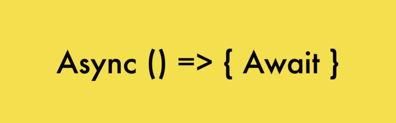

`Promise`是一种有三个状态的对象（“执行中`pending`”、“完成`resolve`”、“失败`reject`”），构造`Promise`对象时的构造函数参数是一个有两个参数的函数，这个函数的两个参数分别对应着`Promise`对象到达两个终点状态`resolve`或`reject`时要调用的函数。

一个典型的`Promise`构造如下👇

```javascript
new Promise(function(resolve, reject){
    /*执行各类语句a*/
    if(/*某个表示任务完成的判断条件*/)
        resolve(/*上面的语句中产生的某个变量*/)
    else
        reject(new Error(/*某个错误*/))
})
```

👆当上面这个新建`Promise`语句执行时，`Promise`构造函数中的`function(resolve, reject){}`会立即被执行，当这个函数在执行“`/*执行各类语句a*/`”时，`Promise`对象的状态为“`pending`”；如果判断条件使函数执行到了`resolve`函数，则`Promise`对象状态变为`resolve`；如果判断条件使函数执行到了`reject`函数，则`Promise`对象状态变为`reject`。

为了让`Promise`在我们想要的地方执行，一般把`Promise`加个壳写成这样👇

```javascript
const myPromise = function (some_value) {
    return new Promise(function (resolve, reject) {
        /*执行各类语句，用到some_value*/
        if (/*某个表示任务完成的判断条件*/)
            resolve(/*上面的语句中产生的某个变量v*/)
        else
            reject(new Error(/*某个错误e*/))
    })
}
```

调用`myPromise()`的返回值为一个新建的`Promise`对象。

然后用的时候就这么写👇

```javascript
myPromise(some_value)
```

关于`return`的注意事项👇

## resolve和reject函数从何而来？

### 答曰：来自`then`方法或者`catch/final`方法。

在上面的`Promise`例子中，如何告诉`myPromise`resolve和reject都是什么函数？

#### 正确姿势1👇

```javascript
function resolve(v/*对应上面例子中的变量v*/){/*对v做点什么*/}
function reject(e/*对应上面例子中的错误e*/){/*对e做点什么*/}
myPromise(some_value).then(resolve,reject)
```

👆这样resolve和reject就会在构造myPromise的那个函数里面被执行了。这就相当于`myPromise`执行完成之后把某个结果`v`传递给了`resolve`函数。然后这个`then`的返回值就是那个`function (resolve, reject) {}`的返回值。

#### 正确姿势2👇

```javascript
function resolve(v/*对应上面例子中的变量v*/){/*对v做点什么*/}
function reject(e/*对应上面例子中的错误e*/){/*对e做点什么*/}
myPromise(some_value).then(resolve).catch(reject)
```

👆起始`then`里面可以不用写`reject`用的那个函数，`reject`函数可以写在`.catch`方法里面，就像`try{}catch(){}`错误处理一样，如果删了上面那个`.catch(reject)`，当出错时`new Error(/*某个错误e*/)`会真的作为错误被抛出来。

`myPromise(some_value)`的返回值是一个`Promise`对象，而`myPromise(some_value).then(resolve,reject)`的返回值则是myPromise对象构造时里面那个`function (resolve, reject) {}`的返回值。

在上面这个例子中，`myPromise(some_value).then(resolve,reject)`和`myPromise(some_value).then(resolve).catch(reject)`的返回值都为`undefined`因为`myPromise`里面的`function (resolve, reject) {}`没有返回值。

>注意，调用resolve或reject并不会终结 Promise 的参数函数的执行。

```javascript
new Promise((resolve, reject) => {
  resolve(1);
  console.log(2);
}).then(r => {
  console.log(r);
});
// 2
// 1
```

>上面代码中，调用`resolve(1)`以后，后面的`console.log(2)`还是会执行，并且会首先打印出来。这是因为虽然看起来`resolve(1)`在`console.log(2)`的前面，但是这其实只是告诉了`Promise`当`resolve`时要执行`resolve(1)`，这个`resolve(1)`语句会被保留直到`console.log(2)`执行完并且函数退出后才会触发。
>
>一般来说，调用`resolve`或`reject`以后，`Promise`的使命就完成了，后继操作应该放到`then`方法里面，而不应该直接写在`resolve`或`reject`的后面。所以，最好在它们前面加上`return`语句，这样就不会有意外。

就像这样👇

```javascript
const myPromise = function (some_value) {
    return new Promise(function (resolve, reject) {
        /*执行各类语句，用到some_value*/
        if (/*某个表示任务完成的判断条件*/)
            return resolve(/*上面的语句中产生的某个变量v*/)
        else
            return reject(new Error(/*某个错误e*/))
    })
}
```

这时再调用`myPromise(some_value).then(resolve,reject)`和`myPromise(some_value).then(resolve).catch(reject)`的话就会有返回值了，因为`myPromise`里面的`function (resolve, reject) {}`有了返回值。并且按照上面那个写法，`myPromise(some_value).then(resolve,reject)`和`myPromise(some_value).then(resolve).catch(reject)`的返回值就是`resolve(/*上面的语句中产生的某个变量v*/)`或者`reject(new Error(/*某个错误e*/))`

后面所有的代码都默认`Promise`在`resolve`或`reject`处返回值。

## nodejs高玩的骚操作👇

### `resolve`函数返回一个`Promise`

先来个简单的，让`then`返回一个新的`myPromise`

```javascript
const myPromise = function (some_value) {
    return new Promise(function (resolve, reject) {
        /*执行各类语句，用到some_value*/
        if (/*某个表示任务完成的判断条件*/)
            return resolve(v/*上面的语句中产生的某个变量v*/)
        else
            return reject(new Error(e/*某个错误e*/))
    })
}

myPromise(value1).then(function(v){
    return myPromise(v)
})
```

然后因为第一个`then`的返回值变成一个`Promise`了，它又可以再`then`一次，所以我们就可以进一步这么写👇

```javascript
function resolve(v/*对应上面例子中的变量v*/){/*对v做点什么*/}
function reject(e/*对应上面例子中的错误e*/){/*对e做点什么*/}

myPromise(value1).then(function(v){
    return myPromise(v)
}).then(resolve,reject)
```

或者这么写👇

```javascript
myPromise(value1).then(function(v){
    return myPromise(v)
}).then(resolve).catch(reject)
```

这相当于是把`myPromise(value1)`的结果传递给了又一个`myPromise(v)`，然后再把`myPromise(v)`的结果传递给`resolve(v)`；并且`myPromise(v)`在`myPromise(value1)`到`resolve`状态了之后才会执行。

#### 出错了咋办？

注意到上面两个例子中的第一个`then`没有指定`reject`，这时如果有某一个`myPromise`运行到`reject`了，后面的`then`都不会执行直到这个`reject`碰到了某个`then(resolve,reject)`或者`catch(reject)`。如果后面没有`then(resolve,reject)`或者`catch(reject)`了？那就成为一个被抛出的错误。

#### 骚操作x5

连6个`myPromise`👇

```javascript
myPromise(v1).then(function(v2){
    return myPromise(v2)
}).then(function(v3){
    return myPromise(v3)
}).then(function(v4){
    return myPromise(v4)
}).then(function(v5){
    return myPromise(v5)
}).then(function(v6){
    return myPromise(v6)
}).then(resolve).catch(reject)
```

套4个`myPromise`👇

```javascript
myPromise(v1).then(function(v2){
    return myPromise(v2).then(function(v3){
        return myPromise2(v2,v3).then(function(v4){
            return myPromise3(v2,v3,v4)
        })
    })
}).then(resolve).catch(reject)
```

嵌套和连接不一样的地方就在于，嵌套可以综合前面各个`Promise`的返回值，连接只能获取前面一个。`myPromise2`和`myPromise3`定义如下👇。

```javascript
const myPromise2 = function (v2,v3) {
    return new Promise(function (resolve, reject) {
        /*执行各类语句*/
        if (/*某个表示任务完成的判断条件*/)
            return resolve(v4/*上面的语句中产生的某个变量v4*/)
        else
            return reject(new Error(e/*某个错误e*/))
    })
}

const myPromise2 = function (v2,v3,v4) {
    return new Promise(function (resolve, reject) {
        /*执行各类语句*/
        if (/*某个表示任务完成的判断条件*/)
            return resolve(v5/*上面的语句中产生的某个变量v5*/)
        else
            return reject(new Error(e/*某个错误e*/))
    })
}
```

## async/await

[教程参考](https://segmentfault.com/a/1190000007535316)



随着 Node 7 的发布，越来越多的人开始研究据说是异步编程终级解决方案的 async/await。async 是“异步”的简写，而 await 可以认为是 async wait 的简写。所以应该很好理解 **async 用于申明一个 function 是异步的**，而 **await 用于等待一个异步方法执行完成**。

如果需要通过 await 来调用一个 async 函数，那这个调用的外面必须得再包一个 async 函数，然后……进入死循环，永无出头之日……

### async

一个单独的async有什么用？请看👇

```javascript
async function testAsync(i) {
    if(i)return "hello async" + i;
    else throw new Error("Oops!");
}
const result = testAsync(1);
console.log(result);
const another = testAsync();
```

输出👇

```sh
Promise { 'hello async' }
```

和一个错误👇

```sh
UnhandledPromiseRejectionWarning: Error: Oops!
```

看到输出就恍然大悟了—— 输出的是一个 Promise 对象。

这样我们就可以理解了，async把一个函数变成了Promise，并将`return`的内容放到了`resolve`中，`throw`的内容放到了`reject`中，它就是一种更加方便而直观地定义`Promise`的方法。因此，上面这个函数就应该这样用：

```javascript
testAsync(1).then((r)=>{console.log(r)}).catch((e)=>{console.log(e)});
testAsync().then((r)=>{console.log(r)}).catch((e)=>{console.log(e)});
```

### await

await的使用分两种情况，第一种是await的表达式不是`Promise`时，这时有没有await都一样。比如下面这段代码输出3👇

```javascript
async function test(i) {
    let res = await i + 1;
    console.log(res);
};
test(2);
```

而第二种是await的表达式是`Promise`的时候，这时它会把`Promise`中`resolve`的输入作为结果返回，而将`reject`的输入作为错误抛出。比如上一节用then链调用的`async`函数的代码等效于👇

```javascript
async function test() {
    try {
        const r = await testAsync(1);
        console.log(r);
        await testAsync();
    } catch(e) {
        console.log(e)
    }
}
test();
```

从上面可以看出，加了await的`Promise`就像一个普通的函数一样，立即返回了他的处理结果，await可以看作是一种调用`Promise`的简便方法。但是我们知道，大多数情况下，`resolve`在`Promise`中是异步调用的，即它不会立即返回，那await是怎么实现把一个`Promise`的`resolve`立即返回的呢？很简单，它阻塞了后面的代码直到`resolve`返回。这相当于把await后面的代码全部放到`then`链定义的`resolve`里面了，也就是说，上面的代码等效于👇

```javascript
function test() {
    return new Promise((resolve,reject) => {
        testAsync(1).then((r)=>{
            console.log(r);
            return testAsync().then(()=>{
                resolve()
                });
        }).catch((e)=>{
            console.log("catched!")
            console.log(e)
        })
    })
}
test();
```

比起`async/await`代码，`Promise`代码难度不少，不是吗？

关于`try/catch`的位置，此处有一个易错点，比如像这样把`try/catch`放到外面来的做法是捕捉不到我们想要的错误的👇

```javascript
async function test() {
    const r = await testAsync(1);
    console.log(r);
    await testAsync();
}
try {
    test();
} catch(e) {
    console.log("catched!")
    console.log(e)
}
```

为什么捕捉不到也很好理解，因为前面标了`async`的函数返回的是一个`Promise`，它的错误要在`.catch((e)=>{})`里面或者用`await`才能捕捉到，就像这样👇

```javascript
test().catch((e)=>{console.log("catched!");console.log(e)})
```

这里还有一个注意点，那就是异步代码是不能向同步代码抛出错误的，比如上面那段进入到`catch`中的错误不能再抛出到外层的同步代码中，比如这段代码也是不能正确捕捉到错误的👇

```javascript
try{
    test().catch((e)=>{throw e})
} catch(e) {
    console.log("catched!")
    console.log(e)
}
```

即使用事件触发也是一样不能捕捉的

```javascript
const events = require("events")
let emitter = new events.EventEmitter()
try{
    emitter.on("error",(e)=>{throw e})
} catch(e) {
    console.log("catched!")
    console.log(e)
}
test().catch((e)=>{emitter.emit("error",e)})
```

异步代码的错误只能用异步代码捕捉到。
