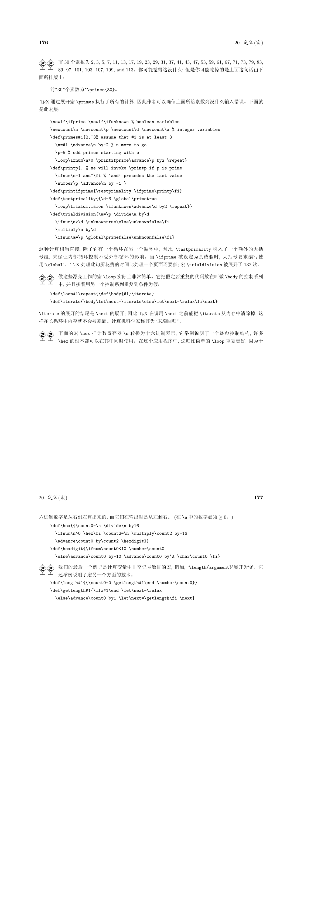

## TEX命令行的使用

首先，第一步当然是打开TEX命令行，如果安装了TEX：
```TEX
$ tex
```
然后会显示：
```TEX
This is TeX, Version 3.14159265 (TeX Live 2019/W32TeX) (preloaded format=tex)
**
```
`**`表示这里要输入一个tex文件，如果在`**`后你键入的第一个字符不是反斜线，那么 TEX 将自动插入`\input 你的输入`读入tex文件（注意，**不能加后缀名“.tex”**，因为TEX要搜索tex文件的时候，会在输入的后面加“.tex”查找“[输入值].tex”文件）。

如果不想编译文件，那就输入`\relex`：
```TEX
This is TeX, Version 3.14159265 (TeX Live 2019/W32TeX) (preloaded format=tex)
**\relax

*
```
下面`*`就只剩一个了，这里就可以输入文本和各种控制词了。当检测到输入了`\end`时，tex程序会输出：
```TEX
[1]
Output written on texput.dvi (1 page, 212 bytes).
```
表示排好版的文件放到texput.dvi里面了，并退出了程序。

##### 直接编译一个文件

如果要编译一个叫做“story.tex”的文件：

```TEX
$ tex story
```

依然注意，**不能加后缀名“.tex”**。

## TEX各种控制词
### 变量
```TEX
\font\cs=<external font name>   %把 \cs 变成字体标识符
\chardef\cs=<number>            %把 \cs 变成字符代码
\countdef\cs=<number>           %把 \cs 变成 \count 寄存器
\def\cs...{...}                 %把 \cs 变成宏
\let\cs=<token>                 %把token当前的含义赋予给 \cs。 
```
##### 定义变量：
```TEX
\let\变量名=值
```
**注意，TEX变量名不能有数字**
##### 显示变量：
```TEX
\show\变量名
```
例如：
```TEX
\let\countA=100
\let\countB=\countA
\show\countB
```
会输出：
```TEX
> \countB=the character 1.
<*> \show\countB
```
这表明`\countB`是一个字符；又例如：
```TEX
\let\countA=\it
\let\countB=\countA
\show\countB
```
输出：
```TEX
> \countB=macro:
->\fam \itfam \tenit .
<*> \show\countB
```
表明`\countB`是个宏。

### TEX宏
>TEX的一些高级控制词和自定义控制词有时又被称作宏，其定义的一般形式为：
```TEX
\def<control sequence><parameter text>{replacement text}
```
>其中`<parameter text>`不包含大括号, 并且在`<replacement text>`中所出现的` { `和` } `要正确嵌套。还有，符号` # `有特殊含义: 在`<parameter text>`中, 第一个出现的` # `后面必须跟`1`, 下一个要跟`2`，依此类推；只允许九个`#`。在`<replacement text>`中, 每个` # `后面必须跟一个`<parameter text>`中的` # `后面出现过的数字, 或者 一个` # `后面跟一个` #`。表示当宏展开时，后一种情况表示一个单个` #`；前一种情况表示插入相应的变量。TEX，包括Plain TEX中所有的宏（约900个）都是由TEX基本控制词（约300个）定义得到，而所有的基本控制词都能转化为屏幕上的输出。

——《The TeXBook》P.161

例如：
```TEX
\def\ib{\it\bf}
\def\ital#1{{\it #1\/}}
\def\itbf#1#2{\it #1\rm\bf #2 \rm}
```
调用时：
```TEX
\ib italicized text
\ital italicized text
\itbf italicized bold text
```
经过宏替换将变为：
```TEX
\it\bf italicized text
{\it i\/}talicized text
\it i\rm\bf t \rm alicized bold text
```
或使用编组：
```TEX
\ib italicized text
\ital{italicized text}
\itbf{italicized text}{bold text}
```
经过宏替换将变为：
```TEX
\it\bf italicized text
{\it italicized text\/}
\it italicized text\rm\bf bold text \rm
```

##### 另一种定义方法

>TEX 还允许定义这样的宏, 其参数用相当普遍的方法来分界; 你不需要总是把变量封装在大括号 中。例如：
```TEX
\def\cs #1. #2\par{...}
```
>定义了一个控制系列 `\cs`, 它有两个参数, 并且这两个参数如下确定出: `#1` 由 `\cs` 和下一个随后出现的“句点+空格”之间的所有内容组成; `#2` 由这个“句点+空格”和其后出现的`\par`之间的所有内容组成。例如：
```TEX
\cs You owe \$5.00. Pay it.\par
```
>第一个变量是`You owe \$5.00`, 而第二个是`Pay it.`。

——《The TeXBook》P.160

（合理联想：正则匹配取得参数）

### 编组
TEX的编组就是把多个文本编组为一个单一对象。例如：
```TEX
\canterline\TeX 123456
```
会以“TEX”为基准居中，而123456到了下一行。如果要让“TEX123456”整体居中，则需要让“TEX123456”编组成为一个单一对象：
```TEX
\canterline{\TeX 123456}
```
此外，在编组中的`\def`也只会在当前编组中发挥作用。如果要让某个编组中的定义在全局发挥作用，则需要`\global`。例如一个在编组中的全局宏定义：
```TEX
{\global\def\ib{\it\bf}}
```

##### LaTeX中的\begin{}和\end{}是怎么实现的？
关键在于《The TeXBook》习题5.6中讲的用基本控制词`\begingroup`和`\endgroup`定义组。答案在习题5.7：
```TEX
\def\begin#1{\begingroup\def\blockname{#1}}
\def\end#1{\def\test{#1}%
    \ifx\test\blockname\endgroup
    \else\errmessage{Some error occurred in \blockname}\fi}
```
这里的`\ifx`、`\else`、`\fi`是什么？看下面👇

### TeX选择结构

[TeX选择结构](i/TeXif.pdf)


### TeX循环结构

[TeX循环结构](i/TeXloop.pdf)


#### TEX支持的源代码字符
```TEX
ABCDEFGHIJKLMNOPQRSTUVWXYZ

abcdefghijklmnopqrstuvwxyz

0123456789 " # $ % & @ * + - = , . : ; ? !

( ) < > [ ] { } ‘ ’ \ | / _ ^ ~
```

#### Plain TEX占用的特殊字符
```TEX
&
#
%
$
```
#### Plain TEX保留的特殊字符
```TEX
\
{}
^
_
~
```
你可以重新定义一个Plain TEX保留字符的定义，例如在CJK和CCT中就有一个对`~`符号的重新定义（这个符号在Plain TEX中表示“输出一个空格但不能在此断行”）：
```TEX
\global\def~{\hskip 0.25em plus 0.125em minus 0.08em \ignorespaces}
```

#### 控制词和空格

TEX把多个空格和单个换行看作单个空格。

控制词后的空格都会被忽略，因为每个控制词后都需要一个空格以与正文分开（或者一个反斜杠接上其他控制词）。

如果要在控制词后放入空格，就需要一个反斜杠加空格。例如：

```TEX
\TeX 123456
```

输出：TEX123456。如果要输出TEX 123456，则需要一个反斜杠加空格：

```TEX
\TeX\ 123456
```

但是这样如果空格后面是个符号又会出现其他问题，终极解决方案是编组再加空格：

```TEX
{\TeX} 123456
```

或者用空编组加空格：

```TEX
\TeX{} 123456
```

如果不希望一个换行变成空格，可以加入`%`，它使得输入文件的行有效地终止而不引入 换行时 TEX 通常要插入的空格。还有, TEX 将忽略掉 `%` 后的任何内容, 直到文件的那行的结尾, 这样就可以在文稿中加入注释, 这些注释只是为了阅读方便。

例如：
```TEX
123
456
789
```
输出：123 456 789，而：
```TEX
123%
456%可有可无的注释甲
789%可有可无的注释乙
```
输出：123456789。

#### Plain TEX中改变部分字体：

```TEX
to be \bf bold \rm or to be ......
```

其中`\bf`表示加粗，`\rm`表示清除字体。同样的效果还可以用编组实现：

```TEX
to be {\bf bold} or to be ......
```

它们都会输出：

to be **bold** or to be ......

类似`\bf`的控制词还有很多。

#### Plain TEX斜体校正\/

`\/`加在斜体字符末尾一般字符开头处，会增大斜体字符和一般字符间的间距，弥补因斜体带来的字符间距缩减。

```TEX
to be {\it italicized\/} or to be ......
to be \it italicized\/\rm or to be ......
```

#### Plain TEX粗体校正\/

加粗字符也会有字符间距缩减问题，解决办法同上。

```TEX
to be {\bf bold\/} or to be ......
to be \bf bold\/\rm or to be ......
```

#### 自定义字体

`\font\myfont=<字体名> at <大小>`，例如10pt的CMR5字体

```TEX
\font\myfont=cmr5 at 10pt
```

或者`\font\myfont=<字体名> scaled <大小>`，例如放大1.2倍的CMR5字体：

```TEX
\font\myfont=cmr5 scaled 1200
```

#### TEX的四种横线：
* 连字符-：`-`
* 短破折号—：`--`
* 破折号——：`---`
* 减号-：`$-$`

### TODO:TeX对齐/制表符`&`

《The TeXBook》22章