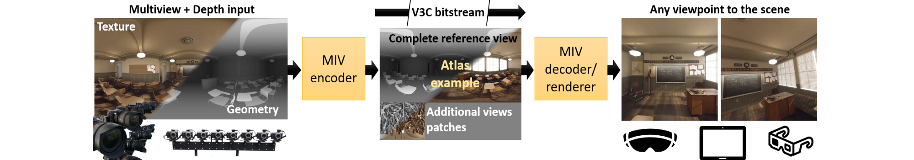
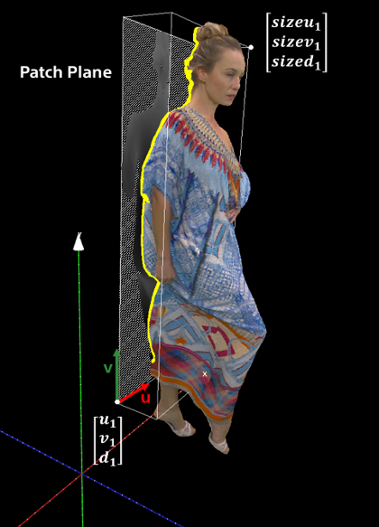
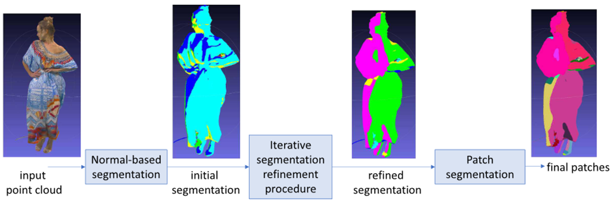
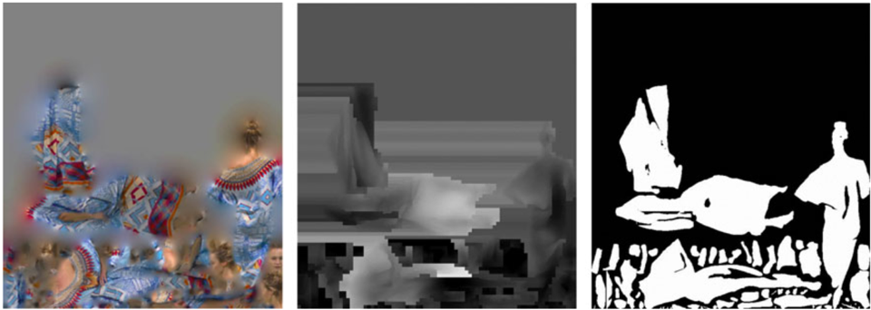
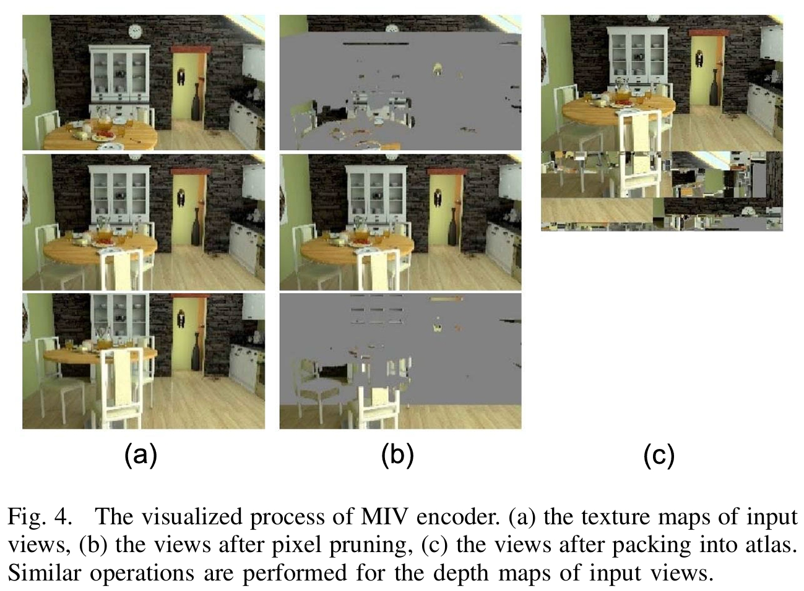

MIV 是 Moving Picture Experts Group (MPEG) 出品的一种3D视频格式，其原理是用多视角下的色彩图(texture)和深度图(geometry)表示场景，从而将3D内容映射为2D内容并使用传统2D视频编码器进行编码。
此类技术又称 Multi-view Video 。

👇一段介绍，来自 C. Zhu, G. Lu, B. He, R. Xie and L. Song, “Implicit-Explicit Integrated Representations for Multi-View Video Compression,” in IEEE Transactions on Image Processing, vol. 34, pp. 1106-1118, 2025

>Over the past decade, the Moving Picture Experts Group (MPEG) has been committed to the development of multi-view video coding standards. Popular coding standards, such as [3D-HEVC](http://hevc.info/3dhevc) [1] and [MIV](https://mpeg-miv.org/) [2], rely on disparity to eliminate inter-view redundancy.
>
>[1] G. Tech, Y. Chen, K. Müller, J.-R. Ohm, A. Vetro, and Y.-K. Wang, “Overview of the multiview and 3D extensions of high efficiency video coding,” IEEE Trans. Circuits Syst. Video Technol., vol. 26, no. 1, pp. 35–49, Jan. 2016.
>
>[2] J. M. Boyce, “MPEG immersive video coding standard,” Proc. IEEE, vol. 109, no. 9, pp. 1521–1536, Sep. 2021.

## MIV 的前身：Video-based Point Cloud Compression (V-PCC)

MIV 的前身是 V-PCC，二者技术一脉相承，但彼时的 V-PCC 还只能做到对 3D Object 编码，而 MIV 现在已经可以处理各种复杂大场景。

V-PCC 的核心思想类似物体三视图，其将3D物体（点云）在不同视角的多个平面上投影，并分解为一大堆补丁，放入2D视频帧中用2D视频编码器进行编码：

在每个平面上，V-PCC先根据法线对物体表明进行切割，将深度相近的点分到一块补丁，然后用一个合并算法将小块合并为大块：

最后，对于每块补丁，分别存储其中的每个点的颜色(Attribute)和相对于选定平面的深度(Geometry)，放入2D图像上，并用一张 Occupancy map 指示哪块是有用的数据：

## 从 V-PCC 到 MIV

V-PCC 本质上还是一种点云编码器，它并不关心点云从何而来，只是对交给它的点云数据进行压缩。
而 MIV 的输入数据是多个视角下拍摄的视频，这也是它又被称为 Multi-view Video 的原因。

如图所示，MIV的核心思想是寻找多个视角下视频帧之间的相似区域，以一个视角的视频为基准，剔除其他视角视频帧中的冗余区域，并将剩下的区域切出来作为补丁 (Atlas) 拼成新的视频帧进行编码：

其直接在2D视频上进行操作，无所谓视频帧是颜色还是深度，深度图可以看作是视频帧的一个额外色彩通道进行编码。

视频解码出来就是多个视角的颜色+深度图，拼起来就相当于一个点云，其渲染过程称为 Depth-image-based rendering (DIBR)。

## MIV 的缺陷

MIV 的质量主要依赖于高精度的相机位姿和深度图，在 3D Fundation Model 满天飞的当下已经不是问题。

MIV 的算法复杂，编码速度比较慢。

👇一段缺陷介绍，来自 C. Zhu, G. Lu, B. He, R. Xie and L. Song, “Implicit-Explicit Integrated Representations for Multi-View Video Compression,” in IEEE Transactions on Image Processing, vol. 34, pp. 1106-1118, 2025

>However, these methods require high-precision depth maps and camera calibration parameters, and the corresponding hand-crafted modules are computationally complex, leading to poor coding efficiency.

MIV 基于深度的表示方法本质上还是点云，没法表示复杂的光照信息，比如半透明物体（半透明玻璃和其后物体有两个深度，没法用一张深度图表示）和反光（同一个点从不同方向看颜色不一样）。