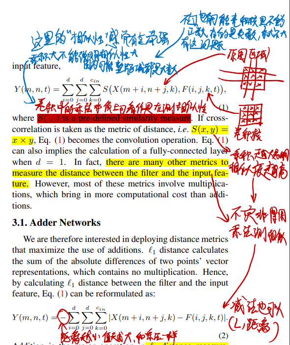
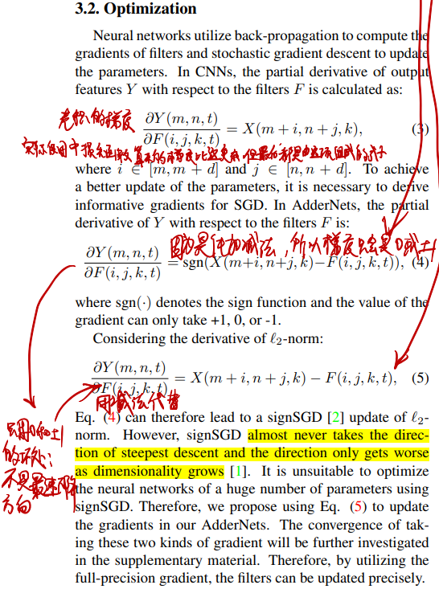
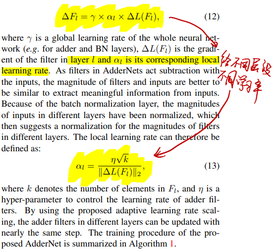
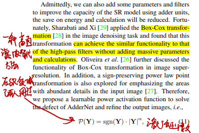

## 《AdderNet: Do We Really Need Multiplications in Deep Learning?》in CVPR 2020

### 核心思想

**用加法代替卷积中的乘法**

### 创新点

* 用加法代替卷积中的乘法的想法乃是此文首创
* 用加法代替卷积中的乘法之后还有一些问题需要解决，本文对其进行了详细阐述
  * 参数学习方面的问题
  * 学习速度方面的问题

### 用加法代替卷积中的乘法 - 核心思路

* 作者将卷积计算的过程看成是一种计算“相似度”的过程，比如一个$3\times 3$的图像区域和一个$3\times 3$的卷积核，这两个矩阵相似度越高最后的结果就越高
  * 卷积核和图像区域每个点都必须要同正同负，并且值很大最后的计算结果才能大
  * 不过这大概只能反映正负的相似性，不太能反映大小的相似性
    * 因为如果卷积核有地方很小而图像区域对应位的点很大，最后结果还是很大
* 既然是计算“相似度”，那减法也能计算相似度
  * 具体来讲，是用$L_1$距离
* 何不直接用这个减法代替乘法搞卷积？

### 用加法代替卷积中的乘法后如何更新参数（计算卷积核参数的梯度）

* 主要的问题：由于是线性计算，正常推导出卷积核参数的梯度项只会是0或者$\pm 1$，这在机器学习领域叫符号梯度下降（signSGD），这个搞法不是最速下降，已经有人证明过它效果不好
* 如何解决：不用正常推导出的梯度，直接用个减法代替（full-precision gradient）
  * 这其实是把一个二次函数的梯度当成线性函数的梯度在用，越接近最优解的梯度越小

### 用加法代替卷积中的乘法后如何传播梯度（计算反向传播的梯度）

用了full-precision gradient，参数的梯度算是没问题了，梯度传播的时候又会出问题：
* 每一层的梯度都大于1或者小于-1时，越往起始层传播梯度显然会越大
  * 梯度传播是乘，乘了大于1的数显然就变大

解决方法：把待传播的梯度截断在$[-1,1]$之间

### 用加法代替卷积中的乘法后如何选择学习率

这个问题起源于方差的计算：

作者在这里提出，实际实验中，CNN里面的$Var[F]$总是非常小，所以输出的方差也很小，但是换成了加法这输出的方差就很大。

于是显然，这里得添加BatchNorm层，但是由于大方差，添加了BN层又会导致反向传播经过BN层梯度变得很小：

每过一层梯度就会减小很多

那么这里就要调整学习率了，每一层给不同的学习率：

### 效果

非常牛逼

## 《AdderSR: Towards Energy Efficient Image Super-Resolution》in CVPR 2021

### 核心思想

用AdderNet搞超分辨率任务

### 创新点

* 第一次将AdderNet用在超分辨率里面
* 解决了AdderNet用在超分辨率时的两个问题
  * 用AdderNet实现了类似ResNet里面的恒等映射
  * 用AdderNet实现了高通滤波器

### 用AdderNet实现恒等映射

恒等映射能力对于处理SR任务来讲很重要（为什么？恒等映射和SR之间的关系还需要进一步学习）

文章证明了单纯的AdderNet无法实现恒等映射

那就学ResNet加支路（ResNet是怎么搞恒等映射的见[《ResNet》](../人工智能/ResNet.md)）

### 用AdderNet实现高通滤波器

高通滤波器对于图像细节的恢复来讲很重要，因为SR里面需要靠高通滤波器处理卷积输出滤出细节部分加到图像里

>The above equation can help the SISR model removing redundant outputs and noise and enhancing the high-frequency details, which is also a very essential component in the SISR models.

（这句话不知道我理解的对不对？高通滤波和SR之间的关系还需要进一步学习）

文章证明了单纯的AdderNet无法实现高通滤波

为什么不满足这个式子就无法实现高通滤波？
* 高通滤波就是把像素差别大的区域变得差别更大，像素差异小的区域变得更小
  * 具体来讲，就是把各种平滑区域都变成一样的值
* 这里证明的$(s*\bm E)\oplus\bm W=a$就是把平滑区域变成一个定值
  * $s*\bm E$就是一个常数乘上全1矩阵，相当于是一个纯低频的极致平滑的图
  * $(s*\bm E)\oplus\bm W$就是对这个平滑的图进行加法卷积操作
  * 按照上面说的高通滤波，这个式子的结果应该是定值
    * 也就是说，不管输入$s$是什么，$(s*\bm E)\oplus\bm W$都应该输出相同的值
  * 于是，要成为高通滤波器，就必须要满足：

$$\exist a\in\mathbf{R}(\forall s\in\mathbf{R} (s*\bm E)\oplus\bm W=a)$$

这就是这里证明$(s*\bm E)\oplus\bm W=a$的意义

* 如果是乘法卷积，一个$\begin{bmatrix} 1 & -1 \\ -1 & 1 \end{bmatrix}$矩阵就能让任意的这种平滑图全变0，$\exist a\in\mathbf{R}(\forall s\in\mathbf{R} (s*\bm E)\oplus\bm W=a)$显然成立

作者直接用了别人论文里的Box-Cox变换（一种高通滤波器替代方法）解决这个问题

### 效果

