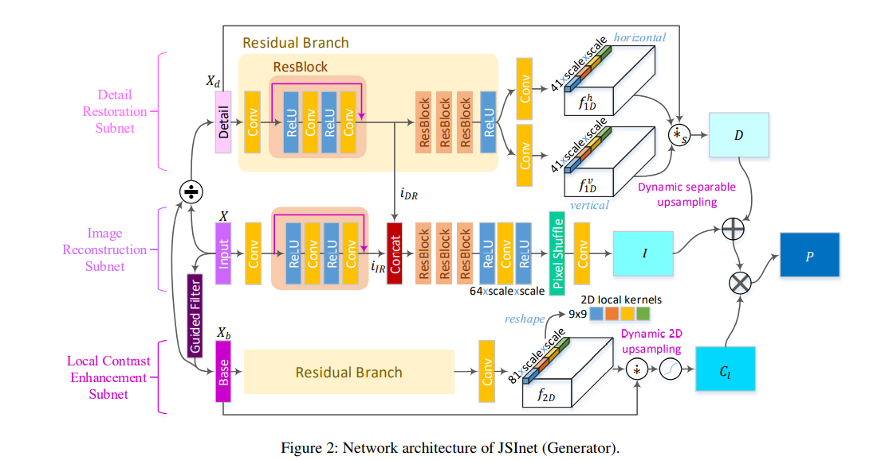

## JSI-GAN: GAN-Based Joint Super-Resolution and Inverse Tone-Mapping with Pixel-Wise Task-Specific Filters for UHD HDR Video

在进行图像超分辨率时，将三个子任务分别用三个不同的模型完成：
* image reconstruction 图像重建
* detail restoration (DR) 细节重建
* local contrast enhancement (LCE) 对比度强化

