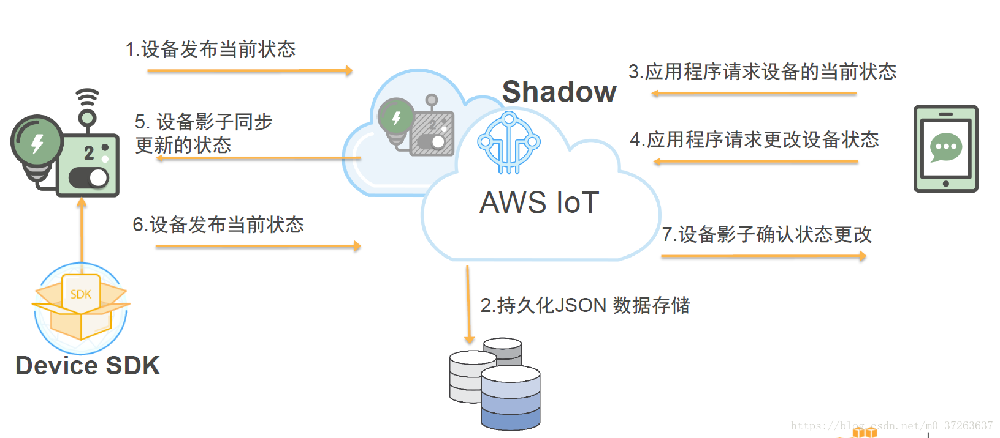
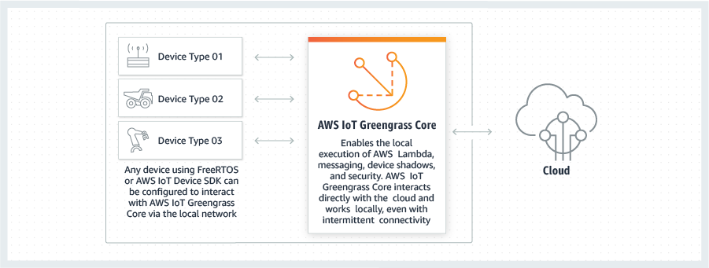
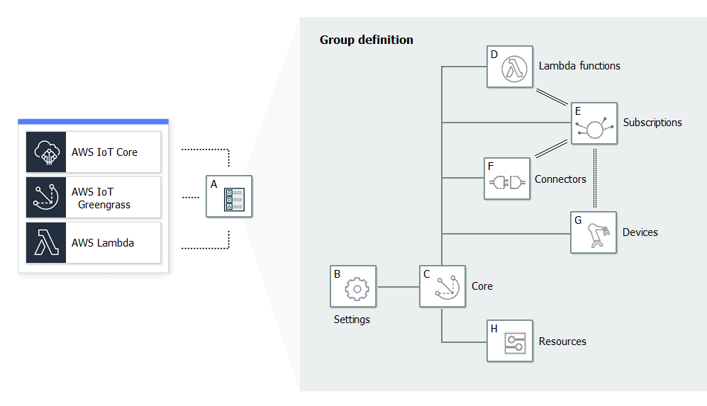

AWS IoT **使连接了 Internet 的设备能够连接到 AWS 云**，并使云中的应用程序能够**与连接了 Internet 的设备进行交互**。常见的 IoT 应用程序可从设备收集和处理遥测数据，或者令用户能够远程控制设备。

连接到 AWS IoT 的每个设备的状态存储在设备影子中。Device Shadow 服务通过响应检索或更新设备状态数据的请求来管理设备影子。Device Shadow 服务可实现设备与应用程序之间的双向通信。

通过使用 X.509 证书可保护您的设备与 AWS IoT 之间的通信。AWS IoT 可为您生成一个证书，您也可以使用自己的证书。无论哪种情况，都必须通过 AWS IoT 注册并激活证书，然后再复制到您的设备上。当您的设备与 AWS IoT 进行通信时，它会将证书作为凭证提供给 AWS IoT。

## 一个重要概念：Device Shadow

设备的影子是用于存储和检索设备的当前状态信息的 JSON 文档。影子通过 MQTT 或 HTTP 获取和设置设备的状态，**无论该设备是否连接到 Internet**。

## AWS IoT的云端：AWS IoT Core

### 借助 AWS IoT Core 轻松将任意数量的设备连接至云和其他设备

AWS IoT Core 支持 HTTP、WebSockets 和 MQTT（专门设计用于容许间断式连接，可最大限度地减少代码在设备上占用的空间及降低网络带宽要求的轻型通信协议）。AWS IoT Core 也支持其他行业标准和自定义协议，而且即使设备使用不同的协议，也可以相互通信。

### 设备身份验证

AWS IoT Core 会在所有连接点为首次连接到 AWS IoT Core 的设备提供自动配置和身份验证以及端到端加密服务，因此在没有验证身份的情况下，数据绝不会在设备和 AWS IoT Core 之间进行交换。此外，您可以通过应用具有详细权限的策略来保护对设备和应用程序的访问。

### 借助 AWS IoT Core，您可以按照自己定义的业务规则快速筛选和转换设备数据并对其执行操作

您可以随时更新规则以实施新设备和应用程序功能。即使对于功能更强大的 IoT 应用程序，您也可以借助 AWS IoT Core 轻松使用 AWS Lambda、Amazon Kinesis、Amazon S3、Amazon DynamoDB、Amazon CloudWatch 和 Amazon Elasticsearch Service 等 AWS 服务。

### AWS IoT Core 会存储互联设备的最新状态，以便能够随时进行读取或设置

使设备对您的应用程序来说，似乎始终处于在线状态。这意味着您的应用程序可以读取设备的状态（即使它已断开连接），并且您也可以设置设备状态，并在设备重新连接后实施该状态。

## AWS IoT的终端：AWS IoT 设备开发工具包

该工具包用于开发AWS IoT 终端设备，使其与AWS IoT Core通信以上报设备状态，接收控制信息等。

## AWS IoT的边缘端：AWS IoT Greengrass

AWS IoT Greengrass 是**将云功能扩展到本地设备的软件**。AWS IoT Greengrass部署在本地设备上，使得设备可以更靠近信息源来收集和分析数据，自主响应本地事件，同时在本地网络上彼此安全地通信。本地设备还可以与 AWS IoT Core 安全通信并将 IoT 数据导出到 AWS 云。AWS IoT Greengrass 开发人员可以使用 AWS Lambda 函数和预构建的连接器来创建无服务器应用程序，这些应用程序将部署到设备上以进行本地执行（Lambda 函数的安全、无线更新）。

在 AWS IoT Greengrass 中，设备可**在本地网络上安全地通信并互相交换消息而不必连接到云**。AWS IoT Greengrass 提供了一个**本地发布/订阅消息管理器**，该管理器可**在丢失连接的情况下智能地缓冲消息**，使云的入站和出站消息得到保留。这里的“本地”可能代表一个建筑层、一辆卡车或整个矿区。

### AWS IoT Greengrass在AWS IoT中的地位

无AWS IoT Greengrass，设备通过AWS IoT设备开发工具包直接连到AWS IoT Core：

有AWS IoT Greengrass，设备连到AWS IoT Greengrass Core，AWS IoT Greengrass Core再连AWS IoT Core

### 一个重要概念：AWS IoT Greengrass 组

Greengrass 组是一系列设置和组件，例如 Greengrass 核心、设备和订阅。组用于定义交互范围。例如，一个组可能表示建筑物的一层、一辆卡车或整个采矿场所。

* A：Greengrass 组定义:有关组设置和组件的信息。
* B：Greengrass 组设置
  * Greengrass 组角色:证书颁发机构和本地连接配置
  * Greengrass 核心连接信息。
  * Lambda 运行时环境。
  * CloudWatch 和本地日志配置。
* C：Greengrass 核心。
* D：Lambda 函数定义
* E：订阅定义:允许使用 MQTT 消息进行通信的订阅列表。
  * 消息源和消息目标。这些可能是设备、Lambda 函数、连接器、AWS IoT Core 和本地影子服务。
  * 用于筛选消息的主题。
* F：连接器定义：连接器表示设备与设备和设备与云之间的一系列通信接口。
* G：设备定义：作为 Greengrass 组的成员的 AWS IoT 设备以及关联的配置数据的列表。
* H：资源定义：Greengrass 核心上的本地资源、机器学习资源和密钥资源的列表，包含关联的配置数据。

AWS IoT Greengrass 组在云端定义，并在AWS IoT Greengrass 核心在线时通过AWS IoT Greengrass Core进行部署。

### 核心软件AWS IoT Greengrass Core

该软件以守护进程的方式部署于本地设备，并配有一个开发工具包。

提供以下功能：

* 连接器和 Lambda 函数的部署与本地执行。
* 在本地处理数据流，并自动导出到 AWS 云。
* 使用托管订阅通过本地网络在设备、连接器和 Lambda 函数之间进行的 MQTT 消息传递。
* 使用托管订阅在 AWS IoT 与设备、连接器和 Lambda 函数之间进行的 MQTT 消息传递。
* 使用设备身份验证和授权确保设备和云之间的安全连接。
* 设备的本地影子同步。影子可配置为与云同步。
* 对本地设备和卷资源的受控访问。
* 用于运行本地推理的云训练机器学习模型的部署。
* 使设备能够发现 Greengrass 核心设备的自动 IP 地址检测。
* 全新的或更新的组配置的集中部署。下载配置数据后，核心设备将自动重启。
* 用户定义的 Lambda 函数的安全、无线 (OTA) 软件更新。
* 本地密钥的安全、加密的存储以及连接器和 Lambda 函数进行的受控访问。

### AWS IoT Greengrass 中的设备

* Greengrass 核心：指运行 AWS IoT Greengrass Core 软件的设备。
  * 直接与 AWS IoT Core 和 AWS IoT Greengrass 服务进行通信。
  * 具有自己的设备证书，用于在 AWS IoT Core 中进行身份验证。
  * 有一个设备影子和一个 AWS IoT Core 注册表中的条目。
  * Greengrass 核心运行本地 Lambda 运行时、部署代理和 IP 地址跟踪器（用于将 IP 地址信息发送到 AWS IoT Greengrass 服务以允许 Greengrass 设备自动发现其组和核心连接信息）。
* 连接到 Greengrass 核心的设备
  * 连接设备（也称为 Greengrass 设备）也有自己的用于 AWS IoT Core 身份验证的设备证书、设备影子和 AWS IoT Core 注册表中的条目。
  * Greengrass 设备可以运行 FreeRTOS 或使用 AWS IoT 设备开发工具包或 AWS IoT Greengrass 发现 API，以获取用于连接和验证同一 Greengrass 组中核心的发现信息。

## AWS IoT中位于云端的其他服务

### AWS IoT Device Management：面向大规模的设备控制

>AWS IoT Device Management 可让您轻松地按照贵企业的功能、安全要求或任何其他类别**将设备队列分组为一个分层结构**。您可以对房间内的所有传感器分组，对同一层楼中的所有房间分组，以及对一栋大楼中的所有楼层分组。通过队列索引，您可以了解任何已连接设备的状态，并**一次跨多台设备执行操作**。您可以使用**批量注册**来注册和快速登记要在新建筑物或工作场所部署的设备队列。

### AWS IoT Device Defender：IoT 设备的安全管理

* 根据一组预定义的安全最佳实践来持续审核您设备上的 IoT 配置
  * 如果您的 IoT 配置存在任何可能引发安全风险的漏洞，例如在多个设备间共享身份证书，或身份证书被吊销的设备试图连接 AWS IoT Core，那么 AWS IoT Device Defender 会发送提醒
* 监控各个设备和 AWS IoT Core 的安全指标，验证它们的行为是否偏离了您为每台设备所定义的相应行为
  * 如果出现任何异常，AWS IoT Device Defender 就会发送提醒，以便您及时采取措施修复问题。例如，出站流量激增可能意味着某台设备参与了 DDoS 攻击

### AWS IoT 1-Click：从简单设备触发 AWS Lambda 函数

* AWS IoT 1-Click 是一种服务，它使简单的设备可以触发 AWS Lambda 函数，以执行某项操作。
* 支持 AWS IoT 1-Click 的设备开箱即可使用，无需编写您自己的固件或将其配置为安全连接。
* >客户可以通过受支持的设备，轻松开始使用 AWS IoT 1-Click。设备制造商可以通过联系我们轻松将设备注册到 AWS IoT 1-Click。

### AWS IoT Analytics：IoT 设备数据分析

#### AWS IoT Analytics主要解决的问题

>IoT 数据是**高度非结构化**数据，难以使用专用于处理结构化数据的传统分析和商业智能工具进行分析。IoT 数据来自通常记录非常嘈杂过程（如温度、动作或声音）的设备。因而来自这些设备的数据**经常具有大量空白、损坏的消息和错误的读数**，必须先清除这些，才能进行分析。另外，IoT 数据**通常仅在需要额外的第三方数据输入的上下文中有意义**。例如，为帮助农民确定确定何时为庄稼浇水，葡萄园灌溉系统通常使用葡萄园的降雨量数据来扩充湿度传感器数据，从而更高效地使用水资源，同时尽可能提升产量。

AWS IoT Analytics 可以自动执行各个复杂的步骤来分析来自 IoT 设备的数据。AWS IoT Analytics 对 IoT 数据进行筛选、转换和扩充，然后再将其存储在时间序列数据存储中以供分析。

* 您可以将该服务设置为只从您的设备中收集需要的数据，应用数学转换来处理数据，并使用特定于设备的元数据（例如设备类型和位置）来扩充数据，然后再存储处理过的数据。
* 您可以使用内置 SQL 查询引擎来运行临时查询或计划查询，从而分析您的数据，也可以执行更复杂的分析和机器学习推理。AWS IoT Analytics 包括针对常见 IoT 使用案例的预构建模型，帮助您轻松开始使用机器学习。
* 您也可以使用自定义分析，将其打包到容器中，以在 AWS IoT Analytics 上执行。AWS IoT Analytics 可自动执行在 Jupyter Notebook 或您自己工具（例如，Matlab、Octave 等）中创建的自定义分析，实现按您的计划执行。

### AWS IoT Events：轻松检测来自 IoT 传感器和应用程序的事件并做出响应

事件是识别比预期更复杂的情况的数据模式，例如当皮带卡住时设备的变化或运动检测器使用移动信号来激活灯和监控摄像机。

>您只需选择要获取的相关数据源，使用简单的“if-then-else”语句为每个事件定义逻辑，并选择在事件发生时触发的警报或自定义操作。IoT Events 会持续监控来自多个 IoT 传感器和应用程序的数据，并与其他服务集成（如 AWS IoT Core 和 AWS IoT Analytics），以实现对事件的早期检测并获取独特见解。IoT Events 自动触发警报和操作，根据您定义的逻辑响应事件，以快速地解决问题，降低维护成本，并提高运营效率。

### AWS IoT SiteWise：从工业设备中轻松地大规模收集、组织与分析数据

AWS IoT SiteWise **提供了一个资产建模框架**，您可以用来构建工业设备、流程和设施的表示形式。使用资产模型，您可以定义要使用的原始数据以及如何将原始数据处理为复杂的指标。

主要用途：

* 通过远程监控快速识别问题
* 使用中心数据源改进跨设施流程

### AWS IoT Things Graph：以可视化方式开发 IoT 应用程序